# R Crash Course for Text Analysis
James Rice

- [R and RStudio](#r-and-rstudio)
- [Some basics before we start](#some-basics-before-we-start)
- [Basic operations in R](#basic-operations-in-r)
  - [Functions in Text Analysis](#functions-in-text-analysis)
- [Data types in R for Text
  Analysis](#data-types-in-r-for-text-analysis)
- [Assigning values to R objects for Text
  Analysis](#assigning-values-to-r-objects-for-text-analysis)
- [Logical Expressions for Text
  Filtering](#logical-expressions-for-text-filtering)
- [Types of objects in R for Text
  Analysis](#types-of-objects-in-r-for-text-analysis)
  - [Vectors for Text Collections](#vectors-for-text-collections)
    - [Indices and subsetting for Text
      Data](#indices-and-subsetting-for-text-data)
  - [Matrices for Structured Text
    Data](#matrices-for-structured-text-data)
  - [Data frames for Text Analysis
    Datasets](#data-frames-for-text-analysis-datasets)
  - [Lists for Complex Text Analysis
    Results](#lists-for-complex-text-analysis-results)
- [Data Management for Text
  Analysis](#data-management-for-text-analysis)
  - [Managing workspace and setting working
    directory](#managing-workspace-and-setting-working-directory)
- [Importing and managing text
  datasets](#importing-and-managing-text-datasets)
  - [Creating new text analysis
    variables](#creating-new-text-analysis-variables)
  - [Basic Text Processing
    Operations](#basic-text-processing-operations)
- [Basic Statistical Analysis and
  Regression](#basic-statistical-analysis-and-regression)
  - [Descriptive Statistics](#descriptive-statistics)
  - [Correlation Analysis](#correlation-analysis)
  - [Linear Regression](#linear-regression)
    - [Simple Linear Regression](#simple-linear-regression)
    - [Multiple Linear Regression](#multiple-linear-regression)
    - [Model Diagnostics](#model-diagnostics)
    - [Making Predictions](#making-predictions)
- [Data Visualization with ggplot2](#data-visualization-with-ggplot2)
  - [Basic ggplot2 Syntax](#basic-ggplot2-syntax)
  - [Common Plot Types](#common-plot-types)
    - [Scatter Plots](#scatter-plots)
    - [Bar Charts](#bar-charts)
    - [Histograms and Density Plots](#histograms-and-density-plots)
    - [Box Plots](#box-plots)
  - [Customizing Plots](#customizing-plots)
    - [Themes and Styling](#themes-and-styling)
    - [Faceting (Multiple Panels)](#faceting-multiple-panels)
  - [Working with Text Analysis Data](#working-with-text-analysis-data)
  - [Text-Specific Visualizations](#text-specific-visualizations)
  - [Saving Plots](#saving-plots)
- [Final notes](#final-notes)
- [References](#references)

This is a crash course in R with a focus on text analysis applications.
It will give you an idea on how R works and introduce you to key
concepts for analyzing textual data.

# R and RStudio

**R** is an open-source programming language for statistical computing
and graphics, with exceptional capabilities for text analysis and
natural language processing.

Most of the functionalities of R come through *packages*, some of which
are built-in within base R and many of which are community-provided (see
[CRAN](http://www.cran.r-project.org) for add-on packages). For text
analysis, key packages include `stringr`, `tidytext`, `tm`, `quanteda`,
and `textdata`.

**RStudio** is an integrated development environment, a user-friendly
interface for us to work with R. To use it locally on your computer, you
need to first [install R](http://www.cran.r-project.org) and then
[RStudio](https://www.rstudio.com/products/rstudio/download/).

Both RStudio Desktop and RStudio Cloud has the same interface:

1.  A window to edit code scripts on top-left.
2.  A window to see the execution and outputs of commands on
    bottom-left.
3.  A window to see the *environment*: objects in temporary memory, on
    top-right.
4.  A window with several tabs: file directory, plots, R packages, and
    help files, on bottom-right.

# Some basics before we start

- Any text following a “\#” is a comment and R ignores comments while
  executing the code
  - You will see comments very often in R scripts: These can be
    explanations, for your colleagues or for your future-self!
- R executes codes line by line. In RStudio, you can:
  - Click “Run” in the editor window.
  - Select a bulk of code and click “Run” to execute several lines of
    code.
  - Type and enter the code in the console.

# Basic operations in R

While text analysis often involves complex operations, we still need to
understand basic R operations:

``` r
# Basic arithmetic (useful for counting words, calculating frequencies, etc.)
3 + 2 - 1  # addition and subtraction
```

    [1] 4

``` r
2 * pi     # multiplication with constants
```

    [1] 6.283185

``` r
3^3        # powers - useful for statistical calculations
```

    [1] 27

``` r
sqrt(16)   # square root function
```

    [1] 4

``` r
log(1)     # natural logarithm (base = e)
```

    [1] 0

``` r
# Operations particularly useful for text analysis
17 / 2      # division - useful for calculating proportions
```

    [1] 8.5

``` r
17 %/% 2    # integer division - getting whole number results
```

    [1] 8

``` r
17 %% 2     # modulo - useful for sampling every nth item
```

    [1] 1

``` r
3000000000000 # scientific notation - useful for large text corpora
```

    [1] 3e+12

## Functions in Text Analysis

In text analysis, functions are essential for processing and
manipulating textual data. Many specialized functions exist in base R
and text analysis packages.

For text analysis, we frequently use functions like `str_length()`,
`str_detect()`, `str_extract()` from the `stringr` package. Let’s see
some basic examples:

``` r
# Basic text processing functions
text_sample <- "This is a sample text for analysis"
nchar(text_sample)  # count characters (base R function)
```

    [1] 34

``` r
tolower(text_sample) # convert to lowercase for standardization
```

    [1] "this is a sample text for analysis"

``` r
toupper(text_sample) # convert to uppercase for emphasis
```

    [1] "THIS IS A SAMPLE TEXT FOR ANALYSIS"

``` r
# Using stringr functions (more powerful for text analysis)
library(stringr)  # load the stringr package for advanced text processing
str_length(text_sample)  # count characters (stringr version)
```

    [1] 34

``` r
str_detect(text_sample, "sample")  # detect if pattern exists (returns TRUE/FALSE)
```

    [1] TRUE

Functions in R have a common format: function name followed by
parentheses. Between parentheses are the input given by us to the
function: these input can be text data, patterns to search for, or
specifications for the function to run. We call the inputs as
*arguments* of a function.

To inspect how a function works, and what are the arguments needed, we
can use the **help** pages of these functions. Every function in R has a
help page and a detailed document. These are very important and even
people with advanced knowledge of R refer to these help pages very
often. To access the help page, we can type the function name without
parentheses and with a question mark in front of it.

``` r
?str_detect  # open help page for string detection function
?nchar       # open help page for character counting function
```

Running this code opens the help page on the bottom-right window of
RStudio. These help pages sometimes can be overwhelming, but in time you
will get used to it and be able to find the information you need. The
most important sections in the help page are,

1.  Description: What the function does
2.  Usage: How should the function be typed
3.  Arguments: Inputs
4.  Value: The output
5.  Examples

> [!NOTE]
>
> Functions are also objects in R. You can write your own function,
> store it and use it - this is particularly useful for custom text
> processing tasks.

> [!NOTE]
>
> Using multiple functions: An output of a function can be the input of
> another function (like f(g(x)) in math). R will evaluate these
> starting from the innermost function, going outside step by step.

> [!NOTE]
>
> This may be confusing in complex operations. Therefore the developers
> of R came with an alternative, the pipeline: `%>%`. Pipeline operator
> takes the output of the code on its left hand side, and gives it as an
> input to the code on its right hand side (Pipeline does not exist in
> base R and we need extra packages to use it).

``` r
# Traditional nested approach
tolower(str_replace_all(text_sample, "[!?.]", ""))  # nested functions (hard to read)
```

    [1] "this is a sample text for analysis"

``` r
# Pipeline approach (much cleaner for text processing)
text_sample %>%   # take text_sample and pass it to next function
  str_replace_all("[!?.]", "") %>%  # remove basic punctuation
  tolower()       # then convert to lowercase
```

    [1] "this is a sample text for analysis"

> [!NOTE]
>
> When you don’t know the name of a function and are looking for text
> analysis solutions, asking ChatGPT or Claude is the most effective way
> to find a solution. Prompts asking about “R text mining”, “R string
> manipulation”, or “R regex” are good starting points for general
> guidance.

# Data types in R for Text Analysis

Understanding data types is crucial for text analysis, as we work with
different types of textual information:

1.  **Characters (Strings)**: The most important data type for text
    analysis
    1.  Can be inside either single or double quote.
    2.  If a string includes quotation marks, either a single quote can
        be used within double quote (or vice versa) or backlashes `\`
        can be used as an *escape* character
    3.  Text data often contains special characters, punctuation, and
        various encodings

``` r
"This is a tweet about climate change"    # basic string with double quotes
```

    [1] "This is a tweet about climate change"

``` r
'Another text with "quotes" inside'       # single quotes allow double quotes inside
```

    [1] "Another text with \"quotes\" inside"

``` r
"Text with 'single quotes' inside"        # double quotes allow single quotes inside
```

    [1] "Text with 'single quotes' inside"

``` r
'Text with \'escaped\' quotes'            # escape characters allow same quote type inside
```

    [1] "Text with 'escaped' quotes"

``` r
# Text with special characters common in social media
tweet_text <- "Climate change is real! 🌍 #ClimateAction @UN"  # emojis, hashtags, mentions
print(tweet_text)  # display the text with special characters
```

    [1] "Climate change is real! 🌍 #ClimateAction @UN"

2.  **Numbers**: Important for text analysis metrics (word counts,
    sentiment scores, frequencies)
3.  **Logical**: `TRUE` or `FALSE` with capital letters. `T` or `F` is
    also ok, but not preferred. Essential for filtering text data.

``` r
# Examples relevant to text analysis
word_count <- 150  # number of words in a document (integer)
sentiment_score <- 0.75  # sentiment analysis score (decimal between 0-1)
contains_keyword <- TRUE  # whether text contains a specific keyword (logical)

class(word_count)      # check the data type of word_count
```

    [1] "numeric"

``` r
class(sentiment_score) # check the data type of sentiment_score  
```

    [1] "numeric"

``` r
class(contains_keyword) # check the data type of contains_keyword
```

    [1] "logical"

4.  **Factors (Categories)**: Useful for categorical text data like
    topics, sentiment categories, or document types

``` r
# Text categories
document_types <- factor(c("tweet", "news", "blog", "tweet", "news"))  # create categorical variable
sentiment_categories <- factor(c("positive", "negative", "neutral", "positive"))  # sentiment labels

levels(document_types)  # show the unique categories in document_types
```

    [1] "blog"  "news"  "tweet"

``` r
table(document_types)   # count frequency of each document type
```

    document_types
     blog  news tweet 
        1     2     2 

# Assigning values to R objects for Text Analysis

R is an object-oriented programming language. We can create objects of
different classes, assign values to them, edit and manipulate these
objects. This is particularly important in text analysis where we often
store and manipulate large collections of text data.

The assignment operator is: `<-`. Shortcut: Option + “-” in MacOS, Alt +
“-” in Windows.

``` r
# Storing text data in objects
my_text <- "Climate change affects global weather patterns"  # assign text to variable
tweet_content <- "Just read an amazing article about renewable energy! #GreenTech"  # social media text

# Check what we stored
my_text       # display the stored text
```

    [1] "Climate change affects global weather patterns"

``` r
tweet_content # display the tweet content
```

    [1] "Just read an amazing article about renewable energy! #GreenTech"

``` r
# We can use objects in text processing operations 
str_length(my_text)           # count characters in stored text
```

    [1] 46

``` r
str_count(tweet_content, "#") # count hashtags in tweet
```

    [1] 1

``` r
# When we assign a new value to an existing object, it overwrites it!
my_text <- "Updated text about environmental policy"  # overwrite previous value
my_text  # display the new content
```

    [1] "Updated text about environmental policy"

``` r
# Storing different types of text analysis results
word_count <- str_count(my_text, "\\w+")  # count words using regex pattern
class(word_count)  # check data type of word count result
```

    [1] "integer"

``` r
contains_policy <- str_detect(my_text, "policy")  # check for keyword presence
class(contains_policy)  # check data type of logical result
```

    [1] "logical"

``` r
# Store multiple related texts
climate_texts <- c("Global warming is accelerating",    # create vector of related texts
                   "Renewable energy adoption is increasing",
                   "Carbon emissions must be reduced")
class(climate_texts)  # check data type of text vector
```

    [1] "character"

# Logical Expressions for Text Filtering

Statements that produce logical outcomes, i.e. `TRUE` or `FALSE`
outcomes, are essential for filtering and analyzing text data. Main
logical operators are below:

== equal to

!= not equal to

\> greater than

\< less than

\>= greater than or equal to

\<= less than or equal to

\| or

& and

! not

``` r
# Basic logical operations
1 < 2   # less than comparison
```

    [1] TRUE

``` r
1 == 2  # equality comparison  
```

    [1] FALSE

``` r
!(1 == 2)  # negation of equality
```

    [1] TRUE

``` r
4 < 7 & 7 < 6  # AND operation (both conditions must be true)
```

    [1] FALSE

``` r
4 < 7 | 7 < 6  # OR operation (either condition can be true)
```

    [1] TRUE

``` r
# Text analysis applications
text1 <- "climate change"  # first text string
text2 <- "global warming"  # second text string

# Compare text strings
text1 == text2  # check if texts are identical
```

    [1] FALSE

``` r
text1 != text2  # check if texts are different
```

    [1] TRUE

``` r
# Check text length
str_length(text1) > 10                    # is text1 longer than 10 characters?
```

    [1] TRUE

``` r
str_length(text1) >= str_length(text2)    # is text1 at least as long as text2?
```

    [1] TRUE

``` r
# Combine logical operations for text filtering
long_text <- str_length(text1) > 5         # check if text is long enough
contains_climate <- str_detect(text1, "climate")  # check if text contains keyword

# Both conditions must be true
long_text & contains_climate  # text must be long AND contain "climate"
```

    [1] TRUE

``` r
# Either condition can be true
str_detect(text1, "weather") | str_detect(text1, "climate")  # contains "weather" OR "climate"
```

    [1] TRUE

``` r
# Text doesn't contain specific word
!str_detect(text1, "economics")  # does NOT contain "economics"
```

    [1] TRUE

# Types of objects in R for Text Analysis

Almost everything in R is an object: functions, plots, dataframes, and
text collections.

Here we will focus on 4 main types of objects that text data are
commonly stored in: 1. Vectors (collections of texts) 2. Matrices
(structured text data) 3. Data frames (most common for text analysis
datasets) 4. Lists (flexible storage for complex text analysis results)

## Vectors for Text Collections

A vector is a one-dimensional object that can contain different values
of same data type. For text analysis, character vectors are extremely
important as they store collections of texts.

``` r
# Create vectors of text data
tweets <- c("Love the new climate policy! #GreenFuture",  # first tweet
            "Renewable energy is the way forward",        # second tweet
            "Electric vehicles are becoming mainstream",   # third tweet
            "Solar panels on every roof!")                # fourth tweet

news_headlines <- c("Global Temperature Rises to Record High",  # first headline
                   "New Solar Technology Breakthrough",         # second headline
                   "UN Climate Summit Begins Tomorrow")         # third headline

tweets          # display all tweets
```

    [1] "Love the new climate policy! #GreenFuture"
    [2] "Renewable energy is the way forward"      
    [3] "Electric vehicles are becoming mainstream"
    [4] "Solar panels on every roof!"              

``` r
news_headlines  # display all headlines
```

    [1] "Global Temperature Rises to Record High"
    [2] "New Solar Technology Breakthrough"      
    [3] "UN Climate Summit Begins Tomorrow"      

To create longer vectors with patterns, there are shortcuts we can use,
particularly useful for generating IDs or labels:

``` r
# Generate document IDs
doc_ids <- paste0("doc_", 1:10)  # create IDs like "doc_1", "doc_2", etc.
doc_ids
```

     [1] "doc_1"  "doc_2"  "doc_3"  "doc_4"  "doc_5"  "doc_6"  "doc_7"  "doc_8" 
     [9] "doc_9"  "doc_10"

``` r
# Generate time periods
years <- 2020:2024  # create sequence of years
years
```

    [1] 2020 2021 2022 2023 2024

``` r
# Repeat categories (useful for labeling text data)
text_sources <- rep(c("twitter", "news", "blog"), times = c(3, 2, 4))  # repeat each source specified number of times
text_sources
```

    [1] "twitter" "twitter" "twitter" "news"    "news"    "blog"    "blog"   
    [8] "blog"    "blog"   

We can use some functions to extract information and attributes of a
text vector:

``` r
length(tweets)  # how many texts do we have in tweets vector?
```

    [1] 4

``` r
length(news_headlines)  # how many headlines do we have?
```

    [1] 3

``` r
class(tweets)      # what type of data is tweets?
```

    [1] "character"

``` r
class(text_sources) # what type of data is text_sources?
```

    [1] "character"

``` r
# Text-specific vector operations
str_length(tweets)          # character count for each text in vector
```

    [1] 41 35 41 27

``` r
str_count(tweets, "\\w+")   # word count for each text using regex pattern
```

    [1] 6 6 5 5

### Indices and subsetting for Text Data

We can access certain elements of a text vector using square brackets
`[]`. We can use numbers as indices or logical expressions. This is
crucial for filtering texts based on content or other criteria.

``` r
tweets[2] # extract second tweet from vector
```

    [1] "Renewable energy is the way forward"

``` r
news_headlines[1:2] # extract first two headlines using range
```

    [1] "Global Temperature Rises to Record High"
    [2] "New Solar Technology Breakthrough"      

``` r
tweets[c(1, 4)] # extract first and fourth tweet using specific positions
```

    [1] "Love the new climate policy! #GreenFuture"
    [2] "Solar panels on every roof!"              

``` r
# Logical filtering based on text content
long_tweets <- str_length(tweets) > 30 # create logical vector: which tweets are longer than 30 characters?
long_tweets
```

    [1]  TRUE  TRUE  TRUE FALSE

``` r
tweets[long_tweets] # extract only the tweets that are longer than 30 characters
```

    [1] "Love the new climate policy! #GreenFuture"
    [2] "Renewable energy is the way forward"      
    [3] "Electric vehicles are becoming mainstream"

``` r
# Filter texts containing specific keywords
climate_mentions <- str_detect(tweets, "climate|renewable|green")  # check which tweets mention climate terms
climate_mentions
```

    [1]  TRUE FALSE FALSE FALSE

``` r
tweets[climate_mentions] # extract texts mentioning climate-related terms
```

    [1] "Love the new climate policy! #GreenFuture"

``` r
# We can also assign new values to selected elements 
tweets_copy <- tweets  # create copy to preserve original
tweets_copy[str_detect(tweets_copy, "#")] <- str_remove_all(tweets_copy[str_detect(tweets_copy, "#")], "#\\w+")  # remove hashtags from tweets containing them
tweets_copy
```

    [1] "Love the new climate policy! "            
    [2] "Renewable energy is the way forward"      
    [3] "Electric vehicles are becoming mainstream"
    [4] "Solar panels on every roof!"              

## Matrices for Structured Text Data

A matrix can be thought as a two dimensional vector, with rows and
columns. In text analysis, matrices are often used for document-term
matrices, where rows represent documents and columns represent words or
features.

We can access values in a matrix using `[,]`. Comma here separates row
and column information.

``` r
# Create a simple word frequency matrix
# Rows = documents, Columns = words
word_freq_matrix <- matrix(data = c(5, 3, 0, 2,    # doc1: frequencies for each word
                                   2, 1, 4, 1,    # doc2: frequencies for each word  
                                   0, 0, 6, 3),   # doc3: frequencies for each word
                          nrow = 3,      # specify number of rows (documents)
                          ncol = 4,      # specify number of columns (words)
                          byrow = TRUE)  # fill matrix row by row

# Add meaningful names
rownames(word_freq_matrix) <- c("doc1", "doc2", "doc3")  # name the documents
colnames(word_freq_matrix) <- c("climate", "change", "energy", "policy")  # name the words
word_freq_matrix  # display the matrix with names
```

         climate change energy policy
    doc1       5      3      0      2
    doc2       2      1      4      1
    doc3       0      0      6      3

``` r
# Access specific elements
word_freq_matrix[2, 3] # get frequency of "energy" in doc2
```

    [1] 4

``` r
word_freq_matrix[2, ] # get all word frequencies for doc2
```

    climate  change  energy  policy 
          2       1       4       1 

``` r
word_freq_matrix[, "climate"] # get "climate" frequencies across all documents
```

    doc1 doc2 doc3 
       5    2    0 

``` r
word_freq_matrix[c(1,2), c("climate", "energy")] # get subset of documents and words
```

         climate energy
    doc1       5      0
    doc2       2      4

In text analysis, we often work with very large, sparse matrices (mostly
zeros) representing document-term relationships.

## Data frames for Text Analysis Datasets

When doing text analysis in R, most of the time we will be dealing with
data frames. Data frames have columns as variables, and each row is an
observation. In text analysis, each row typically represents a document,
post, tweet, or other text unit, with columns for the text content,
metadata, and analysis results.

We can create a data frame using `data.frame()` function.

``` r
# Create a text analysis dataset
text_df <- data.frame(
  doc_id = paste0("doc_", 1:8),  # create unique document IDs
  text = c("Climate change is a global crisis requiring immediate action",     # document texts
           "Renewable energy sources are becoming more affordable",
           "Electric vehicles will transform transportation",
           "Carbon taxes could reduce emissions effectively",
           "Solar panels are now cheaper than fossil fuels", 
           "Wind power generates clean electricity",
           "Green technology creates new job opportunities",
           "Environmental policies need stronger enforcement"),
  source = c(rep("news", 3), rep("policy", 2), rep("blog", 3)),  # categorize document sources
  date = as.Date(c("2024-01-15", "2024-01-16", "2024-01-17", "2024-01-18",  # convert strings to date objects
                   "2024-01-19", "2024-01-20", "2024-01-21", "2024-01-22")),
  word_count = sapply(c("Climate change is a global crisis requiring immediate action",  # count words in each text
                       "Renewable energy sources are becoming more affordable",
                       "Electric vehicles will transform transportation",
                       "Carbon taxes could reduce emissions effectively",
                       "Solar panels are now cheaper than fossil fuels", 
                       "Wind power generates clean electricity",
                       "Green technology creates new job opportunities",
                       "Environmental policies need stronger enforcement"), 
                     function(x) length(strsplit(x, " ")[[1]]))  # basic word counting
)

text_df  # display the complete data frame
```

                                                                 doc_id
    Climate change is a global crisis requiring immediate action  doc_1
    Renewable energy sources are becoming more affordable         doc_2
    Electric vehicles will transform transportation               doc_3
    Carbon taxes could reduce emissions effectively               doc_4
    Solar panels are now cheaper than fossil fuels                doc_5
    Wind power generates clean electricity                        doc_6
    Green technology creates new job opportunities                doc_7
    Environmental policies need stronger enforcement              doc_8
                                                                                                                         text
    Climate change is a global crisis requiring immediate action Climate change is a global crisis requiring immediate action
    Renewable energy sources are becoming more affordable               Renewable energy sources are becoming more affordable
    Electric vehicles will transform transportation                           Electric vehicles will transform transportation
    Carbon taxes could reduce emissions effectively                           Carbon taxes could reduce emissions effectively
    Solar panels are now cheaper than fossil fuels                             Solar panels are now cheaper than fossil fuels
    Wind power generates clean electricity                                             Wind power generates clean electricity
    Green technology creates new job opportunities                             Green technology creates new job opportunities
    Environmental policies need stronger enforcement                         Environmental policies need stronger enforcement
                                                                 source       date
    Climate change is a global crisis requiring immediate action   news 2024-01-15
    Renewable energy sources are becoming more affordable          news 2024-01-16
    Electric vehicles will transform transportation                news 2024-01-17
    Carbon taxes could reduce emissions effectively              policy 2024-01-18
    Solar panels are now cheaper than fossil fuels               policy 2024-01-19
    Wind power generates clean electricity                         blog 2024-01-20
    Green technology creates new job opportunities                 blog 2024-01-21
    Environmental policies need stronger enforcement               blog 2024-01-22
                                                                 word_count
    Climate change is a global crisis requiring immediate action          9
    Renewable energy sources are becoming more affordable                 7
    Electric vehicles will transform transportation                       5
    Carbon taxes could reduce emissions effectively                       6
    Solar panels are now cheaper than fossil fuels                        8
    Wind power generates clean electricity                                5
    Green technology creates new job opportunities                        6
    Environmental policies need stronger enforcement                      5

Each variable within our data frame is a vector, and the rules of
vectors also apply to them. All variables in a data frame must have the
same length. But we might have variables with missing values, depicted
as `NA` in R.

We can use `$` operator to access individual columns/variables.

``` r
text_df$text # access the text column using dollar sign notation
```

    [1] "Climate change is a global crisis requiring immediate action"
    [2] "Renewable energy sources are becoming more affordable"       
    [3] "Electric vehicles will transform transportation"             
    [4] "Carbon taxes could reduce emissions effectively"             
    [5] "Solar panels are now cheaper than fossil fuels"              
    [6] "Wind power generates clean electricity"                      
    [7] "Green technology creates new job opportunities"              
    [8] "Environmental policies need stronger enforcement"            

``` r
# Note the different types of indexing extracting the same value
text_df$word_count[3]  # get word count for 3rd document using column name and position
```

    [1] 5

``` r
text_df[3, 5] # get 3rd row, 5th column using row and column numbers
```

    [1] 5

``` r
text_df[3, "word_count"] # get 3rd row, word_count column using row number and column name
```

    [1] 5

We can also subset the data frame using logical expressions - this is
very common in text analysis for filtering documents:

``` r
# Filter documents with more than 7 words
text_df[text_df$word_count > 7, ]  # subset rows where word count exceeds 7
```

                                                                 doc_id
    Climate change is a global crisis requiring immediate action  doc_1
    Solar panels are now cheaper than fossil fuels                doc_5
                                                                                                                         text
    Climate change is a global crisis requiring immediate action Climate change is a global crisis requiring immediate action
    Solar panels are now cheaper than fossil fuels                             Solar panels are now cheaper than fossil fuels
                                                                 source       date
    Climate change is a global crisis requiring immediate action   news 2024-01-15
    Solar panels are now cheaper than fossil fuels               policy 2024-01-19
                                                                 word_count
    Climate change is a global crisis requiring immediate action          9
    Solar panels are now cheaper than fossil fuels                        8

``` r
# Filter news articles only
text_df[text_df$source == "news", ]  # subset rows where source equals "news"
```

                                                                 doc_id
    Climate change is a global crisis requiring immediate action  doc_1
    Renewable energy sources are becoming more affordable         doc_2
    Electric vehicles will transform transportation               doc_3
                                                                                                                         text
    Climate change is a global crisis requiring immediate action Climate change is a global crisis requiring immediate action
    Renewable energy sources are becoming more affordable               Renewable energy sources are becoming more affordable
    Electric vehicles will transform transportation                           Electric vehicles will transform transportation
                                                                 source       date
    Climate change is a global crisis requiring immediate action   news 2024-01-15
    Renewable energy sources are becoming more affordable          news 2024-01-16
    Electric vehicles will transform transportation                news 2024-01-17
                                                                 word_count
    Climate change is a global crisis requiring immediate action          9
    Renewable energy sources are becoming more affordable                 7
    Electric vehicles will transform transportation                       5

``` r
# Filter texts containing "energy"
text_df[str_detect(text_df$text, "energy"), ]  # subset rows where text contains "energy"
```

                                                          doc_id
    Renewable energy sources are becoming more affordable  doc_2
                                                                                                           text
    Renewable energy sources are becoming more affordable Renewable energy sources are becoming more affordable
                                                          source       date
    Renewable energy sources are becoming more affordable   news 2024-01-16
                                                          word_count
    Renewable energy sources are becoming more affordable          7

``` r
# Multiple conditions: news articles with more than 7 words
text_df[text_df$source == "news" & text_df$word_count > 7, ]  # combine multiple filtering conditions
```

                                                                 doc_id
    Climate change is a global crisis requiring immediate action  doc_1
                                                                                                                         text
    Climate change is a global crisis requiring immediate action Climate change is a global crisis requiring immediate action
                                                                 source       date
    Climate change is a global crisis requiring immediate action   news 2024-01-15
                                                                 word_count
    Climate change is a global crisis requiring immediate action          9

## Lists for Complex Text Analysis Results

Lists are the most flexible object type in that they can include
different types of other R objects, including other lists. In text
analysis, lists are particularly useful for storing complex results like
topic models, sentiment analysis outputs, or multiple datasets.

``` r
# Create a list containing different text analysis components
text_analysis_results <- list(
  raw_texts = text_df,                    # store the complete data frame
  word_frequency_matrix = word_freq_matrix, # store the word frequency matrix
  summary_stats = c(total_docs = nrow(text_df),     # calculate and store summary statistics
                   avg_word_count = mean(text_df$word_count)),
  keywords = c("climate", "energy", "renewable", "carbon")  # store key terms of interest
)

text_analysis_results  # display the entire list structure
```

    $raw_texts
                                                                 doc_id
    Climate change is a global crisis requiring immediate action  doc_1
    Renewable energy sources are becoming more affordable         doc_2
    Electric vehicles will transform transportation               doc_3
    Carbon taxes could reduce emissions effectively               doc_4
    Solar panels are now cheaper than fossil fuels                doc_5
    Wind power generates clean electricity                        doc_6
    Green technology creates new job opportunities                doc_7
    Environmental policies need stronger enforcement              doc_8
                                                                                                                         text
    Climate change is a global crisis requiring immediate action Climate change is a global crisis requiring immediate action
    Renewable energy sources are becoming more affordable               Renewable energy sources are becoming more affordable
    Electric vehicles will transform transportation                           Electric vehicles will transform transportation
    Carbon taxes could reduce emissions effectively                           Carbon taxes could reduce emissions effectively
    Solar panels are now cheaper than fossil fuels                             Solar panels are now cheaper than fossil fuels
    Wind power generates clean electricity                                             Wind power generates clean electricity
    Green technology creates new job opportunities                             Green technology creates new job opportunities
    Environmental policies need stronger enforcement                         Environmental policies need stronger enforcement
                                                                 source       date
    Climate change is a global crisis requiring immediate action   news 2024-01-15
    Renewable energy sources are becoming more affordable          news 2024-01-16
    Electric vehicles will transform transportation                news 2024-01-17
    Carbon taxes could reduce emissions effectively              policy 2024-01-18
    Solar panels are now cheaper than fossil fuels               policy 2024-01-19
    Wind power generates clean electricity                         blog 2024-01-20
    Green technology creates new job opportunities                 blog 2024-01-21
    Environmental policies need stronger enforcement               blog 2024-01-22
                                                                 word_count
    Climate change is a global crisis requiring immediate action          9
    Renewable energy sources are becoming more affordable                 7
    Electric vehicles will transform transportation                       5
    Carbon taxes could reduce emissions effectively                       6
    Solar panels are now cheaper than fossil fuels                        8
    Wind power generates clean electricity                                5
    Green technology creates new job opportunities                        6
    Environmental policies need stronger enforcement                      5

    $word_frequency_matrix
         climate change energy policy
    doc1       5      3      0      2
    doc2       2      1      4      1
    doc3       0      0      6      3

    $summary_stats
        total_docs avg_word_count 
             8.000          6.375 

    $keywords
    [1] "climate"   "energy"    "renewable" "carbon"   

``` r
# Note the double square brackets as indices 
text_analysis_results[1] # returns a list containing the first element (still a list)
```

    $raw_texts
                                                                 doc_id
    Climate change is a global crisis requiring immediate action  doc_1
    Renewable energy sources are becoming more affordable         doc_2
    Electric vehicles will transform transportation               doc_3
    Carbon taxes could reduce emissions effectively               doc_4
    Solar panels are now cheaper than fossil fuels                doc_5
    Wind power generates clean electricity                        doc_6
    Green technology creates new job opportunities                doc_7
    Environmental policies need stronger enforcement              doc_8
                                                                                                                         text
    Climate change is a global crisis requiring immediate action Climate change is a global crisis requiring immediate action
    Renewable energy sources are becoming more affordable               Renewable energy sources are becoming more affordable
    Electric vehicles will transform transportation                           Electric vehicles will transform transportation
    Carbon taxes could reduce emissions effectively                           Carbon taxes could reduce emissions effectively
    Solar panels are now cheaper than fossil fuels                             Solar panels are now cheaper than fossil fuels
    Wind power generates clean electricity                                             Wind power generates clean electricity
    Green technology creates new job opportunities                             Green technology creates new job opportunities
    Environmental policies need stronger enforcement                         Environmental policies need stronger enforcement
                                                                 source       date
    Climate change is a global crisis requiring immediate action   news 2024-01-15
    Renewable energy sources are becoming more affordable          news 2024-01-16
    Electric vehicles will transform transportation                news 2024-01-17
    Carbon taxes could reduce emissions effectively              policy 2024-01-18
    Solar panels are now cheaper than fossil fuels               policy 2024-01-19
    Wind power generates clean electricity                         blog 2024-01-20
    Green technology creates new job opportunities                 blog 2024-01-21
    Environmental policies need stronger enforcement               blog 2024-01-22
                                                                 word_count
    Climate change is a global crisis requiring immediate action          9
    Renewable energy sources are becoming more affordable                 7
    Electric vehicles will transform transportation                       5
    Carbon taxes could reduce emissions effectively                       6
    Solar panels are now cheaper than fossil fuels                        8
    Wind power generates clean electricity                                5
    Green technology creates new job opportunities                        6
    Environmental policies need stronger enforcement                      5

``` r
text_analysis_results[[1]] # returns the actual data frame (extracts content)
```

                                                                 doc_id
    Climate change is a global crisis requiring immediate action  doc_1
    Renewable energy sources are becoming more affordable         doc_2
    Electric vehicles will transform transportation               doc_3
    Carbon taxes could reduce emissions effectively               doc_4
    Solar panels are now cheaper than fossil fuels                doc_5
    Wind power generates clean electricity                        doc_6
    Green technology creates new job opportunities                doc_7
    Environmental policies need stronger enforcement              doc_8
                                                                                                                         text
    Climate change is a global crisis requiring immediate action Climate change is a global crisis requiring immediate action
    Renewable energy sources are becoming more affordable               Renewable energy sources are becoming more affordable
    Electric vehicles will transform transportation                           Electric vehicles will transform transportation
    Carbon taxes could reduce emissions effectively                           Carbon taxes could reduce emissions effectively
    Solar panels are now cheaper than fossil fuels                             Solar panels are now cheaper than fossil fuels
    Wind power generates clean electricity                                             Wind power generates clean electricity
    Green technology creates new job opportunities                             Green technology creates new job opportunities
    Environmental policies need stronger enforcement                         Environmental policies need stronger enforcement
                                                                 source       date
    Climate change is a global crisis requiring immediate action   news 2024-01-15
    Renewable energy sources are becoming more affordable          news 2024-01-16
    Electric vehicles will transform transportation                news 2024-01-17
    Carbon taxes could reduce emissions effectively              policy 2024-01-18
    Solar panels are now cheaper than fossil fuels               policy 2024-01-19
    Wind power generates clean electricity                         blog 2024-01-20
    Green technology creates new job opportunities                 blog 2024-01-21
    Environmental policies need stronger enforcement               blog 2024-01-22
                                                                 word_count
    Climate change is a global crisis requiring immediate action          9
    Renewable energy sources are becoming more affordable                 7
    Electric vehicles will transform transportation                       5
    Carbon taxes could reduce emissions effectively                       6
    Solar panels are now cheaper than fossil fuels                        8
    Wind power generates clean electricity                                5
    Green technology creates new job opportunities                        6
    Environmental policies need stronger enforcement                      5

``` r
# Access specific elements within list components
text_analysis_results[[1]][2, "text"] # get second text from the raw_texts data frame
```

    [1] "Renewable energy sources are becoming more affordable"

``` r
text_analysis_results[[4]][1] # get first keyword from keywords vector
```

    [1] "climate"

``` r
# Lists can store results from text analysis functions
sample_analysis <- list(
  corpus_size = length(tweets),                                    # count total number of tweets
  vocabulary = unique(unlist(strsplit(paste(tweets, collapse = " "), " "))),  # extract unique words (basic method)
  longest_tweet = max(str_length(tweets))                          # find length of longest tweet
)

sample_analysis  # display the analysis results
```

    $corpus_size
    [1] 4

    $vocabulary
     [1] "Love"         "the"          "new"          "climate"      "policy!"     
     [6] "#GreenFuture" "Renewable"    "energy"       "is"           "way"         
    [11] "forward"      "Electric"     "vehicles"     "are"          "becoming"    
    [16] "mainstream"   "Solar"        "panels"       "on"           "every"       
    [21] "roof!"       

    $longest_tweet
    [1] 41

# Data Management for Text Analysis

## Managing workspace and setting working directory

When working with text analysis in R, we often read text files (like CSV
files with social media data, PDFs, or plain text documents) and produce
outputs as files (such as cleaned datasets, word clouds, or analysis
results).

When R reads and writes such files, it works in a pre-specified location
in our folder directory, called **working directory**.

From the settings of RStudio, we can set a default working directory.
But as we need to work on different text analysis projects, it is better
to set working directory to the folder we are using for the individual
project to keep things tidy. This is also very useful when sharing text
analysis code with collaborators.

To see where our current working directory is, we can run `getwd()`
command. To change the working directory we use
`setwd("file path here")` command.

``` r
# Check current working directory
getwd()
```

    [1] "/Users/hjms/Documents/GitHub_Repositories/ess_qta_2025/Crash_course"

``` r
# To set working directory to a specific folder, use:
# setwd("path/to/your/project/folder")
# For example:
# setwd("~/Documents/R-projects/text-analysis")  # Mac/Linux
# setwd("C:/Users/YourName/Documents/R-projects/text-analysis")  # Windows
```

# Importing and managing text datasets

We can import text data from a variety of file types using functions
built for each data file type. Text data commonly comes from CSV files
(social media exports), JSON files (API responses), or plain text files.

``` r
# Read a dataset (assuming we have a text dataset)
# dat <- read.csv("social_media_posts.csv")  # example of reading real CSV file

# For demonstration, let's create a sample dataset
social_media <- data.frame(
  post_id = 1:100,    # create sequential post IDs
  platform = sample(c("twitter", "facebook", "instagram"), 100, replace = TRUE),  # randomly assign platforms
  text_content = paste("Sample post about",   # create sample text content
                      sample(c("climate change", "renewable energy", "sustainability", 
                              "carbon emissions", "green technology"), 100, replace = TRUE)),
  engagement = sample(10:1000, 100),  # randomly assign engagement scores
  stringsAsFactors = FALSE            # keep text as character (not factor)
)

head(social_media) # display first six posts for preview
```

      post_id  platform                       text_content engagement
    1       1  facebook Sample post about renewable energy        784
    2       2   twitter Sample post about green technology        960
    3       3  facebook Sample post about carbon emissions        147
    4       4   twitter   Sample post about sustainability        206
    5       5  facebook   Sample post about sustainability        453
    6       6 instagram   Sample post about sustainability        632

``` r
str(social_media) # show structure of our text dataset
```

    'data.frame':   100 obs. of  4 variables:
     $ post_id     : int  1 2 3 4 5 6 7 8 9 10 ...
     $ platform    : chr  "facebook" "twitter" "facebook" "twitter" ...
     $ text_content: chr  "Sample post about renewable energy" "Sample post about green technology" "Sample post about carbon emissions" "Sample post about sustainability" ...
     $ engagement  : int  784 960 147 206 453 632 287 941 930 485 ...

``` r
# Let's subset posts with high engagement (>500)
high_engagement <- social_media[social_media$engagement > 500, ]  # filter high engagement posts

# Three ways to filter text data (all equivalent)
# Method 1: base R with square brackets
climate_posts1 <- social_media[str_detect(social_media$text_content, "climate"), ]  # base R filtering

# Method 2: base R subset() function  
climate_posts2 <- subset(social_media, str_detect(text_content, "climate"))  # subset function

# Method 3: dplyr filter() function (preferred for readability)
climate_posts3 <- filter(social_media, str_detect(text_content, "climate"))  # dplyr filtering

# Check if results are identical
all(climate_posts1$post_id == climate_posts2$post_id)  # compare method 1 and 2
```

    [1] TRUE

``` r
all(climate_posts1$post_id == climate_posts3$post_id)  # compare method 1 and 3
```

    [1] TRUE

As all three filtering methods produce identical results, we don’t need
to keep all of them in memory. `rm()` function removes objects from the
environment. If we want to remove all objects from the environment
(i.e. clean up the workspace), we can do it with a single command:
`rm(list=ls())`.

``` r
rm(climate_posts2, climate_posts3)  # remove duplicate objects to free up memory
```

Above, we filtered rows using text content. Sometimes we need to select
specific columns for text analysis:

``` r
# Select only relevant columns for text analysis
text_only <- social_media[, c("post_id", "text_content", "platform")]  # base R column selection

# Using subset() function
text_subset1 <- subset(social_media, select = c(post_id, text_content, platform))  # subset function selection

# Using dplyr select() function  
text_subset2 <- select(social_media, post_id, text_content, platform)  # dplyr selection

all(text_only$post_id == text_subset1$post_id)  # verify methods produce identical results
```

    [1] TRUE

``` r
all(text_only$post_id == text_subset2$post_id)  # verify methods produce identical results
```

    [1] TRUE

``` r
rm(text_subset1, text_subset2)  # clean up duplicate objects
```

The `unique()` function is particularly useful in text analysis for
exploring categorical variables:

``` r
# See which platforms are in our dataset
unique(social_media$platform)  # get unique platform names
```

    [1] "facebook"  "twitter"   "instagram"

``` r
# Count unique platforms
length(unique(social_media$platform))  # count number of unique platforms
```

    [1] 3

``` r
# Get unique words across all posts (basic tokenization)
all_words <- unlist(str_split(social_media$text_content, "\\s+"))  # split all posts into individual words
unique_words <- unique(tolower(all_words))  # get unique words in lowercase
head(unique_words, 20) # display first 20 unique words
```

     [1] "sample"         "post"           "about"          "renewable"     
     [5] "energy"         "green"          "technology"     "carbon"        
     [9] "emissions"      "sustainability" "climate"        "change"        

``` r
# Vocabulary size
length(unique_words)  # count total unique words in dataset
```

    [1] 12

## Creating new text analysis variables

Text analysis often involves creating new variables based on text
content. Let’s create several useful text metrics:

``` r
# Basic text metrics
social_media$char_count <- str_length(social_media$text_content)        # count characters in each post
social_media$word_count <- sapply(social_media$text_content, function(x) length(strsplit(x, " ")[[1]]))  # count words (basic method)

# Using mutate() from dplyr (preferred approach)
social_media <- social_media %>%
  mutate(
    contains_climate = str_detect(text_content, "climate"),   # detect climate mentions
    contains_energy = str_detect(text_content, "energy")     # detect energy mentions
  )

head(social_media)  # display first few rows with new variables
```

      post_id  platform                       text_content engagement char_count
    1       1  facebook Sample post about renewable energy        784         34
    2       2   twitter Sample post about green technology        960         34
    3       3  facebook Sample post about carbon emissions        147         34
    4       4   twitter   Sample post about sustainability        206         32
    5       5  facebook   Sample post about sustainability        453         32
    6       6 instagram   Sample post about sustainability        632         32
      word_count contains_climate contains_energy
    1          5            FALSE            TRUE
    2          5            FALSE           FALSE
    3          5            FALSE           FALSE
    4          4            FALSE           FALSE
    5          4            FALSE           FALSE
    6          4            FALSE           FALSE

Creating categorical variables based on text content using `ifelse()`
function:

``` r
# Create topic categories based on keywords
social_media$topic_category <- ifelse(
  str_detect(social_media$text_content, "climate"), "Climate",        # if contains "climate"
  ifelse(str_detect(social_media$text_content, "energy"), "Energy",   # else if contains "energy" 
         ifelse(str_detect(social_media$text_content, "green"), "Green", "Other")) # else if "green", else other
)

# Create engagement level categories
social_media$engagement_level <- ifelse(
  social_media$engagement > 500, "High", "Low")                       # simple high vs low engagement

# Explore our categorizations
table(social_media$topic_category)    # count posts by topic category
```


    Climate  Energy   Green   Other 
         13      24      16      47 

``` r
table(social_media$engagement_level)  # count posts by engagement level
```


    High  Low 
      47   53 

``` r
# Cross-tabulation: topic by engagement level
table(social_media$topic_category, social_media$engagement_level)  # cross-tabulate categories
```

             
              High Low
      Climate    6   7
      Energy    13  11
      Green     12   4
      Other     16  31

## Basic Text Processing Operations

Here are some essential text processing operations commonly used in text
analysis:

``` r
# Sample texts for processing
sample_texts <- c(
  "Climate Change is URGENT! We need action NOW!",      # text with caps and punctuation
  "renewable energy is the future for our planet",      # text with lowercase
  "CARBON emissions must be reduced by 50% soon"        # text with numbers and caps
)

# Text cleaning operations
cleaned_texts <- sample_texts %>%
  str_to_lower() %>%                    # convert all text to lowercase
  str_remove_all("[!?.]") %>%           # remove basic punctuation
  str_squish()                          # remove extra whitespace (multiple spaces become single)

# Compare original and cleaned
data.frame(original = sample_texts, cleaned = cleaned_texts)  # side-by-side comparison
```

                                           original
    1 Climate Change is URGENT! We need action NOW!
    2 renewable energy is the future for our planet
    3  CARBON emissions must be reduced by 50% soon
                                            cleaned
    1   climate change is urgent we need action now
    2 renewable energy is the future for our planet
    3  carbon emissions must be reduced by 50% soon

``` r
# Basic pattern detection
has_caps <- str_detect(sample_texts, "[A-Z]")          # detect if text has capital letters
has_caps
```

    [1]  TRUE FALSE  TRUE

``` r
has_numbers <- str_detect(sample_texts, "[0-9]")       # detect if text has numbers  
has_numbers
```

    [1] FALSE FALSE  TRUE

``` r
# Word tokenization (splitting text into words)
words_list <- str_split(cleaned_texts, " ")            # split each text into individual words
words_list
```

    [[1]]
    [1] "climate" "change"  "is"      "urgent"  "we"      "need"    "action" 
    [8] "now"    

    [[2]]
    [1] "renewable" "energy"    "is"        "the"       "future"    "for"      
    [7] "our"       "planet"   

    [[3]]
    [1] "carbon"    "emissions" "must"      "be"        "reduced"   "by"       
    [7] "50%"       "soon"     

``` r
# Flatten to single vector of all words
all_words <- unlist(words_list)                        # combine all word lists into single vector
word_frequencies <- table(all_words)                  # count frequency of each word
sort(word_frequencies, decreasing = TRUE)             # sort word frequencies from highest to lowest
```

    all_words
           is       50%    action        be        by    carbon    change   climate 
            2         1         1         1         1         1         1         1 
    emissions    energy       for    future      must      need       now       our 
            1         1         1         1         1         1         1         1 
       planet   reduced renewable      soon       the    urgent        we 
            1         1         1         1         1         1         1 

# Basic Statistical Analysis and Regression

One of R’s greatest strengths is its statistical capabilities. Here
we’ll learn how to perform basic descriptive statistics and regression
analysis.

## Descriptive Statistics

R provides many built-in functions for descriptive statistics:

``` r
# Using the built-in mtcars dataset for examples
data(mtcars)  # load the built-in cars dataset
head(mtcars)  # display first six rows of data
```

                       mpg cyl disp  hp drat    wt  qsec vs am gear carb
    Mazda RX4         21.0   6  160 110 3.90 2.620 16.46  0  1    4    4
    Mazda RX4 Wag     21.0   6  160 110 3.90 2.875 17.02  0  1    4    4
    Datsun 710        22.8   4  108  93 3.85 2.320 18.61  1  1    4    1
    Hornet 4 Drive    21.4   6  258 110 3.08 3.215 19.44  1  0    3    1
    Hornet Sportabout 18.7   8  360 175 3.15 3.440 17.02  0  0    3    2
    Valiant           18.1   6  225 105 2.76 3.460 20.22  1  0    3    1

``` r
# Basic descriptive statistics
mean(mtcars$mpg)    # calculate average miles per gallon
```

    [1] 20.09062

``` r
median(mtcars$mpg)  # calculate median miles per gallon
```

    [1] 19.2

``` r
sd(mtcars$mpg)      # calculate standard deviation of mpg
```

    [1] 6.026948

``` r
var(mtcars$mpg)     # calculate variance of mpg
```

    [1] 36.3241

``` r
min(mtcars$mpg)     # find minimum mpg value
```

    [1] 10.4

``` r
max(mtcars$mpg)     # find maximum mpg value
```

    [1] 33.9

``` r
range(mtcars$mpg)   # get both min and max values
```

    [1] 10.4 33.9

``` r
# Summary statistics for all variables
summary(mtcars)     # get summary stats for entire dataset
```

          mpg             cyl             disp             hp       
     Min.   :10.40   Min.   :4.000   Min.   : 71.1   Min.   : 52.0  
     1st Qu.:15.43   1st Qu.:4.000   1st Qu.:120.8   1st Qu.: 96.5  
     Median :19.20   Median :6.000   Median :196.3   Median :123.0  
     Mean   :20.09   Mean   :6.188   Mean   :230.7   Mean   :146.7  
     3rd Qu.:22.80   3rd Qu.:8.000   3rd Qu.:326.0   3rd Qu.:180.0  
     Max.   :33.90   Max.   :8.000   Max.   :472.0   Max.   :335.0  
          drat             wt             qsec             vs        
     Min.   :2.760   Min.   :1.513   Min.   :14.50   Min.   :0.0000  
     1st Qu.:3.080   1st Qu.:2.581   1st Qu.:16.89   1st Qu.:0.0000  
     Median :3.695   Median :3.325   Median :17.71   Median :0.0000  
     Mean   :3.597   Mean   :3.217   Mean   :17.85   Mean   :0.4375  
     3rd Qu.:3.920   3rd Qu.:3.610   3rd Qu.:18.90   3rd Qu.:1.0000  
     Max.   :4.930   Max.   :5.424   Max.   :22.90   Max.   :1.0000  
           am              gear            carb      
     Min.   :0.0000   Min.   :3.000   Min.   :1.000  
     1st Qu.:0.0000   1st Qu.:3.000   1st Qu.:2.000  
     Median :0.0000   Median :4.000   Median :2.000  
     Mean   :0.4062   Mean   :3.688   Mean   :2.812  
     3rd Qu.:1.0000   3rd Qu.:4.000   3rd Qu.:4.000  
     Max.   :1.0000   Max.   :5.000   Max.   :8.000  

``` r
# For specific variables
summary(mtcars$mpg) # detailed summary for mpg variable
```

       Min. 1st Qu.  Median    Mean 3rd Qu.    Max. 
      10.40   15.43   19.20   20.09   22.80   33.90 

``` r
summary(mtcars$cyl) # detailed summary for cylinders variable
```

       Min. 1st Qu.  Median    Mean 3rd Qu.    Max. 
      4.000   4.000   6.000   6.188   8.000   8.000 

## Correlation Analysis

Understanding relationships between variables is crucial in data
analysis:

``` r
# Correlation between two variables
cor(mtcars$mpg, mtcars$wt)  # calculate correlation between mpg and weight
```

    [1] -0.8676594

``` r
# Correlation matrix for multiple variables
cor(mtcars[, c("mpg", "wt", "hp", "qsec")])  # correlations between selected variables
```

                mpg         wt         hp       qsec
    mpg   1.0000000 -0.8676594 -0.7761684  0.4186840
    wt   -0.8676594  1.0000000  0.6587479 -0.1747159
    hp   -0.7761684  0.6587479  1.0000000 -0.7082234
    qsec  0.4186840 -0.1747159 -0.7082234  1.0000000

``` r
# Create a correlation matrix for all numeric variables
cor_matrix <- cor(mtcars)           # calculate all pairwise correlations
round(cor_matrix, 2)                # round to 2 decimal places for readability
```

           mpg   cyl  disp    hp  drat    wt  qsec    vs    am  gear  carb
    mpg   1.00 -0.85 -0.85 -0.78  0.68 -0.87  0.42  0.66  0.60  0.48 -0.55
    cyl  -0.85  1.00  0.90  0.83 -0.70  0.78 -0.59 -0.81 -0.52 -0.49  0.53
    disp -0.85  0.90  1.00  0.79 -0.71  0.89 -0.43 -0.71 -0.59 -0.56  0.39
    hp   -0.78  0.83  0.79  1.00 -0.45  0.66 -0.71 -0.72 -0.24 -0.13  0.75
    drat  0.68 -0.70 -0.71 -0.45  1.00 -0.71  0.09  0.44  0.71  0.70 -0.09
    wt   -0.87  0.78  0.89  0.66 -0.71  1.00 -0.17 -0.55 -0.69 -0.58  0.43
    qsec  0.42 -0.59 -0.43 -0.71  0.09 -0.17  1.00  0.74 -0.23 -0.21 -0.66
    vs    0.66 -0.81 -0.71 -0.72  0.44 -0.55  0.74  1.00  0.17  0.21 -0.57
    am    0.60 -0.52 -0.59 -0.24  0.71 -0.69 -0.23  0.17  1.00  0.79  0.06
    gear  0.48 -0.49 -0.56 -0.13  0.70 -0.58 -0.21  0.21  0.79  1.00  0.27
    carb -0.55  0.53  0.39  0.75 -0.09  0.43 -0.66 -0.57  0.06  0.27  1.00

## Linear Regression

Linear regression is one of the most fundamental statistical techniques.
In R, we use the `lm()` function (linear model) to fit regression
models.

### Simple Linear Regression

Let’s examine the relationship between car weight and fuel efficiency:

``` r
# Fit a simple linear regression model
# mpg (dependent variable) ~ wt (independent variable)
model1 <- lm(mpg ~ wt, data = mtcars)  # create linear model: mpg depends on weight

# View the results
summary(model1)  # display comprehensive model results
```


    Call:
    lm(formula = mpg ~ wt, data = mtcars)

    Residuals:
        Min      1Q  Median      3Q     Max 
    -4.5432 -2.3647 -0.1252  1.4096  6.8727 

    Coefficients:
                Estimate Std. Error t value Pr(>|t|)    
    (Intercept)  37.2851     1.8776  19.858  < 2e-16 ***
    wt           -5.3445     0.5591  -9.559 1.29e-10 ***
    ---
    Signif. codes:  0 '***' 0.001 '**' 0.01 '*' 0.05 '.' 0.1 ' ' 1

    Residual standard error: 3.046 on 30 degrees of freedom
    Multiple R-squared:  0.7528,    Adjusted R-squared:  0.7446 
    F-statistic: 91.38 on 1 and 30 DF,  p-value: 1.294e-10

``` r
# Extract specific components
coefficients(model1)  # get regression coefficients (intercept and slope)
```

    (Intercept)          wt 
      37.285126   -5.344472 

``` r
fitted(model1)        # get predicted values for each observation
```

              Mazda RX4       Mazda RX4 Wag          Datsun 710      Hornet 4 Drive 
              23.282611           21.919770           24.885952           20.102650 
      Hornet Sportabout             Valiant          Duster 360           Merc 240D 
              18.900144           18.793255           18.205363           20.236262 
               Merc 230            Merc 280           Merc 280C          Merc 450SE 
              20.450041           18.900144           18.900144           15.533127 
             Merc 450SL         Merc 450SLC  Cadillac Fleetwood Lincoln Continental 
              17.350247           17.083024            9.226650            8.296712 
      Chrysler Imperial            Fiat 128         Honda Civic      Toyota Corolla 
               8.718926           25.527289           28.653805           27.478021 
          Toyota Corona    Dodge Challenger         AMC Javelin          Camaro Z28 
              24.111004           18.472586           18.926866           16.762355 
       Pontiac Firebird           Fiat X1-9       Porsche 914-2        Lotus Europa 
              16.735633           26.943574           25.847957           29.198941 
         Ford Pantera L        Ferrari Dino       Maserati Bora          Volvo 142E 
              20.343151           22.480940           18.205363           22.427495 

``` r
residuals(model1)     # get residuals (actual - predicted values)
```

              Mazda RX4       Mazda RX4 Wag          Datsun 710      Hornet 4 Drive 
             -2.2826106          -0.9197704          -2.0859521           1.2973499 
      Hornet Sportabout             Valiant          Duster 360           Merc 240D 
             -0.2001440          -0.6932545          -3.9053627           4.1637381 
               Merc 230            Merc 280           Merc 280C          Merc 450SE 
              2.3499593           0.2998560          -1.1001440           0.8668731 
             Merc 450SL         Merc 450SLC  Cadillac Fleetwood Lincoln Continental 
             -0.0502472          -1.8830236           1.1733496           2.1032876 
      Chrysler Imperial            Fiat 128         Honda Civic      Toyota Corolla 
              5.9810744           6.8727113           1.7461954           6.4219792 
          Toyota Corona    Dodge Challenger         AMC Javelin          Camaro Z28 
             -2.6110037          -2.9725862          -3.7268663          -3.4623553 
       Pontiac Firebird           Fiat X1-9       Porsche 914-2        Lotus Europa 
              2.4643670           0.3564263           0.1520430           1.2010593 
         Ford Pantera L        Ferrari Dino       Maserati Bora          Volvo 142E 
             -4.5431513          -2.7809399          -3.2053627          -1.0274952 

### Multiple Linear Regression

We can include multiple predictors in our model:

``` r
# Multiple regression with several predictors
model2 <- lm(mpg ~ wt + hp + cyl, data = mtcars)  # model with weight, horsepower, and cylinders
summary(model2)  # display results for multiple regression model
```


    Call:
    lm(formula = mpg ~ wt + hp + cyl, data = mtcars)

    Residuals:
        Min      1Q  Median      3Q     Max 
    -3.9290 -1.5598 -0.5311  1.1850  5.8986 

    Coefficients:
                Estimate Std. Error t value Pr(>|t|)    
    (Intercept) 38.75179    1.78686  21.687  < 2e-16 ***
    wt          -3.16697    0.74058  -4.276 0.000199 ***
    hp          -0.01804    0.01188  -1.519 0.140015    
    cyl         -0.94162    0.55092  -1.709 0.098480 .  
    ---
    Signif. codes:  0 '***' 0.001 '**' 0.01 '*' 0.05 '.' 0.1 ' ' 1

    Residual standard error: 2.512 on 28 degrees of freedom
    Multiple R-squared:  0.8431,    Adjusted R-squared:  0.8263 
    F-statistic: 50.17 on 3 and 28 DF,  p-value: 2.184e-11

``` r
# Compare models using ANOVA
anova(model1, model2)  # statistical comparison between simple and multiple models
```

    Analysis of Variance Table

    Model 1: mpg ~ wt
    Model 2: mpg ~ wt + hp + cyl
      Res.Df    RSS Df Sum of Sq      F   Pr(>F)   
    1     30 278.32                                
    2     28 176.62  2     101.7 8.0615 0.001718 **
    ---
    Signif. codes:  0 '***' 0.001 '**' 0.01 '*' 0.05 '.' 0.1 ' ' 1

### Model Diagnostics

It’s important to check regression assumptions:

``` r
# Basic diagnostic plots
par(mfrow = c(2, 2))  # arrange plots in 2x2 grid for comprehensive view
plot(model2)          # create four standard diagnostic plots
```

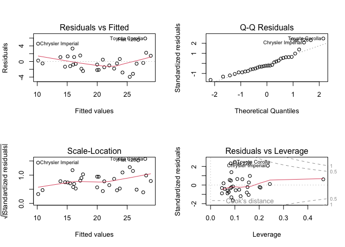

``` r
par(mfrow = c(1, 1))  # reset to single plot layout

# Additional diagnostics
# Check for normality of residuals
shapiro.test(residuals(model2))  # test if residuals are normally distributed
```


        Shapiro-Wilk normality test

    data:  residuals(model2)
    W = 0.93455, p-value = 0.05252

``` r
# Check for multicollinearity (if you have car package)
# vif(model2)  # Variance Inflation Factor - uncomment if car package available
```

### Making Predictions

Once we have a fitted model, we can make predictions:

``` r
# Predict mpg for new data
new_data <- data.frame(wt = c(2.5, 3.0, 3.5),   # create new weight values
                       hp = c(100, 150, 200),     # create new horsepower values
                       cyl = c(4, 6, 8))          # create new cylinder values

predictions <- predict(model2, newdata = new_data)  # generate predictions for new data
predictions
```

           1        2        3 
    25.26408 20.89545 16.52683 

``` r
# Predictions with confidence intervals
predict(model2, newdata = new_data, interval = "confidence")  # predictions with uncertainty bounds
```

           fit      lwr      upr
    1 25.26408 23.67315 26.85500
    2 20.89545 19.92960 21.86131
    3 16.52683 15.01760 18.03605

# Data Visualization with ggplot2

**ggplot2** is one of the most powerful and popular packages for data
visualization in R. It’s based on the “Grammar of Graphics” philosophy,
which builds plots layer by layer.

## Basic ggplot2 Syntax

The basic structure of a ggplot2 command is: -
`ggplot(data, aes(x, y))` - sets up the plot with data and aesthetic
mappings - `+ geom_*()` - adds geometric objects (points, lines, bars,
etc.) - `+ additional layers` - adds titles, themes, etc.

``` r
# Load ggplot2 (already loaded in setup)
library(ggplot2)  # load the ggplot2 package for visualization

# Basic scatter plot
ggplot(data = mtcars, aes(x = wt, y = mpg)) +  # set up plot with data and aesthetics
  geom_point()  # add points to create scatter plot
```

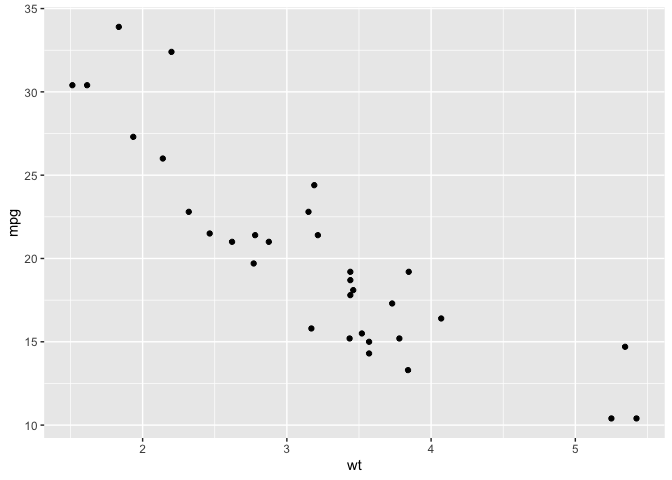

## Common Plot Types

### Scatter Plots

``` r
# Enhanced scatter plot with color and size
ggplot(mtcars, aes(x = wt, y = mpg)) +
  geom_point(aes(color = factor(cyl), size = hp)) +  # map cylinder to color, horsepower to size
  labs(title = "Car Weight vs Fuel Efficiency",      # add descriptive title
       x = "Weight (1000 lbs)",                       # label x-axis
       y = "Miles per Gallon",                        # label y-axis
       color = "Cylinders",                           # label color legend
       size = "Horsepower")                           # label size legend
```


``` r
# Add a regression line
ggplot(mtcars, aes(x = wt, y = mpg)) +
  geom_point() +                                      # add scatter points
  geom_smooth(method = "lm", se = TRUE) +            # add linear regression line with confidence band
  labs(title = "Car Weight vs MPG with Regression Line")  # add title
```


### Bar Charts

``` r
# Bar chart showing count of cars by cylinder
ggplot(mtcars, aes(x = factor(cyl))) +
  geom_bar() +
  labs(title = "Number of Cars by Cylinder Count",
       x = "Number of Cylinders",
       y = "Count")
```


``` r
# Bar chart with means
cyl_summary <- mtcars %>%
  group_by(cyl) %>%
  summarise(mean_mpg = mean(mpg))
```

``` r
# Bar chart showing count of cars by cylinder
ggplot(mtcars, aes(x = factor(cyl))) +
  geom_bar() +                                        # create bar chart counting observations
  labs(title = "Number of Cars by Cylinder Count",   # add descriptive title
       x = "Number of Cylinders",                     # label x-axis
       y = "Count")                                   # label y-axis
```


``` r
# Bar chart with means
cyl_summary <- mtcars %>%
  group_by(cyl) %>%                                   # group data by cylinder count
  summarise(mean_mpg = mean(mpg))                     # calculate mean mpg for each group

ggplot(cyl_summary, aes(x = factor(cyl), y = mean_mpg)) +
  geom_col(fill = "steelblue") +                      # create column chart with specified color
  labs(title = "Average MPG by Cylinder Count",      # add title
       x = "Number of Cylinders",                     # label x-axis
       y = "Average MPG")                             # label y-axis
```


### Histograms and Density Plots

``` r
# Histogram
ggplot(mtcars, aes(x = mpg)) +
  geom_histogram(bins = 10, fill = "lightblue", color = "black") +  # create histogram with 10 bins
  labs(title = "Distribution of Miles per Gallon",                  # add title
       x = "Miles per Gallon",                                      # label x-axis
       y = "Frequency")                                             # label y-axis
```

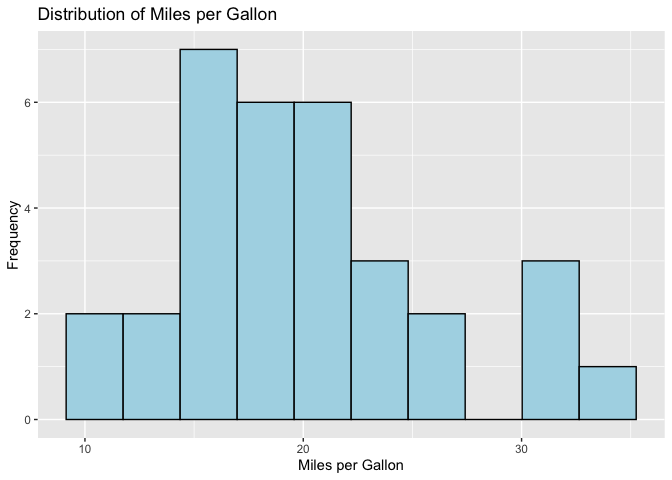

``` r
# Density plot
ggplot(mtcars, aes(x = mpg)) +
  geom_density(fill = "orange", alpha = 0.7) +                     # create density plot with transparency
  labs(title = "Density Plot of Miles per Gallon")                 # add title
```

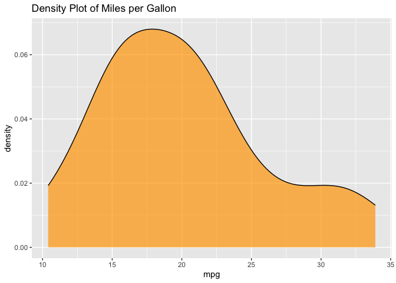

``` r
# Overlapping density plots by group
ggplot(mtcars, aes(x = mpg, fill = factor(cyl))) +
  geom_density(alpha = 0.6) +                                      # create overlapping densities with transparency
  labs(title = "MPG Distribution by Cylinder Count",               # add title
       fill = "Cylinders")                                          # label fill legend
```

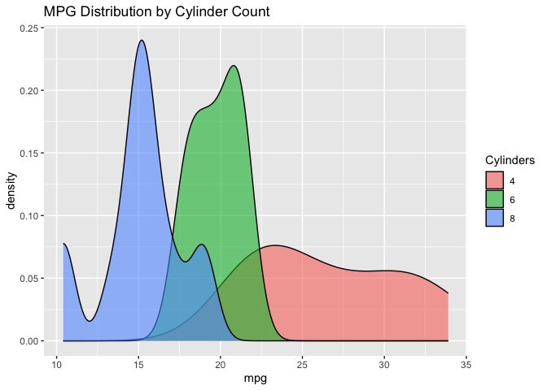

### Box Plots

``` r
# Box plot
ggplot(mtcars, aes(x = factor(cyl), y = mpg)) +
  geom_boxplot(fill = "lightgreen") +                              # create box plot with fill color
  labs(title = "MPG Distribution by Cylinder Count",               # add title
       x = "Number of Cylinders",                                  # label x-axis
       y = "Miles per Gallon")                                     # label y-axis
```

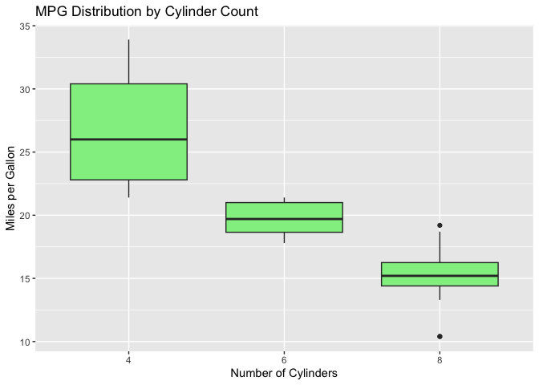

``` r
# Box plot with individual points
ggplot(mtcars, aes(x = factor(cyl), y = mpg)) +
  geom_boxplot(fill = "lightgreen", alpha = 0.7) +                # create semi-transparent box plot
  geom_jitter(width = 0.2, color = "red") +                       # add jittered points to show individual data
  labs(title = "MPG Distribution by Cylinder Count (with data points)")  # add descriptive title
```

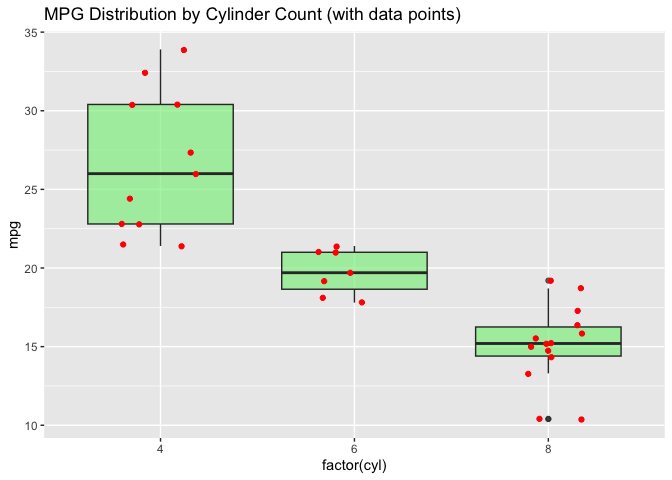

## Customizing Plots

### Themes and Styling

``` r
# Using different themes
p <- ggplot(mtcars, aes(x = wt, y = mpg)) +
  geom_point(aes(color = factor(cyl))) +                          # create base plot with colored points
  labs(title = "Weight vs MPG", color = "Cylinders")              # add labels

# Different theme options
p + theme_minimal()    # apply minimal theme (clean, minimal design)
```

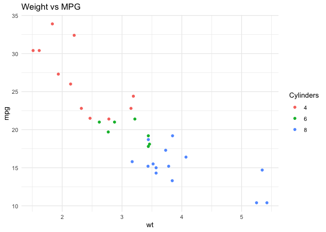

``` r
p + theme_classic()    # apply classic theme (traditional look)
```

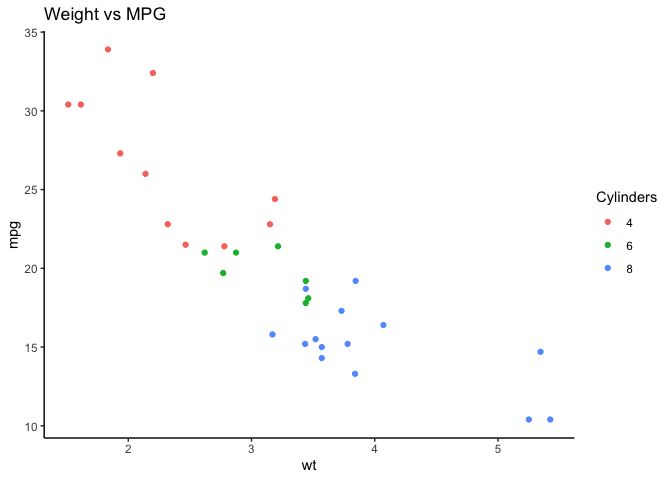

``` r
p + theme_dark()       # apply dark theme (dark background)
```

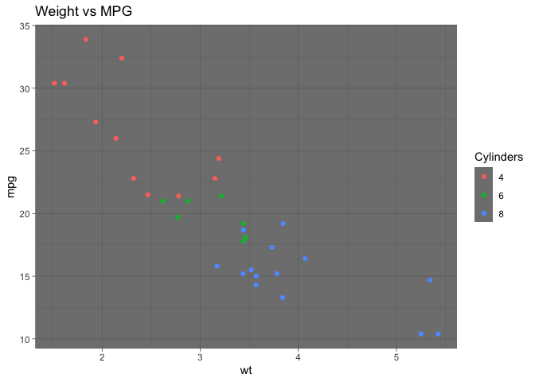

``` r
# Custom theme modifications
p + theme_minimal() +
  theme(plot.title = element_text(size = 16, hjust = 0.5),       # center and resize title
        legend.position = "bottom")                               # move legend to bottom
```

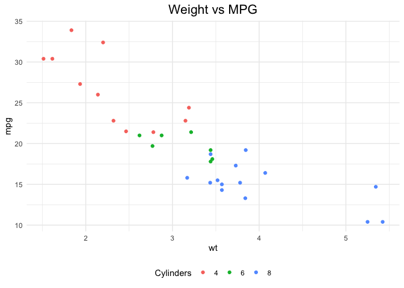

### Faceting (Multiple Panels)

``` r
# Facet by a categorical variable
ggplot(mtcars, aes(x = wt, y = mpg)) +
  geom_point() +                                                  # add scatter points
  geom_smooth(method = "lm", se = FALSE) +                       # add regression line without confidence band
  facet_wrap(~ cyl) +                                            # create separate panels for each cylinder count
  labs(title = "Weight vs MPG by Cylinder Count")                # add title
```

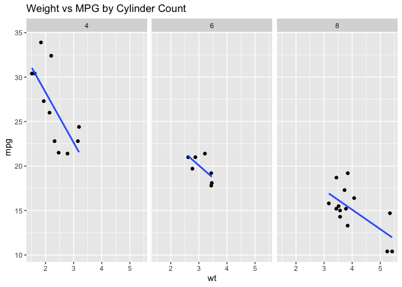

``` r
# Facet grid with two variables
ggplot(mtcars, aes(x = wt, y = mpg)) +
  geom_point() +                                                  # add scatter points
  facet_grid(cyl ~ am) +                                         # create grid: cylinders on rows, transmission on columns
  labs(title = "Weight vs MPG by Cylinders and Transmission")    # add title
```

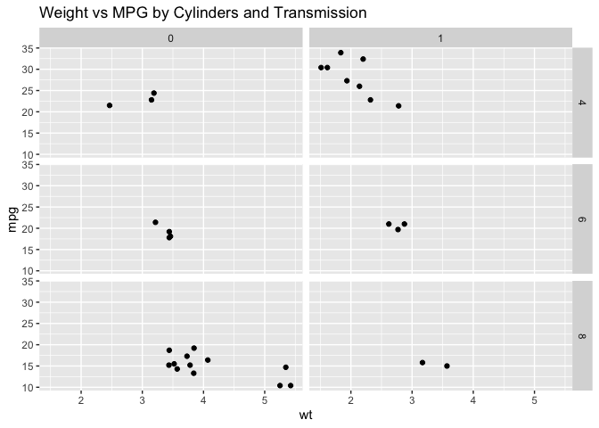

## Working with Text Analysis Data

Let’s apply our visualization skills to text analysis datasets:

``` r
# Create visualizations with our text analysis data
# Bar chart of text sources
ggplot(social_media, aes(x = platform)) +
  geom_bar(fill = "steelblue") +                                  # count posts by platform with blue bars
  labs(title = "Number of Posts by Platform",                    # add title
       x = "Platform",                                            # label x-axis
       y = "Number of Posts")                                     # label y-axis
```


``` r
# Histogram of word counts
ggplot(social_media, aes(x = word_count)) +
  geom_histogram(bins = 15, fill = "lightcoral", color = "black") +  # create histogram of word counts
  labs(title = "Distribution of Word Counts in Posts",               # add title
       x = "Word Count",                                              # label x-axis
       y = "Frequency")                                               # label y-axis
```


``` r
# Box plot of engagement by platform
ggplot(social_media, aes(x = platform, y = engagement)) +
  geom_boxplot(fill = "lightblue") +                              # create box plots for engagement by platform
  labs(title = "Engagement Distribution by Platform",             # add title
       x = "Platform",                                            # label x-axis
       y = "Engagement")                                          # label y-axis
```


``` r
# Scatter plot: word count vs engagement
ggplot(social_media, aes(x = word_count, y = engagement)) +
  geom_point(aes(color = platform)) +                            # scatter plot with points colored by platform
  geom_smooth(method = "lm", se = FALSE) +                       # add overall trend line
  labs(title = "Word Count vs Engagement by Platform",           # add title
       x = "Word Count",                                          # label x-axis
       y = "Engagement",                                          # label y-axis
       color = "Platform")                                        # label color legend
```


``` r
# Faceted analysis by topic category
ggplot(social_media, aes(x = word_count, y = engagement)) +
  geom_point(aes(color = platform)) +                            # scatter plot with platform colors
  facet_wrap(~ topic_category) +                                 # separate panels for each topic
  labs(title = "Word Count vs Engagement by Topic Category",     # add title
       x = "Word Count",                                          # label x-axis
       y = "Engagement",                                          # label y-axis
       color = "Platform")                                        # label color legend
```


## Text-Specific Visualizations

``` r
# Word frequency visualization
word_freq_df <- data.frame(
  word = names(word_frequencies),                                 # extract word names from frequency table
  frequency = as.numeric(word_frequencies)                       # convert frequencies to numeric
) %>%
  arrange(desc(frequency)) %>%                                    # sort by frequency (highest first)
  head(10)                                                        # keep only top 10 words

ggplot(word_freq_df, aes(x = reorder(word, frequency), y = frequency)) +
  geom_col(fill = "darkgreen") +                                  # create column chart with green bars
  coord_flip() +                                                  # flip coordinates for horizontal bars
  labs(title = "Top 10 Most Frequent Words",                     # add title
       x = "Word",                                                # label x-axis (now vertical due to flip)
       y = "Frequency")                                           # label y-axis (now horizontal due to flip)
```


``` r
# Character count distribution by platform
ggplot(social_media, aes(x = char_count, fill = platform)) +
  geom_histogram(alpha = 0.7, position = "identity", bins = 20) +  # overlapping histograms with transparency
  facet_wrap(~ platform) +                                         # separate panels for each platform
  labs(title = "Character Count Distribution by Platform",         # add title
       x = "Character Count",                                       # label x-axis
       y = "Frequency",                                             # label y-axis
       fill = "Platform")                                           # label fill legend
```


``` r
# Topic category distribution
topic_counts <- social_media %>%
  count(topic_category, sort = TRUE)                               # count posts by topic and sort

ggplot(topic_counts, aes(x = reorder(topic_category, n), y = n)) +
  geom_col(fill = "purple", alpha = 0.7) +                        # create column chart with purple bars
  coord_flip() +                                                   # flip for horizontal bars
  labs(title = "Distribution of Posts by Topic Category",         # add title
       x = "Topic Category",                                       # label x-axis
       y = "Number of Posts")                                      # label y-axis
```


## Saving Plots

``` r
# Save the last plot
ggsave("my_plot.png", width = 8, height = 6, dpi = 300)  # save most recent plot as PNG

# Save a specific plot
p <- ggplot(mtcars, aes(x = wt, y = mpg)) + geom_point()  # create and store plot object
ggsave("scatter_plot.pdf", plot = p, width = 10, height = 8)  # save specific plot as PDF

# Save text analysis plot
text_plot <- ggplot(social_media, aes(x = platform, y = engagement)) +  # create text analysis plot
  geom_boxplot(fill = "lightblue") +
  labs(title = "Engagement by Platform")

ggsave("engagement_by_platform.png", plot = text_plot, width = 8, height = 6)  # save with custom dimensions
```

# Final notes

Your R skills for text analysis will develop as you practice. Text
analysis can be challenging because it requires understanding both
programming concepts and linguistic patterns. Patience is the key. Many
times you will encounter upsetting errors and problems, especially when
dealing with messy real-world text data. At these times it is useful to
look out for help.

R packages for text analysis have extensive vignettes and documentation.
Key packages to explore further include: - **stringr**: for string
manipulation and pattern matching - **tidytext**: for tidy text analysis
workflows  
- **tm**: traditional text mining package - **quanteda**: quantitative
analysis of textual data - **textdata**: access to text datasets and
sentiment lexicons - **wordcloud**: for creating word clouds -
**topicmodels**: for topic modeling

You can access package documentation from the help pages or by simply
googling or querying ChatGPT or Claude about different functions.

Keep in mind it is very likely that some other person encountered in the
past the same text analysis challenge you are struggling with. You will
be surprised about the specificity and variety of the solutions you can
find by asking AI, and there is a variety of possibilities for
customization of code for a huge variety of tasks and in a diverse and
comprehensive collection of coding languages.

# References

For further training in text analysis with R, excellent resources
include:

- **Text Mining with R** by Julia Silge and David Robinson (free online
  book)
- **Quantitative Social Science** by Kosuke Imai (includes text analysis
  chapters)
- **An Introduction to Statistical Learning** by James, Witten, Hastie,
  and Tibshirani
- RStudio Education resources and cheat sheets
- Various text analysis tutorials and workshops available online

Key takeaways from today: - Text data requires special handling and
cleaning before analysis - R provides powerful tools for string
manipulation and pattern matching - Data frames are ideal for storing
text datasets with metadata - Logical expressions are essential for
filtering text based on content - The `stringr` package is indispensable
for text processing - Regular expressions (regex) are powerful for
pattern matching in text - Statistical analysis and visualization are
crucial for understanding text data patterns - ggplot2 provides
excellent tools for visualizing text analysis results - Practice with
real text data is essential for mastering these skills

Wish you all best of luck with your text analysis journey!

This intro to R walkthrough has benefited from tutorials written by
Mehmet Arslan for the Essex Summer School in 2022. All errors are mine.
