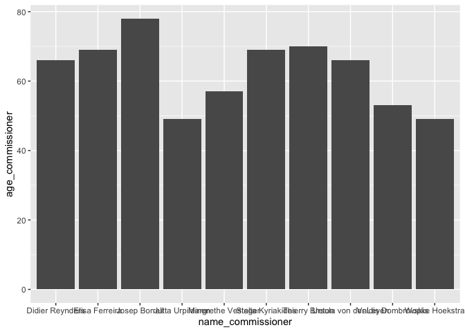
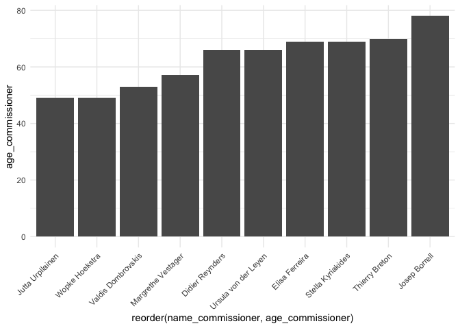

# QTA Lab Session 1 – Introduction to R. Text as an object in R


## Introduction

In order to analyze text, we will use the `R` statistical language, a
versatile tool for doing all sorts of analyses, whether it is
statistical analysis, text analysis, or otherwise.

Today, you’ll get hands-on practice using R. You’ll learn how to create
and manipulate different types of objects, and how to use functions to
work with them. It will not be possible to cover everything in one
session, but you will get acquainted with some basics. If you have never
used R before, I strongly recommend you participate in the R crash
course that James organizes this afternoon.

To work with `R`, we will use `RStudio`, a graphical user interface
(GUI) that makes coding in R easier and more organized. The RStudio
interface is typically divided into four panels:

- The Console panel (lower-left) is where you type and run your R
  commands.

- The Script panel (upper-left) is used to write and save code in
  files—such as .R or .qmd files—which you can run line by line in the
  Console.

- The Environment panel shows the objects (like variables and datasets)
  you’ve created during your R session.

- The fourth panel, a Plots/Files/Help/Viewer panel, displays additional
  outputs like plots, file directories, help documentation, and web
  previews.


`R` can serve many different purposes. For instance, we can use R as a
calculator. Give it a try by typing the following commands in the
`Console`.

**NB**: in these documents, you have to type in the commands appearing
in the grey blocks (the blocks are so called `code blocks`). Within
these code snippets, the `#` symbol is used to denote comments. Comments
are not executed by `R`, but are there to help you understand what the
code does. You can run the code in a line by pressing `Ctrl + Enter` or
by clicking on the `Run` button in the `Console` panel.

``` r
#addition
2+2
```

    [1] 4

``` r
#exponentiation
3**2 
```

    [1] 9

``` r
#subtraction
4-5
```

    [1] -1

``` r
3+2
```

    [1] 5

``` r
3-2
```

    [1] 1

See, for example,
[here](http://mercury.webster.edu/aleshunas/R_learning_infrastructure/Using%20R%20as%20a%20calculator.html)
for more on `R` as a calculator.

You can also do conduct more advanced operations, such as taking the
mean of two numbers, or finding the median of three numbers. For this we
use the `mean()` function, and the `median()` function respectively.

`R` contains a lot of functions like this. Functions in `R` are denoted
with parentheses (). What’s goes in these parentheses is the argument
(or the arguments) that the function is being applied to. When using a
function, you have to make sure that the arguments are of the right
type. For example, the `mean()` function requires a numerical argument.

We can also create a so-called `vector` of numbers using the `c()`
function (which stands for concatenate). A vector is just a row of
observations of the same data type.

For example, `c(2,4)` is just a vector of numbers 2 and 4.
`c("A", "B", "F")` is a vector of three capitalized letters.
`c("John", "Paul", "George", "Ringo")` is a vector with the first names
of the Beatles. And so on.

In `R`, data can come in different types, and it’s important to
understand these types because they determine what kind of operations
you can perform. The most common data types include:

- **Numeric**: These are real numbers, such as 3.14, -7, or 100. Most
  numbers in `R` default to this type.

- **Integer**: Whole numbers (without decimals), like 1, 42, or -10. You
  can explicitly create them using the L suffix (e.g., 10L).

- **Factor**: Categorical data, which can be ordered or unordered. For
  example, “low”, “medium”, “high” or “red”, “green”, “blue”. Factors
  are useful for statistical modeling and plotting.

- **Character**: These are text values, also called strings, such as
  “apple”, “EU policy”, or “2025”.

- **Logical**: These represent boolean values: TRUE or FALSE. They’re
  often used in comparisons or filtering.

- **Date**: R has a special data type to represent calendar dates (e.g.,
  as.Date(“2025-07-05”)).

Functions in R often expect certain types as input. You can check the
type of any object using the `class()` or `typeof()` functions.

The functions we use in `R` can only be applied to certain types of
data.For example, the `mean()` function can only be applied to numerical
data, while the `str_to_upper()` function from the `stringr` library can
only be applied to character data.

Knowing the type helps you avoid errors and better understand how your
data behaves.

``` r
#take the mean of 2 and 4
mean(c(2,4))
```

    [1] 3

``` r
#take the median (the middle value) of 2, 4 and 100
median(c(2, 4, 100))
```

    [1] 4

We can create objects in `R` using the assignment operator (`<-`). For
example, let’s create an object `x` which is a vector of the numbers 2,
3 and 10. On a Windows computer, the shortcut for the assignment
operator is `Ctrl + Alt + -` (the minus sign), while on a Mac it is
`Option + -`.

``` r
x <- c(2,3,10)
```

This is useful, because we can now take the mean of `x`:

``` r
mean(x)
```

    [1] 5

Check the `Environment` panel. It now contains the object `x` and you
can use it for all kinds of operations.

We can also create an object called Beatles with the first names of the
Beatles members.

``` r
beatles <- c("John", "Paul", "George", "Ringo")
```

What happens if we take the mean of the beatles object?

``` r
#mean(beatles)
```

The output is `NA`, which is `R` speak for a missing value, which makes
sense, because taking the mean requires numerical input. The mean of a
set of names does not exist.

**Question**: Write some code to find the mean of the numbers 4, 5, 6
and 7 and call it y. The calculate x + y. What is the output you get?
Why is this?

``` r
y <- c(4,5,6,7)
x+y
```

    [1]  6  8 16  9

``` r
#your answer here
```

Now let’s try to take the square root of x using the `squareroot()`
function.

``` r
#squareroot(x)
```

This will throw an error saying that the function `squareroot` is not
found. This is because the function `squareroot` does not exist, unless
we define it ourselves. In base R, the function is called `sqrt`.

``` r
sqrt(x)
```

    [1] 1.414214 1.732051 3.162278

Steps to decode the error message:

1)  Read the error carefully: The error message clearly states that the
    function “squareroot” could not be found. This is a hint that there
    might be a typo or a misunderstanding about the function’s name.

2)  check for typos: The first step should be to check for typos in the
    function name. R functions are case-sensitive and must be spelled
    exactly as defined in R or any packages you are using.

3)  Reference the documentation: If the spelling seems correct or if you
    are unsure about the function’s existence, reference the R
    documentation or look it up online. For R, you can use the help()
    function or ? followed by the function name to check if it’s a valid
    function, like so

``` r
?sqrt

help(sqrt)
```

## Packages

So far you have used some functions that are built-in to `R` (base R).
However, a lot of the functionality of `R` comes from using so-called
`packages`. These packages contain all kinds of functions and objects to
do particular analyses in `R`. They are under continuous development by
active users of `R` who use the language to do particular types of
analyses. By using these packages you can build on their work.

**NB**: it’s good practice to cite a package you have used for your data
analysis. If you don’t know how to cite a package, just type
citation(package = “here”) in the console, replacing “here” with name of
the package you have used.

Today we will use 3 packages: `quanteda`, `ggplot2` and `stringr`. These
packages will allow us to do various cool things in `R`

For example `quanteda` is a library that contains functions related to
quantitative text analysis. In order to use the functions in these
libraries, you will need to 1) install them, using the
`install.packages()` function, and 2) load them using the `library()`
function.

Let’s install them first (you only need to do this once, after that you
can load the library using the `library()` function. In order to use the
`install.packages()` function, you need to remove the `#` symbol in
front of the function.

``` r
#install.packages("quanteda")
#install.packages("stringr")
#install.packages("ggplot2")
```

Let’s load the packages we need. You can do this by typing in the
`library()` function with the name of the package you want to load.

Keep in mind that you need to **install the packages only once**, but
you need to **load them every time you start a new `R` session**.

``` r
library(quanteda)
library(stringr)
library(ggplot2)
```

## Text as (character) data

**So what this have to do with quantitative text analysis?**

Well, text can be read into `R` as a character object or character
vector, which we can examine using various functions available to us in
the various packages.

But before we get to that, let’s keep things simple first. Let’s say we
have a `vector` with recent European Commissioners. Let’s call this
string `commissioners`.

``` r
# Define the vector with the names of European Commissioners

commissioners <- c(
  "Ursula von der Leyen", "Wopke Hoekstra", "Margrethe Vestager", 
  "Valdis Dombrovskis", "Josep Borrell", "Stella Kyriakides", 
  "Didier Reynders","Jutta Urpilainen", "Elisa Ferreira", "Thierry Breton"
)

# Print the vector to confirm its contents
print(commissioners)
```

     [1] "Ursula von der Leyen" "Wopke Hoekstra"       "Margrethe Vestager"  
     [4] "Valdis Dombrovskis"   "Josep Borrell"        "Stella Kyriakides"   
     [7] "Didier Reynders"      "Jutta Urpilainen"     "Elisa Ferreira"      
    [10] "Thierry Breton"      

To access individual Commissioners in this `commissioners` vector, we
can use square brackets. For example, if we type in `commissioners[1]`,
`R` will return the content of first element of `commissioners`, if we
type in `commissioners[5],`R\` will return the 5th element of
commissioners. Just try it out.

``` r
commissioners[1]
```

    [1] "Ursula von der Leyen"

``` r
commissioners[5]
```

    [1] "Josep Borrell"

Let’s inspect the type of the `commissioners` object. We can do this
using the `class()` function, which tells us what type of object we are
dealing with. In this case, we expect it to be a character vector, since
it contains names of Commissioners:

``` r
class(commissioners)
```

    [1] "character"

When data is of type character, we can use the `stringr()` library for
some useful functions. For example, in for some reason we want to have
the commissioner names in all caps, we can use the `str_to_upper()`
function from the `stringr` library

``` r
str_to_upper(commissioners)
```

     [1] "URSULA VON DER LEYEN" "WOPKE HOEKSTRA"       "MARGRETHE VESTAGER"  
     [4] "VALDIS DOMBROVSKIS"   "JOSEP BORRELL"        "STELLA KYRIAKIDES"   
     [7] "DIDIER REYNDERS"      "JUTTA URPILAINEN"     "ELISA FERREIRA"      
    [10] "THIERRY BRETON"      

``` r
str_to_lower(commissioners)
```

     [1] "ursula von der leyen" "wopke hoekstra"       "margrethe vestager"  
     [4] "valdis dombrovskis"   "josep borrell"        "stella kyriakides"   
     [7] "didier reynders"      "jutta urpilainen"     "elisa ferreira"      
    [10] "thierry breton"      

**Question**: how would you create a vector with all string characters
lower cased? If you don’t know, google `stringr` and `lowercasing`.
Figure out want function you would need to use.

``` r
#your answer here
```

We can also count the length of the vector elements:

``` r
str_count(commissioners)
```

     [1] 20 14 18 18 13 17 15 16 14 14

**Question**: Ursula Von der Leyen has 17 letters but the `str_count`
function returns 20 Why is that?

We order the elements of a string vector using the `str_sort()`:

``` r
str_sort(commissioners, decreasing = TRUE)
```

     [1] "Wopke Hoekstra"       "Valdis Dombrovskis"   "Ursula von der Leyen"
     [4] "Thierry Breton"       "Stella Kyriakides"    "Margrethe Vestager"  
     [7] "Jutta Urpilainen"     "Josep Borrell"        "Elisa Ferreira"      
    [10] "Didier Reynders"     

``` r
str_sort(commissioners, decreasing = FALSE)
```

     [1] "Didier Reynders"      "Elisa Ferreira"       "Josep Borrell"       
     [4] "Jutta Urpilainen"     "Margrethe Vestager"   "Stella Kyriakides"   
     [7] "Thierry Breton"       "Ursula von der Leyen" "Valdis Dombrovskis"  
    [10] "Wopke Hoekstra"      

We can also detect the presence or absence of a pattern in a string.
This returns a logical vector for which elements are TRUE when a pattern
is detected, and false when a pattern is not detected. For example, we
can ask `R` which commissionsers have an `ll` in them:

``` r
str_detect(commissioners, "ll")
```

     [1] FALSE FALSE FALSE FALSE  TRUE  TRUE FALSE FALSE FALSE FALSE

**Question**: Write some code to detect whether the sequence `rr` occurs
in any of the names in the `commissioners` vector.

``` r
#your answer here
```

**Bonus question**: Use the `str_replace()` function to replace the
sequence `l` with `xx`. The syntax of this function is slightly
different from these earlier functions. Use Google to try and figure out
how it works.

``` r
#your answer here
```

## Dataframes

A different object in `R` is a so called dataframe. Dataframes are data
displayed in tabular format. Dataframes can have different types of data
inside them, but they are all of the same length. For examople, while
the first column can be character, the second and third can be numeric
or logical. This is different from other objects, such as a `matrix`
which can only contain one particular object type.

In order to create a dataframe we can use the \`data.frame()’ function.

Let’s take the age of these commissioners. We’ll put this data in a
numerical variable called age.

``` r
age <- c(66, 49, 57, 53, 78, 69, 66, 49, 69, 70)
```

We can now use the data.frame() to create a dataframe, which we’ll call
data. This dataframe has two variables: the name of the commissioner
(`name_commissioner`) and their age (`age_commissioner`).

``` r
data <- data.frame(name_commissioner = commissioners, 
                   age_commissioner = age)
print(data)
```

          name_commissioner age_commissioner
    1  Ursula von der Leyen               66
    2        Wopke Hoekstra               49
    3    Margrethe Vestager               57
    4    Valdis Dombrovskis               53
    5         Josep Borrell               78
    6     Stella Kyriakides               69
    7       Didier Reynders               66
    8      Jutta Urpilainen               49
    9        Elisa Ferreira               69
    10       Thierry Breton               70

Now that we have the data in this format, we can plot it. We’ll use the
`ggplot()` function from the `ggplot2` package to create a plot (which
is another object in `R`). Since we already loaded it in memory we can
use its functions. Let’s create a bar plot using the `geom_bar()`
function from ggplot.

The following code creates a bar plot with the names of the
commissioners on the x-axis and their ages on the y-axis. The
`stat = "identity"` argument tells ggplot that we want to use the actual
values in the data, rather than counting occurrences. The `aes()`
function is used to specify the aesthetics of the plot, such as the x
and y axes.

NB: No worries if you don’t yet understand this syntax – this is a
practice exercise.

``` r
plot <- ggplot(data = data, 
               aes(x = name_commissioner, y = age_commissioner)) +
  geom_bar(stat= "identity")

print(plot)
```



Let’s make this plot a bit nicer by adding a theme. The
`theme_minimal()` function adds a minimal theme to the plot, which makes
it look cleaner and more visually appealing. There are many different
themes available in ggplot2, and you can choose the one that best fits
your preferences.

``` r
plot <- ggplot(data = data, aes(x = name_commissioner, 
                                y = age_commissioner)) +
  geom_bar(stat= "identity") +
  theme_minimal() 
print(plot)
```


We’ll make this plot even nicer by rotating the x-axis labels.

``` r
plot <- ggplot(data = data, aes(x = name_commissioner, 
                                y = age_commissioner)) +
  geom_bar(stat= "identity") +
  theme_minimal() +
  theme(axis.text.x = element_text(angle = 45, hjust = 1))

print(plot)
```


Now we will order the commissioners by age. We can do this by using the
`reorder()` function. This function allows us to reorder the x-axis
based on the values of the y-axis.

``` r
plot <- ggplot(data = data, aes(x = reorder(name_commissioner, age_commissioner), 
                                y = age_commissioner)) +
  geom_bar(stat= "identity") +
  theme_minimal() +
  theme(axis.text.x = element_text(angle = 45, hjust = 1))

print(plot)
```



**Question** How would you make this plot nicer? What aspects would you
change?

In a last step, we’ll save this plot as a PNG file. We can do this using
the `ggsave()` function. This function saves the last plot created in
the current R session to a file in the current working directory.

``` r
#| label: "ggsave"
#| echo: true
#| message: false
#| warning: false

ggsave("commissioners_plot.png", plot = plot, width = 10, height = 6)
```

## Practice excercises

1)  Create a character vector of countries (in the same order as
    `commissioners`) and call this vector `countries`. Append this
    variable to the `data` object as a new variable.

``` r
countries <- c("Germany", "Netherlands", "Denmark", "Latvia", "Spain", "Greece", "Belgium", "Finland", "Portugal", "France")
  
data <- cbind(data, countries)
```

2)  Look up some data on these countries that you find interesting.
    Perhaps their GDP per capita or something else. Plot this
    information using the ggplot code above.

``` r
gdp <- c(45000, 50000, 60000, 30000, 35000, 25000, 40000, 45000, 20000, 50000)

data <- cbind(data, gdp)

plot <- ggplot(data = data, aes(x = reorder(countries, gdp), 
                                y = gdp)) +
  geom_bar(stat= "identity") +
  theme_minimal() +
  theme(axis.text.x = element_text(angle = 45, hjust = 1))

print(plot)
```


