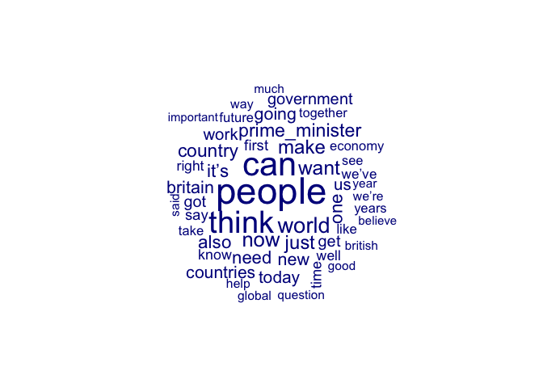
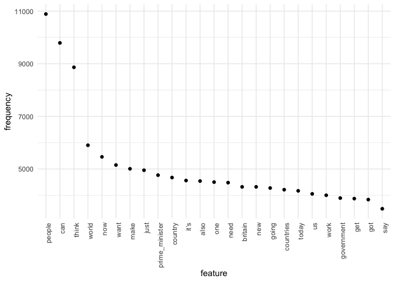
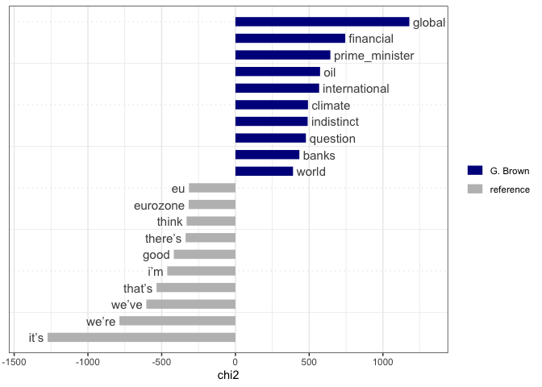
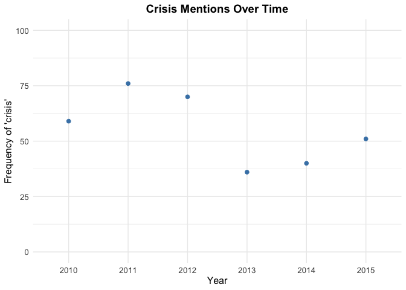

# QTA Lab Session 3: Reading in text data. Inspecting a dfm.


In this document we will go through the steps of going from raw texts to
a document term matrix that can be analyzed.

## Load libraries

``` r
library(quanteda)
library(stringr)
library(quanteda.textstats)
library(quanteda.textplots)
library(tidyverse)
```

## Reading in data

Let’s take a look a set of UK prime minister speeches from the
[EUSpeech](https://dataverse.harvard.edu/dataverse/euspeech) dataset.

Read in the speeches as follows using the `read.csv()` function from
base `R`:

``` r
speeches <- read.csv(file = "speeches_uk.csv", 
                     header = TRUE, 
                     stringsAsFactors = FALSE, 
                     sep = ",", 
                     encoding = "UTF-8")
```

This `read.csv()` call tells `R` that:

- the file is called “speeches_uk.csv”
- the first row contains the column names
- the columns are separated by commas
- the encoding is UTF-8
- we don’t want to turn strings into factors, which is a different data
  type in `R` that is not useful for text analysis but rather for
  categorical variables.

Let’s take a look at the structure of this dataset:

``` r
str(speeches)
```

    'data.frame':   787 obs. of  6 variables:
     $ id     : int  1 2 3 4 5 6 7 8 9 10 ...
     $ text   : chr  "<p>This European Council has focused on 3 issues – the UK renegotiation, migration and terrorism.</p><p>I talke"| __truncated__ "<p>Thank you Prime Minister for welcoming me here to Warsaw.</p><p>It is an honour to be the first leader to ma"| __truncated__ "<p>Thank you President Iohannis for welcoming me to Bucharest today. It’s a pleasure to be here and to have had"| __truncated__ "<p>This is a government that delivers</p><p>Thank you very much for that brief introduction. It’s great to be h"| __truncated__ ...
     $ title  : chr  "EU Council: PM press conference" "PM statement in Poland: 10 December 2015" "PM statement on talks in Romania, 9 December 2015" "PM Speech: This is a government that delivers" ...
     $ date   : chr  "18-12-2015" "10-12-2015" "09-12-2015" "07-12-2015" ...
     $ country: chr  "Great Britain" "Great Britain" "Great Britain" "Great Britain" ...
     $ speaker: chr  "D. Cameron" "D. Cameron" "D. Cameron" "D. Cameron" ...

As you can see, the corpus contains 787 speeches and variables
containing meta data like speaker, country, date, etc. We’ll add a
variable year that we construct from the date variable. The date
variable is currently in the format “dd-mm-yyyy”, so we first rely on
`as.Date()` to turn this in a date variable. We can then use the
`format()` function to extract the year from it.

``` r
speeches$year <- format(as.Date(speeches$date, format = "%d-%m-%Y"), "%Y")
```

Take a look at a few speeches. Let’s do some very light cleaning on
these speeches, using the `stringr` library, in particular the
`str_replace_all()` we learned about yesterday.

``` r
#remove html tags
speeches$text <- str_replace_all(speeches$text, "<.*?>", " ")

#replace multiple white spaces with a single white space
speeches$text <- str_squish(speeches$text)

#we'll lowercase the text, so that we don't have to deal with case sensitivity later on
speeches$text <- tolower(speeches$text)
```

Our speeches object is currently a dataframe. To be able to apply
functions in `quanteda` on this object it needs to recognize it as a
corpus object. To do this we can use the `corpus()` function. We point
to the `text` variable in the dataframe that contains the text data
using the `text_field` argument. By default the text_field argument
assumes that the text data is stored in a variable called “text”. If
this is not the case, you need to specify the name of the variable that
contains the text data.

``` r
corpus_speeches <- corpus(speeches, 
                          text_field = "text")

#the ndoc function displays the number of documents in the corpus
ndoc(corpus_speeches)
```

    [1] 787

Metadata such as speaker, date, etc. are stored in a corpus object as
docvars, and can be accessed like so (we’ll use the `head()` function to
limit the output):

``` r
#date
head(docvars(corpus_speeches, "date"), 10)
```

     [1] "18-12-2015" "10-12-2015" "09-12-2015" "07-12-2015" "07-12-2015"
     [6] "01-12-2015" "28-11-2015" "23-11-2015" "19-11-2015" "16-11-2015"

``` r
#speaker
head(docvars(corpus_speeches, "speaker"), 10)
```

     [1] "D. Cameron" "D. Cameron" "D. Cameron" "D. Cameron" "D. Cameron"
     [6] "D. Cameron" "D. Cameron" "D. Cameron" "D. Cameron" "D. Cameron"

``` r
#number of speeches per speaker

table(docvars(corpus_speeches, "speaker"))
```


    D. Cameron   G. Brown   T. Blair 
           493        283         11 

Let’s tokenize this corpus. We’ll use the argument `padding=TRUE` to
leave an empty string where the removed tokens previously existed. This
is useful if a positional match is needed between the pre- and
post-selected tokens, for instance if collocations need to be computed.
We’ll also remove punctuation, symbols, URLs, and separators. We will
not remove numbers, as we may want to keep them for some analyses. We’ll
also group the tokens by speaker, so that we can later construct a dfm
that contains the speeches of each speaker as a separate document.

``` r
tokens_speech <- corpus_speeches %>%
  tokens(what = "word",
         remove_punct = TRUE, 
         padding = TRUE,
         remove_symbols = TRUE, 
         remove_numbers = FALSE,
         remove_url = TRUE,
         remove_separators = TRUE,
         split_hyphens = FALSE) %>%
  tokens_remove(stopwords("en"))
```

Let’s check the most occurring collocations (this may take a few
seconds) that occur 10 times or more. In order to speed things up, we
can sample a subset of the tokens object by using the `tokens_sample()`
function. We’ll use the `min_count` argument to specify that we only
want collocations that occur at least 10 times. The lambda statistic is
a measure of the strength of the collocation, with higher values
indicating stronger collocations.

``` r
collocations <- tokens_speech %>%
  #tokens_sample(size = 10, replace = FALSE) %>%
  textstat_collocations(min_count = 10) %>%
  arrange(-lambda)

head(collocations, 10)
```

           collocation count count_nested length   lambda         z
    4244    anita rani    56            0      2 18.35496 11.202953
    5063     sinn fein    13            0      2 18.02206  8.928733
    5079   magna carta    12            0      2 17.94510  8.884145
    4422  sierra leone    25            0      2 17.55942 10.674700
    4509    konnie huq    18            0      2 17.23852 10.451002
    4645     hong kong    11            0      2 16.76310 10.101877
    4666 amy winehouse    10            0      2 16.67213 10.031981
    4333   rolls royce    24            0      2 16.42080 10.915618
    4177      al qaeda   180            0      2 16.22048 11.383895
    4464   lashkar gah    15            0      2 16.21429 10.576518

If we want to add the most occurring collocations to the tokens object,
we can use the `tokens_compound()` function. Before being able to use
this we need to reorganise the collocations object so that it becomes a
list of collocations. We can do this by filtering the collocations that
occur at least 10 times, pulling the `collocation` column, and then
converting it to a phrase object using the `phrase()` function.

``` r
collocations <- collocations %>%
  filter(lambda > 10) %>%
  pull(collocation) %>%
  phrase()

tokens_speech <- tokens_compound(tokens_speech, collocations)

ndoc(tokens_speech)
```

    [1] 787

We’ll remove the empty strings that were created by the padding argument
in the `tokens()` function. This is done using the `tokens_remove()`
function, which removes tokens that match a certain pattern. In this
case, we want to remove empty strings.

``` r
tokens_speech <- tokens_remove(tokens_speech, "")
```

Now let’s construct a dfm from this tokens object. We’ll group this by
speaker.

``` r
speeches_dfm_speaker <- dfm(tokens_speech) %>%
  dfm_group(groups = docvars(., "speaker"))
```

It’s straightforward in **quanteda** to inspect a dfm. For example, the
`topfeatures()` function displays the most occurring features:

``` r
topfeatures(speeches_dfm_speaker, 20)
```

            people            can          think          world            now 
             10889           9791           8865           5901           5460 
              want           make           just prime_minister        country 
              5150           5006           4953           4765           4673 
              it’s           also            one           need        britain 
              4561           4541           4501           4480           4320 
               new          going      countries          today             us 
              4320           4276           4212           4170           4054 

You can check the number of features in the dfm using the dim()
function:

``` r
dim(speeches_dfm_speaker)
```

    [1]     3 26589

There are over 26,000 features in this dfm. Let’s select those tokens
that appear at least 10 times by using the `dfm_trim()` function

``` r
speeches_dfm_speaker = dfm_trim(speeches_dfm_speaker, min_termfreq = 10)
dim(speeches_dfm_speaker)
```

    [1]    3 6938

As you can see, this reduces the size of the dfm considerably. However,
be mindful that applying such arbitrary cutoffs may remove meaningful
features.

*NB:* Because most words don’t occur in most documents, a dfm often
contains many zeroes (sparse). Internally, `quanteda` stores the dfm in
a sparse format, which means that the zeroes are not stored, so you can
create a dfm of many documents and many words without running into
memory problems.

## Visualization in **quanteda**

**quanteda** contains some very useful functions to plot your corpus in
order get a feel for what is going on. For example, it is easy to
construct a wordcloud to see which features appear most often in your
corpus.

``` r
textplot_wordcloud(speeches_dfm_speaker, max_words=50)
```



A slightly more informative frequency plot can be constructed as follows
(using the **ggplot2** library):

``` r
speeches_dfm_features <- textstat_frequency(speeches_dfm_speaker, n = 25)

# Sort by reverse frequency order
speeches_dfm_features$feature <- with(speeches_dfm_features, reorder(feature, -frequency))

ggplot(speeches_dfm_features, aes(x = feature, y = frequency)) +
    geom_point() + theme_minimal() + 
    theme(axis.text.x = element_text(angle = 90, hjust = 1))
```



*NB* **ggplot2** is a really nice library for making plots and figures.
If you have some time after this course is over, I strongly recommend
Kieran Healy’s [book](https://socviz.co/) on Data Visualization for
learning more about effective data viz.

Let’s say we are interested in which words are spoken relatively more
often by David Cameron than by Tony Blair and Gordon Brown. For this we
can use `textstat_keyness()` and `textplot_keyness()` functions.

``` r
head(textstat_keyness(speeches_dfm_speaker, target = "G. Brown"), 10)
```

              feature      chi2 p n_target n_reference
    1          global 1179.0045 0     2001         710
    2       financial  744.6062 0     1129         351
    3  prime_minister  643.6608 0     2832        1933
    4             oil  573.8752 0      677         143
    5   international  567.3980 0     1356         652
    6         climate  491.8563 0      685         190
    7      indistinct  489.6562 0      393          21
    8        question  477.7632 0     1653        1003
    9           banks  433.3753 0      795         305
    10          world  390.5158 0     3187        2714

``` r
textplot_keyness(textstat_keyness(speeches_dfm_speaker, target = "G. Brown"), n = 10)
```



In a next step, let’s focus on just the speeches of David Cameron. We
can do this by subsetting the dfm using the `dfm_subset()` function.
We’ll group the dfm by year.

``` r
speeches_dfm_year_cameron <- dfm(tokens_speech) %>%
  dfm_subset(speaker == "D. Cameron") %>%
  dfm_group(groups = docvars(., "year"))


dim(speeches_dfm_year_cameron)
```

    [1]     6 26589

Let’s inspect how often Cameron referred to crisis on a year to year
basis. For this group the ‘crisis’ feature in the dfm by the year
variable in the docvars

``` r
docvars(speeches_dfm_year_cameron, "crisis") <- as.numeric(speeches_dfm_year_cameron[,"crisis"])
```

Let’s plot the crisis variable against the year variable

``` r
df <- docvars(speeches_dfm_year_cameron)

crisis_plot <- ggplot(df, aes(x = year, y = crisis)) +
  geom_point(color = "steelblue", size = 2) +
  labs(title = "Crisis Mentions Over Time",
       x = "Year",
       y = "Frequency of 'crisis'") +
  theme_minimal() +
  theme(
    plot.title = element_text(hjust = 0.5, size = 14, face = "bold"),
    axis.text = element_text(size = 10),
    axis.title = element_text(size = 12)
  ) +
  ylim(0,100)

print(crisis_plot)
```



## Exercises

Display the most occurring three-word-collocations in tokens_speech

``` r
collocations_3 <- tokens_speech %>%
  textstat_collocations(size = 3,
                        min_count = 10) %>%
  arrange(-lambda)

head(collocations_3, 10)
```

                         collocation count count_nested length    lambda        z
    62          make poverty history    13            0      3 10.332487 4.882715
    107               free point use    10            0      3  8.662480 4.167246
    142           trade asia morning    11            0      3  8.308170 3.806911
    68                can trade asia    10            0      3  8.095348 4.783094
    143        good friday agreement    14            0      3  7.889451 3.802480
    100          points based system    20            0      3  7.603060 4.302569
    117    foreign direct investment    16            0      3  7.511954 4.072441
    123 office budget responsibility    14            0      3  7.455267 4.038132
    160           low pay commission    10            0      3  7.415317 3.566368
    169            ever closer union    23            0      3  7.067555 3.453955

Apply `kwic()` to `tokens_speech` object and look up “sinn_fein”.
Inspect the context in which the Sinn Fein (an Irish nationlist party)
is mentioned.

``` r
kwic(tokens_speech, 
     pattern = phrase("sinn_fein"),
     window = 5)  %>%
  tail()
```

    Keyword-in-context with 6 matches.                                                                           
     [text531, 2142]                       can tell us saying dup | sinn_fein |
      [text553, 474] question bearing mind difficult relationship | sinn_fein |
      [text553, 593]              can take place support provided | sinn_fein |
     [text777, 1469]                 point view now created peace | sinn_fein |
     [text777, 1489]     back political party recognised bringing | sinn_fein |
     [text777, 1501] peace northern_ireland ultimately going help | sinn_fein |
                                         
     moment can give us sense            
     dup moment fact they’re trading     
     policing quite rightly course ensure
     now new gentlemen irish politics    
     cold trying end armed campaign      
     price pay know stay fixed           

Create a dfm from `tokens_speech` and call it `speeches_dfm`. Group it
by speaker.

``` r
speeches_dfm <- dfm(tokens_speech) %>%
  dfm_group(groups = docvars(., "speaker"))
```

Check how many documents and features `speeches_dfm` has.

``` r
dim(speeches_dfm) 
```

    [1]     3 26589

Trim `speeches_dfm` so that it only contains words that appear in at
least 20 times. Inspect the number of features.

``` r
speeches_dfm <- dfm_trim(speeches_dfm, 
                         min_termfreq = 20)

dim(speeches_dfm)
```

    [1]    3 4671

Apply `textstat_keyness` to the `speeches_dfm` object to display 10 the
most distinctive features for Tony Blair

``` r
head(textstat_keyness(speeches_dfm, target = "T. Blair"), 10)
```

                    feature      chi2 p n_target n_reference
    1         lauren_cooper 2196.3616 0       34           0
    2            bob_geldof 2012.8569 0       34           3
    3            tony_blair 1855.3257 0       60          63
    4        patrick_kielty 1663.9310 0       26           0
    5  blue_peter_presenter 1264.6956 0       20           0
    6               georgia 1154.1534 0       26          11
    7            gleneagles  550.5039 0       17          15
    8                darfur  401.4013 0       17          26
    9                africa  287.3269 0       59         541
    10            taoiseach  257.2959 0       18          54
