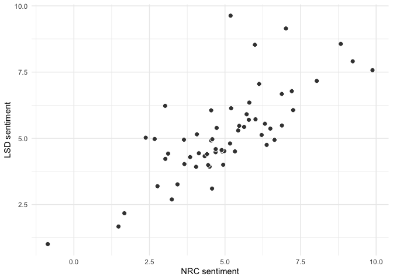
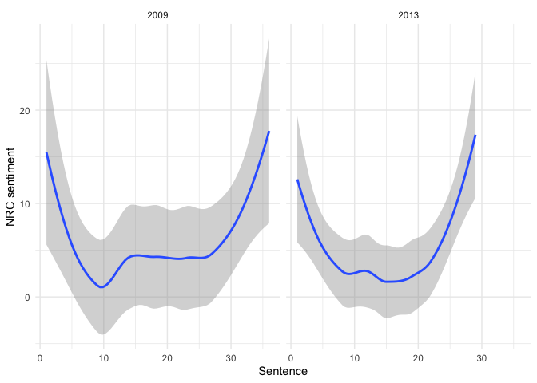
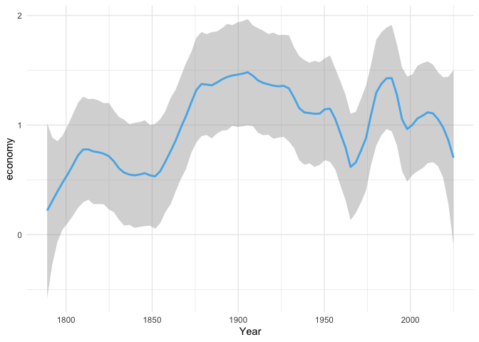
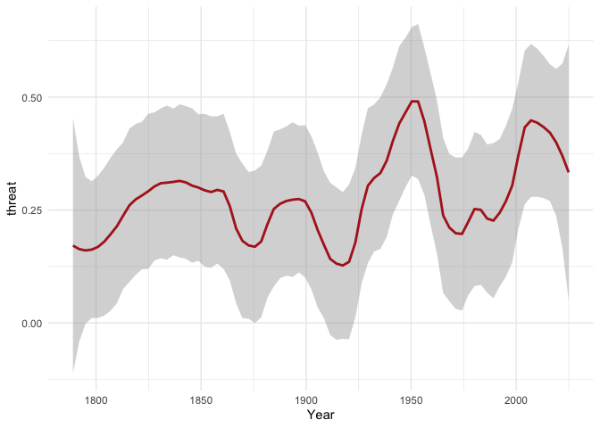
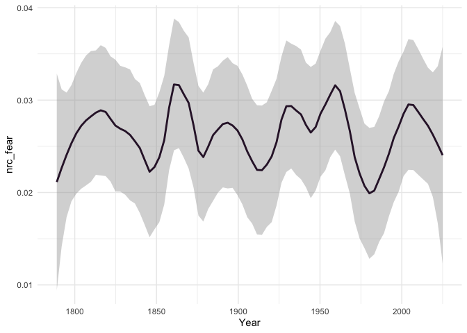
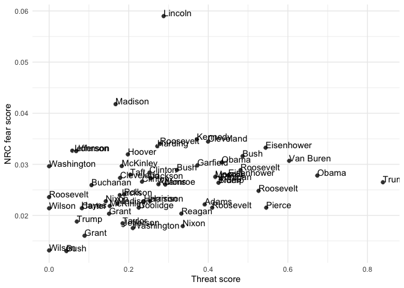

# QTA lab Session 4: Categorizing text using dictionaries


This document describes how to use dictionary methods in **quanteda**.
Let’s first load the required libraries. If you haven’t installed
**quanteda.sentiment** yet, you can do so by running
`remotes::install_github("quanteda/quanteda.sentiment")`, since this
package is not yet on CRAN, so you need to install it from the GitHub
page of the developer.

``` r
library(quanteda)
library(stringr)
library(tidyverse)
library(quanteda.sentiment)
```

Let’s save the inaugural speeches as an object `speeches_inaugural` just
like we did in the previous lab session.

``` r
speeches_inaugural <- data_corpus_inaugural
```

We’ll first tokenize this corpus.

``` r
tokens_inuagural <- tokens(speeches_inaugural,
                           what = "word",
                           remove_punct = TRUE, 
                           remove_symbols = TRUE, 
                           remove_numbers = FALSE,
                           remove_url = TRUE,
                           remove_separators = TRUE,
                           split_hyphens = FALSE,
                           padding = FALSE
                       )
```

In a next step, we’ll include negations of positive and negative
sentiment words. This is done by using the `tokens_compound` function,
which allows you to create compound tokens based on a dictionary of
negations. We’ll also create a dfm called `dfm_inaugural` that contains
the tokenized inaugural speeches.

``` r
tokens_inuagural <- tokens_compound(tokens_inuagural, pattern = phrase("not *"))

dfm_inaugural <- dfm(tokens_inuagural)
```

## Off-the shelf dictionaries

**quanteda.sentiment** contains a number of off-the-shelf sentiment
dictionaries that allow you to assess the sentiment of a text. These
dictionaries are stored as dictionary objects. Let’s take a look at the
Lexicoder Sentiment Dictionary (LSD) from Young and Soroka (2012) and
the NRC Word-Emotion Association Lexicon from Mohammad and Turney
(2013). They are stored in `quanteda.sentiment` as dictionary object
under `data_dictionary_LSD2015` and `data_dictionary_NRC` respectively.

``` r
summary(data_dictionary_LSD2015)
```

                 Length Class  Mode     
    negative     2858   -none- character
    positive     1709   -none- character
    neg_positive 1721   -none- character
    neg_negative 2860   -none- character

``` r
print(data_dictionary_LSD2015, max_nval = 5)
```

    Dictionary object with 4 key entries.
    Polarities: pos = "positive", "neg_negative"; neg = "negative", "neg_positive" 
    - [negative]:
      - a lie, abandon*, abas*, abattoir*, abdicat* [ ... and 2,853 more ]
    - [positive]:
      - ability*, abound*, absolv*, absorbent*, absorption* [ ... and 1,704 more ]
    - [neg_positive]:
      - best not, better not, no damag*, no no, not ability* [ ... and 1,716 more ]
    - [neg_negative]:
      - not a lie, not abandon*, not abas*, not abattoir*, not abdicat* [ ... and 2,855 more ]

We can use `dfm_lookup` to apply it to our dfm containing inaugural
speeches. This results in a dfm with the same number of rows as the
original dfm, but with the columns containing the number of positive and
negative sentiment words (and their negations)

``` r
dfm_inaugural_LSD <- dfm_lookup(dfm_inaugural, 
                                dictionary = data_dictionary_LSD2015)

head(dfm_inaugural_LSD)
```

    Document-feature matrix of: 6 documents, 4 features (29.17% sparse) and 4 docvars.
                     features
    docs              negative positive neg_positive neg_negative
      1789-Washington       43      121            0            0
      1793-Washington        3       10            0            0
      1797-Adams            57      238            0            4
      1801-Jefferson        70      175            2            0
      1805-Jefferson        94      161            3            1
      1809-Madison          58      138            0            4

We can calculate the relative fraction of negative sentiment tokens to
positive sentiment tokens in each speech by dividing the number of
sentiment tokens by the total number of tokens in the speech. We can
save this as a variable in the docvars of the dfm object.

``` r
#number of negative words
docvars(dfm_inaugural, "neg_words") <- as.numeric(dfm_inaugural_LSD[,1]) + as.numeric(dfm_inaugural_LSD[,3])

#number of positive words
docvars(dfm_inaugural, "pos_words") <- as.numeric(dfm_inaugural_LSD[,2]) + as.numeric(dfm_inaugural_LSD[,4])

#sentiment score
docvars(dfm_inaugural, "LSD_sentiment")  <-  100*(docvars(dfm_inaugural, "pos_words") - docvars(dfm_inaugural, "neg_words"))/ntoken(dfm_inaugural)

docvars(dfm_inaugural, c("President", "LSD_sentiment"))
```

        President LSD_sentiment
    1  Washington     5.4698457
    2  Washington     5.1851852
    3       Adams     8.0364900
    4   Jefferson     6.0093349
    5   Jefferson     3.0204461
    6     Madison     7.2103004
    7     Madison     1.6708438
    8      Monroe     6.4997018
    9      Monroe     4.4913541
    10      Adams     4.9124012
    11    Jackson     7.0159858
    12    Jackson     4.9403748
    13  Van Buren     4.3273013
    14   Harrison     3.2411821
    15       Polk     4.5711889
    16     Taylor     9.8799631
    17     Pierce     6.6383753
    18   Buchanan     4.6891652
    19    Lincoln     1.4755011
    20    Lincoln    -0.8633094
    21      Grant     5.7880677
    22      Grant     4.4427711
    23      Hayes     6.3209076
    24   Garfield     3.6560596
    25  Cleveland     7.2532699
    26   Harrison     4.7235023
    27  Cleveland     4.6929606
    28   McKinley     6.3786531
    29   McKinley     4.9748973
    30  Roosevelt     4.4057377
    31       Taft     3.4284655
    32     Wilson     4.0428062
    33     Wilson     4.5424621
    34    Harding     5.1677244
    35   Coolidge     5.6320401
    36     Hoover     5.2021487
    37  Roosevelt     4.5430251
    38  Roosevelt     3.8461538
    39  Roosevelt     4.1353383
    40  Roosevelt     5.9891107
    41     Truman     8.8300221
    42 Eisenhower     6.8796069
    43 Eisenhower     5.8041112
    44    Kennedy     2.6726058
    45    Johnson     2.3761032
    46      Nixon     4.8884670
    47      Nixon     6.8830442
    48     Carter     9.2257002
    49     Reagan     4.0714582
    50     Reagan     5.3291536
    51       Bush     6.2119896
    52    Clinton     3.0264817
    53    Clinton     3.6414566
    54       Bush     5.7161207
    55       Bush     6.1284047
    56      Obama     3.1171019
    57      Obama     4.5805207
    58      Trump     5.4355401
    59      Biden     2.7671350
    60      Trump     2.7671350

Let’s do the same, but this time with the NRC Word-Emotion Association
Lexicon

``` r
dfm_inaugural_NRC <- dfm_lookup(dfm_inaugural, 
                                dictionary = data_dictionary_NRC)

#number of negative words (NB: these are stored in the 6th column in the dfm)
docvars(dfm_inaugural, "neg_NRC_words") <- as.numeric(dfm_inaugural_NRC[,6])

#number of positive words (NB: these are stored in the 7th column in the dfm)
docvars(dfm_inaugural, "pos_NRC_words") <- as.numeric(dfm_inaugural_NRC[,7])

#sentiment score
docvars(dfm_inaugural, "NRC_sentiment")  <- 100*(docvars(dfm_inaugural, "pos_NRC_words") - docvars(dfm_inaugural, "neg_NRC_words"))/ntoken(dfm_inaugural)

head(docvars(dfm_inaugural, c("President", "NRC_sentiment")))
```

       President NRC_sentiment
    1 Washington      5.469846
    2 Washington      9.629630
    3      Adams      7.167680
    4  Jefferson      5.717620
    5  Jefferson      6.226766
    6    Madison      6.781116

Let’s plot the correlation between the two sentiment measures.

``` r
cor(docvars(dfm_inaugural, "LSD_sentiment"), docvars(dfm_inaugural, "NRC_sentiment"))
```

    [1] 0.7581632

``` r
correlation_plot_LSD_NRC <- ggplot(docvars(dfm_inaugural), aes(LSD_sentiment, NRC_sentiment)) + 
  geom_point(pch = 21, fill = "gray25", color = "white", size = 2.5) +
  scale_x_continuous(name = "NRC sentiment") +
  scale_y_continuous(name = "LSD sentiment") +
  theme_minimal()

print(correlation_plot_LSD_NRC)
```



The correlation of 0.76 is reassuring since both measures should be
capturing the same construct

As a last step we’ll inspect if Presidents make use of narrative arches
in their speeches. For example, they may start a speech more subdued and
end on a more positive note. Or they may start positive and end
positive. Let’s first create a paragraph-based dfm of Obama’s inaugural
speeches

``` r
obama_corpus <- corpus_subset(speeches_inaugural, President == "Obama") %>%
  corpus_reshape(to =  "paragraph")

ndoc(obama_corpus)
```

    [1] 65

``` r
obama_tokens <- tokens(obama_corpus,
                           what = "word",
                           remove_punct = TRUE, 
                           remove_symbols = TRUE, 
                           remove_numbers = FALSE,
                           remove_url = TRUE,
                           remove_separators = TRUE,
                           split_hyphens = FALSE,
                           padding = FALSE
                       )

obama_dfm <- dfm(obama_tokens)
```

Let’s apply the NRC dictionary to this dfm object.

``` r
obama_dfm_NRC <- dfm_lookup(obama_dfm, 
                                dictionary = data_dictionary_NRC)

docvars(obama_dfm, "neg_words") <- as.numeric(obama_dfm_NRC[,6])

docvars(obama_dfm, "pos_words") <- as.numeric(obama_dfm_NRC[,7])

#sentiment score
docvars(obama_dfm, "NRC_sentiment")  <- 100*(docvars(obama_dfm, "pos_words") - docvars(obama_dfm, "neg_words"))/ ntoken(obama_dfm)
```

Let’s plot this information as a sequence of paragraphs over time. We
can use the `docvars` function to extract the year of the speech and use
it as a facet variable.

``` r
table(docvars(obama_dfm, "Year"))
```


    2009 2013 
      36   29 

``` r
#the following code will create a variable sentence in the docvars of obama_dfm that contains a paragraph counter

docvars(obama_dfm, "sentence") <- NA
docvars(obama_dfm, "sentence")[1:36] <- 1:36
docvars(obama_dfm, "sentence")[37:65] <- 1:29

obama_plot <- ggplot(docvars(obama_dfm), aes(sentence, NRC_sentiment)) + 
  geom_smooth() +
  scale_x_continuous(name = "Sentence") +
  scale_y_continuous(name = "NRC sentiment") +
  theme_minimal() + facet_grid(~Year)

print(obama_plot)
```



## Self made dictionaries

When working with your own dictionary, most of the work will go into
evaluating its validity and reliability in order to make sure that it
captures the construct that you are looking for. However, once you have
settled on a dictionary, it is easy in **quanteda** to apply it to a
corpus.

Let’s say where are interested in how often these presidents refer to
the economy. Let’s create a dictionary object `econ_dict` that contains
words that are related to the economy. A dictionary object is a list
object with the key being the category and the values being the words
that belong to that category, represented as a character vector. The
asterisk is a wildcard that allows you to match words that start with
the same letters.

``` r
#create a dictionary
econ_dict <- dictionary(list(
  Economy = c(
    "econ*", "job*", "employ*", "unemploy*", "labor*", "labour*", 
    "income*", "wage*", "pay*", "salary*", "work*", "worker*", 
    "industr*", "business*", "firm*", "market*", "trade*", "export*", 
    "import*", "gdp", "growth*", "recession*", "inflation*", 
    "deflation*", "investment*", "productiv*", "profit*", 
    "consumption*", "demand*", "supply*", "crisis*", "financ*", 
    "credit*", "debt*", "bank*", "tax*", "budget*", "subsid*", 
    "bailout*", "regulation*", "monetary*", "fiscal*", 
    "cost*", "price*", "econom*", "development*", "capital*", 
    "entrepreneur*", "small business*", "stock*", "share*", 
    "exchange*", "interest rate*", "central bank*", "pension*", "saving*"
  )
))

econ_dict_dfm <- dfm_lookup(dfm_inaugural, 
                            dictionary = econ_dict)

dim(econ_dict_dfm)
```

    [1] 60  1

``` r
tail(econ_dict_dfm)
```

    Document-feature matrix of: 6 documents, 1 feature (0.00% sparse) and 10 docvars.
                    features
    docs             Economy
      2005-Bush           13
      2009-Obama          38
      2013-Obama          23
      2017-Trump          22
      2025-Trump          15
      2021-Biden.txt      15

If we want to average the average number of mentions per speaker we can
save these dictionary results as a variable in our corpus object. Let’s
call it `economy`.

``` r
docvars(speeches_inaugural, "economy") <- 100*as.numeric(econ_dict_dfm) / ntoken(dfm_inaugural)
```

Let’s plot the fraction of economy words over time. We’ll add a smooth
line to the plot to make the trend more visible.

``` r
lineplot_economy <- ggplot(docvars(speeches_inaugural),
                                aes(x = Year, y = economy)) +
  geom_smooth(method = "loess",
              span = 0.2,
              color = "#56B4E9") + 
  theme_minimal()


print(lineplot_economy)
```



## Excercise

Create a dictionary titled `threat_dictionary`, with threat as a key and
threat\* peril\* risk\* danger\* hazard\* menace\* attack\* violence\*
crisis\* instabil\* emergency\* conflict\* terror\* hostil\* aggress\*
assault\* disaster\* catastroph\* security\* insecurity\* as values

``` r
threat_dict <- dictionary(list(
  Threat = c(
    "threat*", "peril*", "risk*", "danger*", "hazard*", "menace*", 
    "attack*", "violence*", "crisis*", "instabil*", "emergency*", 
    "conflict*", "terror*", "hostil*", "aggress*", "assault*", 
    "disaster*", "catastroph*", "security*", "insecurity*"
  )
))
```

Apply this dictionary to `dfm_inaugural` and call the resulting object
`dfm_inaugural_threat`. Append the results in the docvars of
`speeches_inaugural` as a variable `threat` containing the fraction of
threat words in each speech

``` r
dfm_inaugural_threat <- dfm_lookup(dfm_inaugural, 
                                dictionary = threat_dict)

docvars(speeches_inaugural, "threat") <- 100*as.numeric(dfm_inaugural_threat) / ntoken(dfm_inaugural)
```

Plot the fraction of threat words over time

``` r
lineplot_threat<- ggplot(docvars(speeches_inaugural),
                                aes(x = Year, y = threat)) +
  geom_smooth(method = "loess",
              span = 0.2,
              color = "#B22222") + 
  theme_minimal()


print(lineplot_threat)
```



Apply the NRC emotion detection lexicon to `dfm_inaugural` and append a
varioble called nrc_fear as metadata to `speeches_inaugural` that
contains the fraction of NRC fear words in each speech.

``` r
dfm_inaugural_fear <- dfm_lookup(dfm_inaugural, 
                                dictionary = data_dictionary_NRC)

docvars(speeches_inaugural, "nrc_fear") <- as.numeric(dfm_inaugural_fear[,4]) / ntoken(dfm_inaugural)
```

Plot the fraction of fear words over time

``` r
lineplot_fear<- ggplot(docvars(speeches_inaugural),
                                aes(x = Year, y = nrc_fear)) +
  geom_smooth(method = "loess",
              span = 0.2,
              color = "#301934") + 
  theme_minimal()


print(lineplot_fear)
```



Calculate the correlation between nrc_fear and threat, and produce a
scatterplot

``` r
cor(docvars(speeches_inaugural, "threat"), docvars(speeches_inaugural, "nrc_fear"))
```

    [1] 0.2544225

``` r
correlation_plot_ <- ggplot(docvars(speeches_inaugural), aes(threat, nrc_fear, label = President)) + 
  geom_point(pch = 21, fill = "gray25", color = "white", size = 2.5) +
  scale_x_continuous(name = "Threat score") +
  scale_y_continuous(name = "NRC fear score") +
  theme_minimal() + geom_text(hjust=0, vjust=0)

print(correlation_plot_)
```



Reflect on these results

``` r
#your answer here
```
