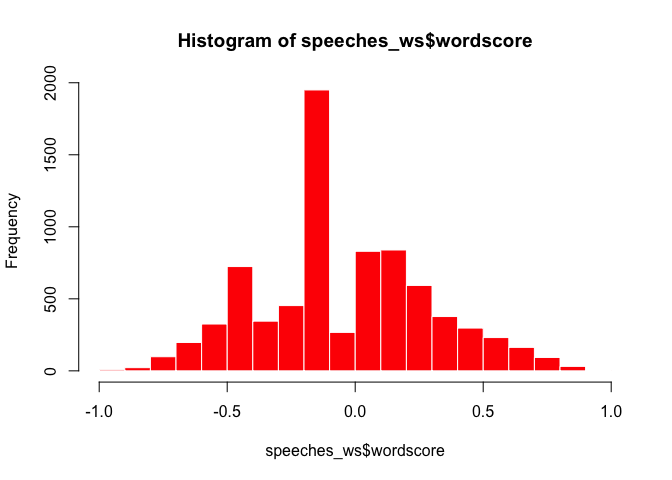
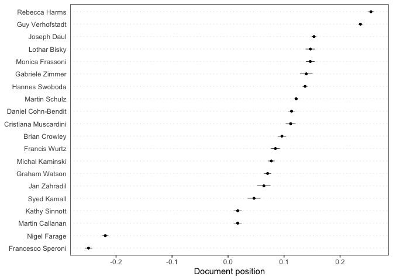
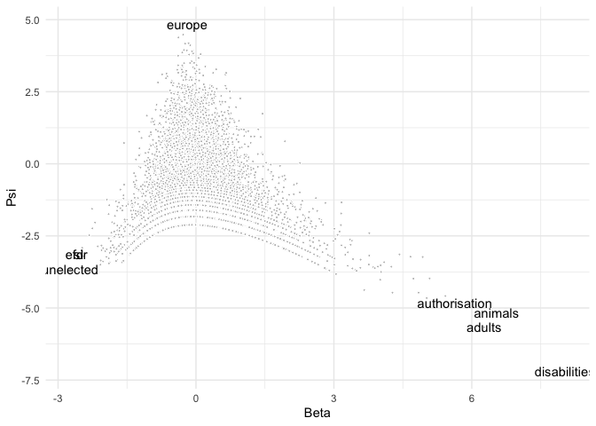
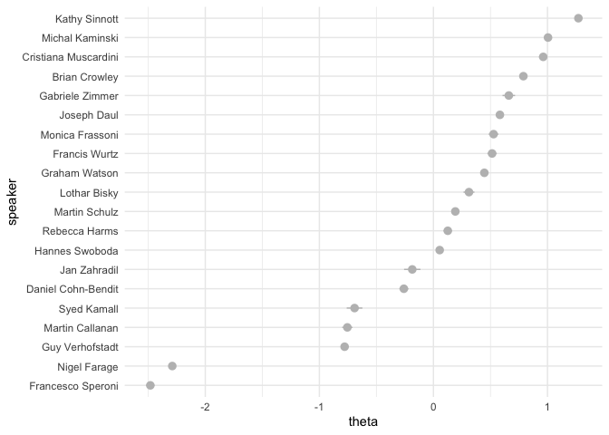
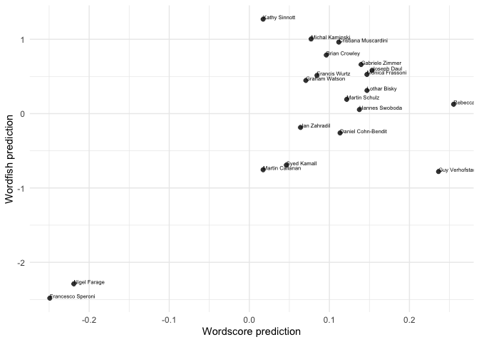
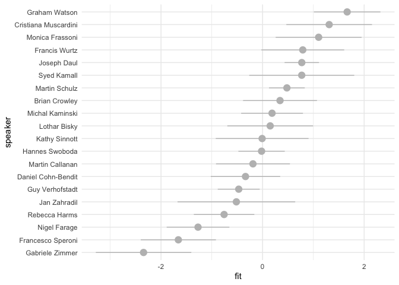
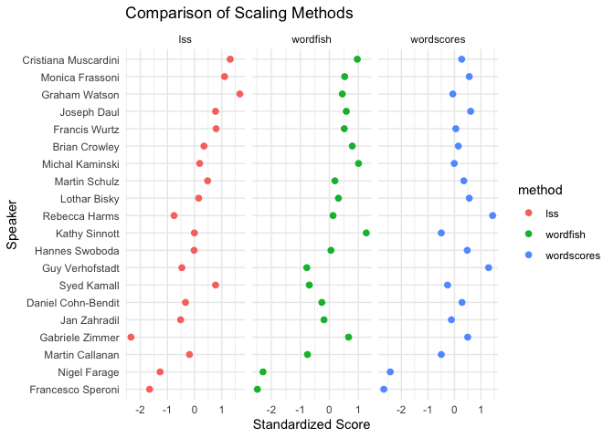

# QTA lab Session 6: Scaling methods


This document gives some examples of how to apply scaling methods
(Wordscores, Wordfish, LSS) in **quanteda**. For these examples, we use
the (English) speeches of EP group leaders that are part of the
[EUSpeech](https://dataverse.harvard.edu/dataverse/euspeech) dataset. By
the end of this lab, you will: - Understand the conceptual differences
between supervised, unsupervised, and semi-supervised scaling methods. -
Apply each method to estimate ideological positions of political
actors. - Interpret and compare the resulting scales across methods.

The **quanteda**, **quanteda.textmodels**, **quanteda.textstats**,
**quanteda.textplots**, **ggplot2** and **tidyverse** packages are
familiar at this point. The **quanteda.corpora** package can be
downloaded as follows:
`devtools::install_github("quanteda/quanteda.corpora")`. The **LSX**
package can be downloaded using `install.packages("LSX")`.

``` r
#load libraries
library(quanteda)
library(quanteda.textmodels)
library(quanteda.textplots)
library(quanteda.corpora)
library(quanteda.textstats)
library(ggplot2)
library(tidyverse)
library(LSX)
```

In a next step, we’ll read in the speeches of the EP group leaders. The
dataset is available as a CSV file called `speeches_ep.csv`. The file
contains the following columns: `speaker`, `text`, `title` and `date`.
The `speaker` column contains the name of the speaker, the `text` column
contains the speech text, and the `date` column contains the date of the
speech.

``` r
#read in the EP speeches
speeches <- read.csv(file = "speeches_ep.csv", 
                     header = TRUE, 
                     stringsAsFactors = FALSE, 
                     sep = ",", 
                     encoding = "UTF-8")
```

Inspect how many unique speakers there are in the dataset.

``` r
unique(speeches$speaker)
```

     [1] "Lothar Bisky"         "Martin Callanan"      "Daniel Cohn-Bendit"  
     [4] "Brian Crowley"        "Joseph Daul"          "Nigel Farage"        
     [7] "Monica Frassoni"      "Rebecca Harms"        "Syed Kamall"         
    [10] "Michal Kaminski"      "Cristiana Muscardini" "Martin Schulz"       
    [13] "Kathy Sinnott"        "Francesco Speroni"    "Hannes Swoboda"      
    [16] "Guy Verhofstadt"      "Graham Watson"        "Francis Wurtz"       
    [19] "Jan Zahradil"         "Gabriele Zimmer"     

Let’s first merge the speeches for each speaker using some tidyverse
data-wrangling. The `%>%`, `group_by()`, `summarise()` and `ungroup()`
functions are used to concatenate the speeches for each speaker. The
`%>%` command is the pipe function and helps us with a chain of
functions. Think of it as a way to pass the output of one function to
the next function. The paste() function concatenates the speeches for
each speaker.

``` r
speeches <- speeches %>%
  group_by(speaker) %>%
  summarise(text = paste(text, collapse = " ")) %>%
  ungroup()

#confirm that you have a total of 20 (very long) concatenated speeches, 1 for each EP speaker
dim(speeches)
```

    [1] 20  2

Let’s create a corpus and tokenize it. We will remove punctuation,
symbols, numbers, urls, and separators. We will also remove stopwords.
Instead of the standard stopwords, we will use the `smart` stopword
list, which is a more comprehensive list of stopwords. We will also
convert all tokens to lowercase.

``` r
#create a corpus object

corpus_speeches <- corpus(speeches,
                          text_field = "text")

#tokenise the corpus
tokens_speeches <- tokens(corpus_speeches,
                          what = "word",
                          remove_punct = TRUE, 
                          remove_symbols = TRUE, 
                          remove_numbers = TRUE,
                          remove_url = TRUE,
                          remove_separators = TRUE,
                          split_hyphens = FALSE,
                          ) %>%
  tokens_remove(stopwords(source = "smart"), padding = TRUE) %>%
  tokens_tolower()

#we'll also remove some common words that are not in the stopword list

tokens_speeches <- tokens_remove(tokens_speeches, 
                                 c("mr president",
                                   "madam predident",
                                   "applause", 
                                   "ladies gentlemen",
                                   "President-in-Office",
                                   "ms",
                                   "mr"))
```

MEP speeches are full of jargon and references to politicians. Let’s
append bigram collocations to our tokens object to account for this.

``` r
collocations <- tokens_speeches %>%
  textstat_collocations(min_count = 20,
                        size = 2:3) %>%
  arrange(-lambda)

head(collocations, 20)
```

                     collocation count count_nested length   lambda         z
    301            michał tomasz   259          259      2 20.61947 10.304773
    291          tomasz kamiński   259          259      2 19.52086 11.945406
    300             roland clark    24           24      2 17.16105 10.429436
    292               van rompuy   219          124      2 16.78853 11.708955
    297             derek roland    24           24      2 16.65022 10.657426
    299            gerard batten    20           19      2 16.13550 10.560536
    298             nigel farage    90           87      2 15.12356 10.602704
    302              john bufton    22           22      2 14.41328  9.967592
    172             kamiński ecr   257          257      2 14.40310 25.550598
    303             21st century    42           12      2 14.01461  9.812047
    266                 red tape    38           11      2 13.89942 16.142242
    242               tony blair    27           13      2 13.63022 18.841641
    82           baroness ashton   113           53      2 12.64351 33.327175
    183                blue card    26           19      2 12.56046 24.602482
    309              tax evasion    42           17      2 12.39175  8.704183
    112 medium-sized enterprises    36            5      2 11.86591 29.473940
    277          transaction tax    68           68      2 11.85911 14.330468
    133            death penalty    42            3      2 11.34246 28.303564
    257           united kingdom    82            9      2 11.30284 17.546444
    285            angela merkel    20            8      2 11.15661 13.135898

If we want to add the most surprising collocations to our tokens object
we can do so using `tokens_compound`. We’ll include all collocations
since most of these seem to be meaningful in the context of EU politics.

``` r
collocations <- collocations %>%
  pull(collocation) %>%
  phrase()

tokens_speeches <- tokens_compound(tokens_speeches, collocations)

#we'll remove padded white spaces

tokens_speeches <- tokens_remove(tokens_speeches, "")
```

Create a dfm, and change the document names to the speaker names.

``` r
dfm_speeches <- dfm(tokens_speeches)
docnames(dfm_speeches) <- docvars(dfm_speeches, "speaker")
dfm_speeches <- dfm_speeches %>%
  dfm_trim(min_termfreq = 3, min_docfreq = 3)
```

## Wordscores

Let’s see if we can use Wordscores to locate these speakers on a
pro-anti EU dimension. We’ll first need to determine reference texts to
anchor this dimension. On the anti-EU side we’ll locate Francesco
Speroni and Nigel Farage, leaders of the then European Freedom and
Democracy group, a Eurosceptic outlet. On the pro-EU dimension we’ll
locate Guy Verhofstadt, leader of the liberal ALDE group, and a pro-EU
voice, as well as Rebecca Harms, the leader of the Greens:

``` r
#append an empty reference_score variable to the speeches_dfm docvars
docvars(dfm_speeches, "reference_score") <- NA

#locate which rows correspond with Guy Verhofstadt and Rebecca Harms (pro_eu) and Francesco Speroni and Nigel Farage (anti_eu)
pro_eu <- which(docvars(dfm_speeches) == "Guy Verhofstadt" | 
                  docvars(dfm_speeches) == "Rebecca Harms")
anti_eu <- which(docvars(dfm_speeches) == "Francesco Speroni" |
                 docvars(dfm_speeches) == "Nigel Farage" )

#assign reference scores to Guy Verhofstadt and Rebecca Harms (1) and Francesco Speroni and Nigel Farage (-1)
docvars(dfm_speeches, "reference_score")[pro_eu] <- 1
docvars(dfm_speeches, "reference_score")[anti_eu] <- -1

#inspects the reference_score variable:
docvars(dfm_speeches, "reference_score")
```

     [1] NA NA NA -1 NA NA NA  1 NA NA NA NA NA NA NA NA NA -1  1 NA

``` r
#implement wordscores as per Laver, Benoit, Garry (2003)
speeches_ws <- textmodel_wordscores(dfm_speeches, 
                                    y = docvars(dfm_speeches, "reference_score"),
                                    scale = c("linear"), 
                                    smooth = 1)
summary(speeches_ws, 10)
```


    Call:
    textmodel_wordscores.dfm(x = dfm_speeches, y = docvars(dfm_speeches, 
        "reference_score"), scale = c("linear"), smooth = 1)

    Reference Document Statistics:
                         score total min max   mean median
    Brian Crowley           NA 10720   0 144 1.3666      0
    Cristiana Muscardini    NA  6672   0  63 0.8506      0
    Daniel Cohn-Bendit      NA 13787   0 178 1.7576      0
    Francesco Speroni       -1 11468   0 147 1.4620      0
    Francis Wurtz           NA  8877   0  72 1.1317      0
    Gabriele Zimmer         NA  4277   0  78 0.5453      0
    Graham Watson           NA 12831   0 134 1.6358      0
    Guy Verhofstadt          1 31452   0 370 4.0097      1
    Hannes Swoboda          NA 24685   0 348 3.1470      1
    Jan Zahradil            NA  4048   0  48 0.5161      0
    Joseph Daul             NA 30939   0 594 3.9443      1
    Kathy Sinnott           NA 10768   0 138 1.3728      0
    Lothar Bisky            NA  7427   0  71 0.9468      0
    Martin Callanan         NA 11561   0 162 1.4739      0
    Martin Schulz           NA 41260   0 479 5.2601      1
    Michal Kaminski         NA 15537   0 180 1.9807      0
    Monica Frassoni         NA  8209   0  76 1.0465      0
    Nigel Farage            -1 17498   0 225 2.2307      0
    Rebecca Harms            1 13707   0 152 1.7475      0
    Syed Kamall             NA  4850   0  69 0.6183      0

    Wordscores:
    (showing first 10 elements)
            president council_president        commission   council_meeting 
             -0.04190           0.35138           0.60067           0.36127 
                place             month             focus          economic 
             -0.33405          -0.31066           0.74405          -0.10056 
              affairs    european_union 
              0.70715           0.04149 

``` r
#sort most discriminant words:

#anti-EU words
head(sort(speeches_ws$wordscores), 10)
```

            referendum       nation_state     british_people                efd 
            -0.9358256         -0.9321734         -0.9162932         -0.9117301 
    national_democracy             anthem               ukip        referendums 
            -0.9107811         -0.9086855         -0.9066934         -0.8995567 
                   gbp            frankly 
            -0.8993811         -0.8940046 

``` r
#pro-EU words
tail(sort(speeches_ws$wordscores), 10)
```

            plants         sector     copenhagen     discussion          japan 
         0.8552032      0.8572396      0.8693281      0.8730063      0.8731351 
        colleagues        finally           task        council responsibility 
         0.8827768      0.8989964      0.8996609      0.9009517      0.9381154 

``` r
#histogram of wordscores
hist(speeches_ws$wordscore, col = "red", border = 0)
```



Let’s use the Wordscores model to predict the document scores of the
speeches of the remaining group leaders

``` r
speeches_wordscores_predict <- predict(speeches_ws,
                                       newdata = dfm_speeches, 
                                       se = TRUE)
```

Which speakers are most like Farage and Speroni?

``` r
sort(speeches_wordscores_predict$fit, decreasing = FALSE)[1:5]
```

    Francesco Speroni      Nigel Farage   Martin Callanan     Kathy Sinnott 
          -0.24917110       -0.21919459        0.01723457        0.01725882 
          Syed Kamall 
           0.04632618 

This lists Kathy Sinnott (I&D), Martin Callanan (ECR) and Syed Kamall
(ECR) as the most anti-EU speakers.

Which speakers are most like Verhofstadt and Harms?

``` r
sort(speeches_wordscores_predict$fit, decreasing = TRUE)[1:5]
```

      Rebecca Harms Guy Verhofstadt     Joseph Daul    Lothar Bisky Monica Frassoni 
          0.2551528       0.2363498       0.1533609       0.1469739       0.1469051 

This lists Joseph Daul (EPP), Lothar Bisky (Party of the European Left)
and Monica Frassoni (Green Party) as the most pro-EU speakers.

Visualize the document scores in a plot:

``` r
textplot_scale1d(speeches_wordscores_predict)
```



## Wordfish

Estimate a Wordfish model and inspect its output. Using the argument
`dir=c(4,8)` set the direction of the dimension so that the document
score for Francesco Speroni (speaker 4) is smaller than the document
score for Guy Verhofdstadt (speaker 8)

``` r
speeches_wf <- textmodel_wordfish(dfm_speeches,
                                  dir = c(4,8))
summary(speeches_wf)
```


    Call:
    textmodel_wordfish.dfm(x = dfm_speeches, dir = c(4, 8))

    Estimated Document Positions:
                            theta      se
    Brian Crowley         0.78855 0.01647
    Cristiana Muscardini  0.96244 0.01836
    Daniel Cohn-Bendit   -0.25928 0.02008
    Francesco Speroni    -2.48181 0.01837
    Francis Wurtz         0.51427 0.02077
    Gabriele Zimmer       0.66081 0.02801
    Graham Watson         0.44633 0.01773
    Guy Verhofstadt      -0.77875 0.01381
    Hannes Swoboda        0.05477 0.01425
    Jan Zahradil         -0.18570 0.03667
    Joseph Daul           0.58272 0.01081
    Kathy Sinnott         1.27086 0.01012
    Lothar Bisky          0.31152 0.02436
    Martin Callanan      -0.75468 0.02276
    Martin Schulz         0.19191 0.01068
    Michal Kaminski       1.00439 0.01159
    Monica Frassoni       0.52706 0.02149
    Nigel Farage         -2.28962 0.01561
    Rebecca Harms         0.12573 0.01883
    Syed Kamall          -0.69151 0.03505

    Estimated Feature Scores:
         president council_president commission council_meeting   place   month
    beta   -0.2789            0.5635    -0.1623         -0.2004 -0.2235 -0.5291
    psi     4.4795            0.4959     4.1826          0.3625  2.8969  0.9600
          focus economic affairs european_union proposals  created   return economy
    beta 0.4329  -0.2916 0.07232        -0.2358  -0.05286 -0.02881 -0.09412 0.01344
    psi  1.6198   3.3446 1.27710         4.1671   2.37183  1.33786  1.64447 2.43798
         previous   state implemented immediately restart   today  speak  future
    beta -0.06205 -0.2088      0.1296     -0.1087  0.0453 -0.2981 0.2227 0.07079
    psi   1.17915  3.0917      1.0612      1.2953 -1.2744  3.8598 2.2199 3.26968
          europe  people   claim    care situation uncertainty present chamber
    beta -0.1908 -0.3814 -0.2725 0.02203   0.08046    0.534270 0.04356 -0.4515
    psi   4.8536  4.3811  0.6200 1.18816   3.14637    0.008965 2.22659  2.1246

Let’s take out the word level parameters beta and psi. Beta is the
estimated word position on the underlying dimension and psi denotes word
fixed effects.

``` r
wordfish_word_data <- data.frame(beta = speeches_wf$beta,
                            psi = speeches_wf$psi,
                            features = speeches_wf$features)

dim(wordfish_word_data)
```

    [1] 7844    3

``` r
head(wordfish_word_data)
```

            beta       psi          features
    1 -0.2789059 4.4795212         president
    2  0.5635276 0.4958744 council_president
    3 -0.1623243 4.1826499        commission
    4 -0.2003815 0.3625022   council_meeting
    5 -0.2234994 2.8968506             place
    6 -0.5291254 0.9600482             month

``` r
word_plot <- ggplot(data = wordfish_word_data, aes(x = beta, y = psi)) +
    geom_point(pch = 21, fill = "gray", color = "white", size = 0.75) +
  labs(x = "Beta", y = "Psi") + guides(size = "none", color = guide_legend("")) + 
  theme_minimal() +
  geom_text(data=subset(wordfish_word_data, beta > 5.5 | beta < -2.5 | psi > 4.5),  
            aes(x = beta, y = psi, label = features))

print(word_plot)
```



Plot the document positions generated by Wordfish. Alpha is the document
position on the dimension and theta is the document fixed effect.

``` r
#generate a dataframe with document level alpha beta and omega
wordfish_document_data <- data.frame(alpha = speeches_wf$alpha,
                                     theta = speeches_wf$theta,
                                     se = speeches_wf$se.theta,
                                     speaker = speeches_wf$docs)

#order the speaker factor by theta
wordfish_document_data$speaker <- reorder(wordfish_document_data$speaker, 
                                           wordfish_document_data$theta)


#plot wordfish results using ggplot2
wordfish_plot <- ggplot(wordfish_document_data, 
                        aes(x= speaker, 
                            y = theta,
                            ymin = theta -1.96*se,
                            ymax = theta + 1.96*se)) +
  geom_pointrange(fill = "gray", color = "gray", size = .5) +
  theme_minimal() + coord_flip()
print(wordfish_plot)
```



Both Wordscores and Wordfish are scaling models and if they pick up on
the same dimension they should give us similar results. Let’s see if
this indeed the case.

``` r
scaling_data <- rbind(data.frame(speeches_wordscores_predict, wordfish_document_data))

scaling_plot <- ggplot(scaling_data, aes(x = fit, 
                                         y = theta, 
                                         label = speaker)) +
  geom_point(pch = 21, fill = "gray25", color = "white", size = 2.5) +
  scale_x_continuous(name = "Wordscore prediction") +
  scale_y_continuous(name = "Wordfish prediction") +
  theme_minimal() + geom_text(aes(label=speaker), 
                                        hjust=0, 
                                        vjust=0, 
                                        size = 2)
  
print(scaling_plot)
```



``` r
correlation <- cor.test(x=scaling_data$fit, 
                        y=scaling_data$theta,
                        method = 'pearson')
print(correlation)
```


        Pearson's product-moment correlation

    data:  scaling_data$fit and scaling_data$theta
    t = 3.8704, df = 18, p-value = 0.001121
    alternative hypothesis: true correlation is not equal to 0
    95 percent confidence interval:
     0.3297897 0.8599921
    sample estimates:
          cor 
    0.6739544 

## Latent semantic scaling (LSS)

In a third step, we’ll apply Latent Semantic Scaling (LSS) to the
speeches. LSS is a semi-supervised scaling method that uses a seed list
of sentiment words as a starting point. It then relies on word
embeddings to find nearest neighbors to these seed words. From this
information it calculates `polarity scores` for each word.

In order to apply LSS to the corpus we first need to transform the
corpus at the sentence level and tokenize it

``` r
corpus_speeches_sent <- corpus_reshape(corpus_speeches, to =  "sentences")

tokens_speeches_sent <- tokens(corpus_speeches_sent,
                               what = "word",
                               remove_punct = TRUE, 
                               remove_symbols = TRUE, 
                               remove_numbers = TRUE,
                               remove_url = TRUE,
                               remove_separators = TRUE,
                               split_hyphens = FALSE,
                          ) %>%
  tokens_remove(stopwords(source = "smart"), padding = TRUE) %>%
  tokens_tolower()

#we'll also remove some common words that are not in the stopword list

tokens_speeches_sent <- tokens_remove(tokens_speeches_sent, 
                                      c("mr president",
                                        "madam predident",
                                        "applause", 
                                        "ladies gentlemen",
                                        "President-in-Office",
                                        "ms",
                                        "mr"))


tokens_speeches_sent <- tokens_compound(tokens_speeches_sent, collocations)

tokens_speeches_sent <- tokens_remove(tokens_speeches_sent, "")

dfmat_speeches_sent <- tokens_speeches_sent %>% 
  dfm()

topfeatures(dfmat_speeches_sent, 20)
```

            europe      president         people     commission european_union 
              3248           2386           2067           1649           1623 
          european           time      countries        council     parliament 
              1521           1306           1278           1275           1243 
             today           make          group         crisis             eu 
              1225           1149           1135           1102           1101 
     member_states           work         debate         treaty           made 
               985            869            827            826            824 

In this case we rely on the short list of sentiment words as a seed
list. However, keep in mind that the seed list can be any list of words
that you want to use as a starting point for the LSS model. The seed
words are used to calculate the polarity scores for each word in the
corpus.

``` r
seed <- as.seedwords(data_dictionary_sentiment)
print(seed)
```

           good        nice   excellent    positive   fortunate     correct 
              1           1           1           1           1           1 
       superior         bad       nasty        poor    negative unfortunate 
              1          -1          -1          -1          -1          -1 
          wrong    inferior 
             -1          -1 

Using the seed words, LSS computes polarity of words frequent in the
context of `europe*` (which in this example should denote how positive
or negative words are around references to Europe). We’ll set the
p-value to 0.05, which means that only words that are significantly more
frequent in the context of `europe*` than in the rest of the corpus will
be included in the analysis.

``` r
# identify context words 
europe <- char_context(tokens_speeches_sent, pattern = "europe*", p = 0.05)

head(europe, 50)
```

     [1] "peoples"               "citizens"              "future"               
     [4] "progressive_alliance"  "reformists"            "model"                
     [7] "democrats"             "values"                "group"                
    [10] "vision"                "facility"              "united_states"        
    [13] "identity"              "patent"                "monetary_fund"        
    [16] "crisis"                "institution"           "integration"          
    [19] "founding"              "member_states"         "united"               
    [22] "role"                  "national"              "interests"            
    [25] "continent"             "world"                 "institutions"         
    [28] "defend"                "socialist_group"       "creation"             
    [31] "idea"                  "voice"                 "integrated"           
    [34] "solidarity"            "community"             "prosperity"           
    [37] "rest"                  "player"                "defence"              
    [40] "strong"                "vienna"                "alliance"             
    [43] "states"                "shared"                "globalisation"        
    [46] "stronger"              "confederation"         "leaders"              
    [49] "aspirations"           "social_market_economy"

In a next step we run the LSS model. We set the number of embeddings
dimensions to 300 and cache the results, which speeds up the process.

``` r
tmod_lss <- textmodel_lss(dfmat_speeches_sent, 
                          seeds = seed,
                          terms = europe, 
                          k = 300, 
                          cache = TRUE)
```

Display the most positive words that appear in the context of Europe

``` r
head(coef(tmod_lss), 20)
```

        interest   convention  enlargement       treaty  coordinated  cooperation 
      0.08643922   0.08591248   0.08194326   0.07997650   0.07979404   0.07950526 
            rome        works    incapable   foundation        build member_state 
      0.07183063   0.07042391   0.06946027   0.06490730   0.06355286   0.06240046 
           image    effective       spirit     socially       manage      succeed 
      0.06084538   0.05978478   0.05747473   0.05688138   0.05653193   0.05466323 
           daily       closer 
      0.05462541   0.05262317 

Most negative words that appear in the context of Europe

``` r
tail(coef(tmod_lss), 20)
```

             row      citizen technologies         rest leading_role       entire 
     -0.03966444  -0.04009810  -0.04014532  -0.04020691  -0.04028293  -0.04085265 
         western   instrument civilisation         room       choice         idea 
     -0.04094090  -0.04414091  -0.04669045  -0.04691071  -0.04776710  -0.04846129 
             big       values      adopted  development        trend        force 
     -0.04905636  -0.05014265  -0.05018610  -0.05026184  -0.05748922  -0.05800779 
         balkans    unelected 
     -0.05817461  -0.06016439 

To obtain document-level scores, we use the `dfm_group()` to re-assemble
the sentence-level dfm back at the document-level. We then use
`predict()` to make document level LSS predictions.

``` r
dfmat_doc <- dfm_group(dfmat_speeches_sent)
dat <- docvars(dfmat_doc)
dat$fit <- unlist(predict(tmod_lss, 
                          newdata = dfmat_doc, 
                          se = TRUE)[1])
dat$se <- unlist(predict(tmod_lss, 
                         newdata = dfmat_doc, 
                         se = TRUE)[2])
```

We then plot these predictions, ordering speakers from most positive to
most negative on Europe.

``` r
dat$speaker <- with(dat, reorder(speaker, fit))


lss_plot <- ggplot(arrange(dat, fit), 
                        aes(x= speaker, 
                            y = fit,
                            ymin = fit -1.96*se,
                            ymax = fit + 1.96*se)) +
  geom_pointrange(pch = 21, fill = "gray", color = "gray", size = 0.75) +
  theme_minimal() + coord_flip()
print(lss_plot)
```



## Compare Results Across Methods

Combine the document scores from all three methods

``` r
doc_positions <- data.frame(
  speaker = speeches$speaker,
  wordscores = as.numeric(speeches_wordscores_predict$fit),
  wordfish = wordfish_document_data$theta,
  lss = dat$fit
)

# Standardize scores for comparison
doc_positions_scaled <- doc_positions %>%
  mutate(across(where(is.numeric), scale)) %>%
  pivot_longer(cols = -speaker, names_to = "method", values_to = "score")

# Plot all three methods
ggplot(doc_positions_scaled, aes(x = score, y = reorder(speaker, score), color = method)) +
  geom_point(size = 2) +
  facet_wrap(~ method, scales = "free_x") +
  theme_minimal() +
  labs(x = "Standardized Score", y = "Speaker", title = "Comparison of Scaling Methods")
```



## Exercises

For this set of exercises we will use `data_corpus_irishbudget2010` a
corpus that consists of 2010 budget speeches in Ireland. The dataset is
included in the quanteda package.

1.  Tokenize `data_corpus_irishbudget2010`, remove stopwords,
    punctuation characters, and create a dfm called `dfm_budget_debates`

<!-- -->

2.  Create a binary variable `ref_score` that equals 1 if the speaker’s
    name is “Lenihan” (i.e., the Minister of Finance at the time) and -1
    if the speaker’s name is “Kenny” (Enda Kenny was leader of the
    opposition at the time). For all other speakers, assign the value
    NA.

<!-- -->

3.  Apply a Wordscores model for this document-feature matrix using
    `ref_score` as the value for `y`.

<!-- -->

4.  Explore the scores for all words in the dfm using
    `textplot_scale1d()`. Note: set margin to “features”. Why are some
    terms clustered around -1 and +1?

<!-- -->

5.  Use `predict()` for predicting the document-level word scores for
    all documents in the dfm. Set `se = TRUE` to add 95% confidence
    intervals.

<!-- -->

6.  Apply `textplot_scale1d()` to the object created in question 5. Does
    this method distinguish between government (FF and Green) and
    opposition parties?

Use the `dfm_budget_debates`. Create a new dfm object that only keeps
terms that appear in at least three documents and that appear at least
three times. Call the resulting dfm `dfm_budget_debates_trimmed`

Run a Wordfish model on this dfm.

Use `textplot_scale1d()` to plot (1) document-positions, and (2) scores
for each word. You can achieve this by adjusting the `margin` argument.
