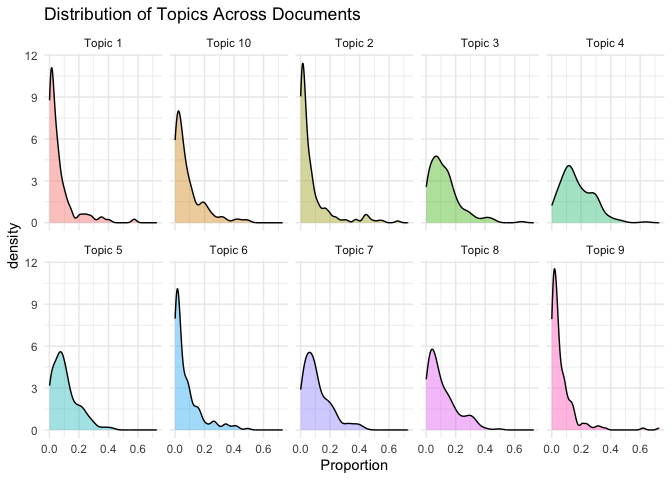
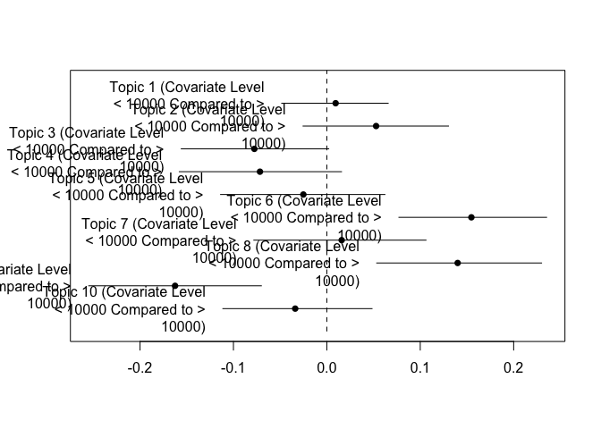

# QTA lab Session 7: Topic models


This document gives some examples of how to estimate LDA, STM and
semisupervised topic models in `R`. For these examples, we will use the
corpus `data_corpus_ungd2017` which contains the speeches from the UN
General Assembly in 2017 and is available in **quanteda.corpora**.

Let’s load necessary libraries first. We will estimate LDA topic models
using the **seededlda** library and structural topic models using the
**stm** library.

``` r
#load libraries
library(quanteda)
library(quanteda.textmodels)
library(quanteda.textplots)
library(quanteda.corpora)
library(quanteda.textstats)
library(seededlda)
library(stm)
library(ggplot2)
library(tidyverse)
```

Let’s read in the data

``` r
corpus_speeches <- data_corpus_ungd2017

summary(corpus_speeches, n = 10)
```

    Corpus consisting of 196 documents, showing 10 documents:

                     Text Types Tokens Sentences country_iso un_session year
              Afghanistan   781   2063        86         AFG         72 2017
                   Angola   681   1939        59         AGO         72 2017
                  Albania   838   2277        88         ALB         72 2017
                  Andorra   888   2818        90         AND         72 2017
     United Arab Emirates   758   2368        78         ARE         72 2017
                Argentina   835   2454        90         ARG         72 2017
                  Armenia   684   1846        78         ARM         72 2017
        Antigua & Barbuda   894   2585       103         ATG         72 2017
                Australia   695   1849        92         AUS         72 2017
                  Austria   543   1461        75         AUT         72 2017
                  country continent          gdp gdp_per_capita
              Afghanistan      Asia 1.954398e+10            550
                   Angola    Africa 1.221238e+11           4100
                  Albania    Europe 1.303854e+10           4538
                  Andorra    Europe 3.012914e+09          39147
     United Arab Emirates      Asia 3.825751e+11          40699
                Argentina  Americas 6.374303e+11          14398
                  Armenia      Asia 1.153659e+10           3937
        Antigua & Barbuda  Americas 1.510085e+09          14803
                Australia   Oceania 1.323421e+12          53800
                  Austria    Europe 4.165957e+11          47291

As you can see the corpus contains 196 speeches, one from each UN member
state. Let’s tokenise this corpus.

``` r
#tokenise the corpus

tokens_speeches <- tokens(corpus_speeches,
                          what = "word",
                          remove_punct = TRUE, 
                          remove_symbols = TRUE, 
                          remove_numbers = TRUE,
                          remove_url = TRUE,
                          remove_separators = TRUE,
                          split_hyphens = FALSE,
                          ) %>%
  tokens_remove(stopwords(source = "smart"), padding = TRUE)
```

Let’s append collocations that occur 10 times or more

``` r
collocations <- tokens_speeches %>%
  textstat_collocations(min_count = 10,
                        size = 2:3) %>%
  arrange(-lambda)

head(collocations, 50)
```

                     collocation count count_nested length   lambda         z
    504              addis ababa    21           17      2 17.34646  8.623235
    505            côte d'ivoire    18           12      2 17.19618  8.540575
    506              puerto rico    18           11      2 17.19618  8.540575
    511             burkina faso    13           12      2 16.88111  8.363469
    513         nagorno karabakh    12           10      2 16.80415  8.319293
    489                 viet nam    17           14      2 16.04200  9.720082
    494               boko haram    11            4      2 15.62216  9.414313
    490             saudi arabia    13            4      2 15.27167  9.709122
    491               inter alia    12           12      2 15.19471  9.648646
    483               costa rica    22           16      2 15.19468 10.092471
    427             pope francis    21           16      2 15.14923 12.896590
    492    correspondent banking    11           11      2 15.11133  9.582271
    485              el salvador    15            6      2 15.07334  9.832276
    488               cabo verde    14           10      2 15.00665  9.779522
    481             sierra leone    26           13      2 14.99057 10.126026
    487               san marino    20           13      2 14.35437  9.780399
    159            peter thomson    78           78      2 14.04622 21.757298
    495              ban ki-moon    17           17      2 13.70659  9.410037
    341         antónio guterres    81           81      2 13.16130 15.696760
    500             donald trump    13           13      2 13.07439  8.982665
    499         ethnic cleansing    15            7      2 13.04890  8.999767
    502              saint kitts    12            7      2 12.87227  8.842339
    234          legally binding    20           20      2 12.51968 18.618926
    90           miroslav lajčák    61           61      2 12.47037 26.025375
    390                lake chad    19           17      2 12.30000 14.104390
    508               status quo    17            7      2 12.25010  8.509921
    510       ezulwini consensus    15            3      2 12.17491  8.441242
    514        high commissioner    21           19      2 11.92122  8.315350
    515            arab emirates    16           16      2 11.89417  8.263461
    331       russian federation    13            4      2 11.83764 16.130026
    516          solomon islands    18           10      2 11.77980  8.201513
    407                g-5 sahel    18           15      2 11.58659 13.444625
    211     twenty-first century    32            5      2 11.28098 19.404126
    517    seventy-first session    33            4      2 11.26844  7.903450
    434 greenhouse-gas emissions    10            7      2 11.26842 12.677354
    521           virgin islands    10            9      2 11.14471  7.684105
    69            prime minister    47           29      2 11.12416 28.344312
    135                 road map    36           20      2 11.01175 22.851742
    438      secretary general's    13           12      2 11.00323 12.641959
    417       two-state solution    38           11      2 10.95784 13.113272
    56     territorial integrity    51           13      2 10.95368 30.237348
    44          korean peninsula    78           14      2 10.86343 33.811222
    442          north-east asia    15            2      2 10.81449 12.543598
    350         non-state actors    14            6      2 10.81041 15.435989
    149   seventy-second session   128           14      2 10.74385 22.205583
    523             human beings    41           13      2 10.65028  7.483550
    161       ballistic missiles    14            8      2 10.61215 21.739997
    85            western sahara    33            9      2 10.54059 26.778138
    41               middle east    86           28      2 10.51431 35.073343
    166         domestic product    27           27      2 10.44959 21.529506

``` r
tokens_speeches <- tokens_compound(tokens_speeches, collocations)
```

Let’s include only those tokens that appear in the speeches of at least
5 countries and maximum 150 countries

``` r
dfm_speeches <- dfm(tokens_speeches) %>%
     dfm_trim(min_docfreq = 5, 
             max_docfreq = 150) 

#check the number of documents and features
dim(dfm_speeches)
```

    [1]  196 4535

## Estimating an LDA topic model

Let’s estimate a topic model with 10 topics. This may take a little
while, depending on your system. *k* refers to the number of topics to
be estimated; this is a parameter determined by the researcher. The
$\alpha$ parameter is a hyperparameter has an impact on the topic
distribution in each document (more on that in the exercises). In order
to make the results reproducible, we’ll use `set.seed()` function. We’ll
set the maximum number of iterations at 1000 to speed up estimation (the
argument defaults to 2000 iterations).

``` r
set.seed(123)

lda_10 <- textmodel_lda(dfm_speeches, 
                       k = 10,
                       alpha = 1,
                       max_iter = 1000)
```

Take a look at the output of the topic model with 10 topics. For
example, we can take a look at the 10 highest-loading terms for each of
*k* topics using the terms() function.

``` r
terms(lda_10, 10)
```

          topic1          topic2                    topic3          
     [1,] "united_states" "terrorism"               "nations"       
     [2,] "caribbean"     "state"                   "future"        
     [3,] "government"    "syria"                   "history"       
     [4,] "mexico"        "israel"                  "make"          
     [5,] "solidarity"    "iraq"                    "responsibility"
     [6,] "peoples"       "region"                  "years"         
     [7,] "cuba"          "iran"                    "live"          
     [8,] "destruction"   "international_community" "great"         
     [9,] "president"     "states"                  "war"           
    [10,] "venezuela"     "yemen"                   "citizens"      
          topic4                    topic5                    topic6            
     [1,] "regard"                  "human_rights"            "africa"          
     [2,] "implementation"          "agenda"                  "security_council"
     [3,] "dialogue"                "terrorism"               "african"         
     [4,] "president"               "commitment"              "african_union"   
     [5,] "cooperation"             "law"                     "organization"    
     [6,] "national"                "rights"                  "force"           
     [7,] "region"                  "nuclear_weapons"         "mali"            
     [8,] "important"               "women"                   "fight"           
     [9,] "states"                  "committed"               "terrorism"       
    [10,] "sustainable_development" "sustainable_development" "reform"          
          topic7               topic8         topic9            
     [1,] "government"         "global"       "nuclear"         
     [2,] "decent_life"        "conflict"     "united_states"   
     [3,] "cent"               "cooperation"  "korea"           
     [4,] "sustainable_planet" "important"    "north_korea"     
     [5,] "commitment"         "stability"    "military"        
     [6,] "environment"        "reform"       "nuclear_weapons" 
     [7,] "end"                "conflicts"    "threat"          
     [8,] "poverty"            "strong"       "security_council"
     [9,] "peaceful"           "organization" "president"       
    [10,] "economy"            "europe"       "sovereignty"     
          topic10                  
     [1,] "global"                 
     [2,] "agenda"                 
     [3,] "action"                 
     [4,] "sustainable_development"
     [5,] "focus"                  
     [6,] "sustainable"            
     [7,] "pacific"                
     [8,] "resources"              
     [9,] "including"              
    [10,] "threats"                

In order to obtain the topic that loads highest on each document, we can
use the `topics` function. We can append this as a variable to our
`docvars`

``` r
head(topics(lda_10), 10)
```

             Afghanistan               Angola              Albania 
                  topic3               topic4               topic8 
                 Andorra United Arab Emirates            Argentina 
                  topic5               topic2               topic4 
                 Armenia    Antigua & Barbuda            Australia 
                  topic4               topic1               topic8 
                 Austria 
                  topic8 
    10 Levels: topic1 topic2 topic3 topic4 topic5 topic6 topic7 topic8 ... topic10

``` r
docvars(dfm_speeches, "topic") <- topics(lda_10)

# cross-table of the topic frequency
table(docvars(dfm_speeches, "topic"))
```


     topic1  topic2  topic3  topic4  topic5  topic6  topic7  topic8  topic9 topic10 
         16      14      21      44      18      14      21      21       9      18 

The topic proportions in each document are stored in an object called
theta ($\theta$)

``` r
head(lda_10$theta, 10)
```

                              topic1      topic2      topic3      topic4
    Afghanistan          0.021875000 0.070312500 0.268750000 0.032812500
    Angola               0.088888889 0.034920635 0.001587302 0.300000000
    Albania              0.007204611 0.027377522 0.276657061 0.121037464
    Andorra              0.038318912 0.002472188 0.144622991 0.265760198
    United Arab Emirates 0.044389642 0.432799014 0.106041924 0.212083847
    Argentina            0.099496222 0.027707809 0.152392947 0.285894207
    Armenia              0.009140768 0.182815356 0.140767824 0.314442413
    Antigua & Barbuda    0.575360419 0.011795544 0.213630406 0.053735256
    Australia            0.001618123 0.053398058 0.186084142 0.008090615
    Austria              0.028571429 0.074725275 0.068131868 0.004395604
                              topic5      topic6     topic7      topic8     topic9
    Afghanistan          0.076562500 0.067187500 0.10312500 0.267187500 0.05000000
    Angola               0.122222222 0.157142857 0.16984127 0.058730159 0.01111111
    Albania              0.061959654 0.008645533 0.09510086 0.328530259 0.01296830
    Andorra              0.297898640 0.007416564 0.06922126 0.069221261 0.03708282
    United Arab Emirates 0.004932182 0.019728730 0.03822441 0.107274969 0.01233046
    Argentina            0.229219144 0.018891688 0.06045340 0.061712846 0.01007557
    Armenia              0.071297989 0.042047532 0.09323583 0.074954296 0.05850091
    Antigua & Barbuda    0.002621232 0.009174312 0.06684142 0.003931848 0.01441678
    Australia            0.098705502 0.006472492 0.10194175 0.373786408 0.10194175
    Austria              0.134065934 0.127472527 0.02857143 0.283516484 0.23076923
                            topic10
    Afghanistan          0.04218750
    Angola               0.05555556
    Albania              0.06051873
    Andorra              0.06798517
    United Arab Emirates 0.02219482
    Argentina            0.05415617
    Armenia              0.01279707
    Antigua & Barbuda    0.04849279
    Australia            0.06796117
    Austria              0.01978022

Let’s confirm that row sums of $\theta$ add up to one.

``` r
head(rowSums(lda_10$theta), 10)
```

             Afghanistan               Angola              Albania 
                       1                    1                    1 
                 Andorra United Arab Emirates            Argentina 
                       1                    1                    1 
                 Armenia    Antigua & Barbuda            Australia 
                       1                    1                    1 
                 Austria 
                       1 

## Visualizing a LDA topic model

Let’s say we are interested in topic 9 which deals (in my case) with
nuclear weapons, treaties, North Korea, etc. We can store the document
proportions for this topic in the docvars of our dfm, and call it
\`nuclear_weapons_topic’

``` r
docvars(dfm_speeches, 'nuclear_weapons_topic') <- lda_10$theta[, 9]
```

Let’s plot the nuclear weapons topic

``` r
top_nuclear <- docvars(dfm_speeches) %>%
  arrange(desc(nuclear_weapons_topic)) %>%
  slice_head(n = 15)  # Top 15 countries

topic_plot <- ggplot(top_nuclear, aes(x = reorder(country, nuclear_weapons_topic), y = nuclear_weapons_topic)) +
  geom_col() +
  coord_flip() +
  theme_minimal() +
  labs(x = "Country", y = "Topic Proportion", title = "Top 15 Countries for Nuclear Weapons Topic")

print(topic_plot)
```


Take a look at topic proportions for each country

``` r
topic_df <- as.data.frame(lda_10$theta)
colnames(topic_df) <- paste0("Topic ", 1:ncol(topic_df))

# Convert to long format
topic_long <- pivot_longer(topic_df, cols = everything(), names_to = "Topic", values_to = "Proportion")

# Density plot
ggplot(topic_long, aes(x = Proportion, fill = Topic)) +
  geom_density(alpha = 0.4) +
  facet_wrap(~ Topic, ncol = 5) +
  theme_minimal() +
  labs(title = "Distribution of Topics Across Documents") +
  theme(legend.position = "none")
```



In a heatmap, darker colors correspond with higher proportions, whereas
lighter colors denote lower proportions. In addition, it displays a
clustering of countries and topics?

## Estimating a Structural topic model

Structural topic models allow us to model topical content and topical
prevalence as a function of metadata. We can estimate an stm using the
`stm()` function in the **stm** library. Let’s first estimate an stm
without any metadata and 10 topics. init.type = “Spectral” is a good
starting point for large datasets, and leads to more reliable results.

``` r
stm_10 <- stm(dfm_speeches, 
              data = docvars(dfm_speeches),
              seed = 123,
              K = 10,
              verbose = FALSE,
              init.type = "Spectral")
```

We can inspect the estimated topics using the `labelTopics()` function
in the **stm** library. FREX prioritizes words that are both frequent in
a specific topic and relatively unique to that topic; lift refers to the
relative frequency of a term in a topic compared to its overall
frequency in the corpus.

``` r
labelTopics(stm_10)
```

    Topic 1 Top Words:
         Highest Prob: korea, north_korea, united_states, nuclear, democratic_people's_republic, nuclear_weapons, lose 
         FREX: korea, lose, north_korea, democratic_people's_republic, missile, china, japan 
         Lift: lose, korean, abandoning, nuclear_test, north-south, reconsider, north-east_asia 
         Score: lose, korean, north-east_asia, korea, peninsula, trump, north_korea 
    Topic 2 Top Words:
         Highest Prob: state, region, years, azerbaijan, year, global, important 
         FREX: azerbaijan, georgia, afghanistan, ukraine, russia, central_asia, turkey 
         Lift: azerbaijan, nagorno_karabakh, russia's, suppression, georgia, russian, afghan 
         Score: azerbaijan, central_asia, turkish, georgia, eu, russian, nagorno_karabakh 
    Topic 3 Top Words:
         Highest Prob: sustainable_development, global, agenda, including, call, national, government 
         FREX: pacific, sids, asean, ocean, small_island_developing_states, nepal, impacts 
         Lift: indonesia, samoa, nepal, pacific_islands_forum, pathway, landlocked, pacific_island 
         Score: indonesia, sids, asean, samoa, nepal, viet_nam, small_island_developing_states 
    Topic 4 Top Words:
         Highest Prob: terrorism, region, syria, iraq, states, yemen, state 
         FREX: yemen, da'esh, iraq, arab, syrian, iraqi, syria 
         Lift: hesitate, sectarian, syria's, kuwait, syrians, saudi_arabia, yemeni_people 
         Score: kuwait, hesitate, arab, iraqi, da'esh, egypt, saudi_arabia 
    Topic 5 Top Words:
         Highest Prob: government, commitment, implementation, cooperation, international_community, regard, sustainable_development 
         FREX: south_sudan, sudan, kingdom, morocco, committee, rakhine_state, kenya 
         Lift: 2016-2020, sudan, oriented, prerequisites, keen, panel, transitional 
         Score: sudan, kingdom, libyan, central_african_republic, rakhine_state, kenya, south_sudan 
    Topic 6 Top Words:
         Highest Prob: government, caribbean, nations, global, life, make, nation 
         FREX: canada, barbuda, indigenous_peoples, bahamas, caribbean, dominica, antigua 
         Lift: bahamas, indigenous_peoples, caicos, financial_institutions, turks, storm, percentage 
         Score: indigenous_peoples, barbuda, bahamas, canada, antigua, saint, dominica 
    Topic 7 Top Words:
         Highest Prob: global, agenda, conflict, future, strong, human_rights, secretary-general 
         FREX: european_union, rules-based, multilateralism, prevention, australia, strong, european 
         Lift: netherlands, perspectives, agreeing, connect, rules-based, singapore, online 
         Score: netherlands, rules-based, australia, singapore, oceans, eu, zealand 
    Topic 8 Top Words:
         Highest Prob: agenda, human_rights, states, sustainable_development, nuclear_weapons, security_council, international_community 
         FREX: burundi, spain, somalia, agenda, democratic_republic, pope_francis, poland 
         Lift: burundi, afflicted, antonio, planned, pope_francis, spain, poland 
         Score: burundi, guatemala, pope_francis, congo, poland, spain, democratic_republic 
    Topic 9 Top Words:
         Highest Prob: united_states, israel, nations, president, government, state, iran 
         FREX: india, israel, colombia, iran, drug, venezuela, israeli 
         Lift: maduro, president_trump, south_africa, island_states, drug, india, cuban 
         Score: president_trump, maduro, colombia, drug, iranian, israeli, india 
    Topic 10 Top Words:
         Highest Prob: africa, organization, regard, mali, government, fight, resources 
         FREX: mali, niger, sahel, africa, haiti, african_union, continent 
         Lift: drawing, g-5_sahel, niger, burkina_faso, geared, chad, sahel 
         Score: niger, g-5_sahel, mali, sahel, chad, haiti, burkina_faso 

We can also plot this model using `plot()`

``` r
plot(stm_10)
```


`findThoughts()` returns the topic documents associated with a topic

``` r
findThoughts(stm_10,texts = as.character(corpus_speeches), n = 1, topics = c(1))
```


     Topic 1: 
         First of all, allow me to congratulate His Excellency Mr. Miroslav Lajčák on his election as the President of the General Assembly at its seventy-second session. I look forward to the successful outcome of this session, which will unfold under his able guidance.
    Before going into the main points in my remarks, I feel obligated to make comments on the speech made some four days ago by someone called the United States President, which tainted this sacred United Nations forum. Since Trump uttered such reckless and violent words from this very rostrum, attacking the supreme dignity of the Democratic People's Republic of Korea, I think it is fair for me to respond in a corresponding tone.
    During his eight months in power, he has turned the White House into a noisy marketplace filled with the crackling sounds of abacus beads. Now he has tried to turn the United Nations forum into a gangster's nest where only money is respected and bloodshed is the order of the day. The absurd reality of a person like Trump - a mentally deranged and complacent megalomaniac, a person who is even chastised by some Americans as "Commander-in-Grief", "Lyin' King" and "President Evil" - holding the office of President of the United States, and, indeed, the dangerous reality of an aging gambler using threats, fraud and every other type of schemes to acquire a patch of land having his finger on the nuclear button, are what constitute the gravest threat to international peace and security today.
    Due to his lack of basic common knowledge and appropriate feelings, he has tried to insult the supreme dignity of my country by referring to its leader as "rocket man". By doing so, however, he has committed the irreversible error of making our rockets rain down on the entire United States mainland all the more inevitable. No one other than Trump himself is on a suicide mission. Should innocent lives in the United States be harmed by his suicidal inclinations, Trump will be held totally responsible.
    Our respected Supreme Leader Comrade Kim Jong Un responded to Trump's statement:
    "As a man who represents the Democratic People's Republic of Korea and on behalf of the dignity and honour of my State and my people, and on my own behalf, I will make the man holding the prerogative of the supreme command in the United States pay dearly for his speech calling for the total destruction of the Democratic People's Republic of Korea."
    Trump may not have been aware of what he uttered, but we will make sure that he bears consequences far beyond his words and far beyond the scope of what he can handle - even if he claims to be able to handle anything.
    The theme of the seventy-second session is "Focusing on people: Striving for peace and a decent life for all on a sustainable planet". For all countries and peoples to enjoy peace and a decent life, it is imperative that genuine international justice be realized before anything else. Realizing international justice is one of the principal missions of the United Nations.
    As Article 1 of the Charter of the United Nations stipulates, one of the purposes of the United Nations is
    "to bring about by peaceful means, and in conformity with the principles of justice and international law, adjustment or settlement of international disputes or situations which might lead to a breach of the peace".
    However, due to the high-handedness and arbitrariness of one particular large Power, the purposes and principles of the Charter and other established basic principles of international relations are at present being wantonly ignored in the United Nations arena. Conspiracies to commit abnormal acts that justify or legitimize high-handedness and arbitrariness or acts that violate truth and justice are tolerated or supported.
    The most flagrant violation of international justice can be seen in the handling of the situation on the Korean peninsula. Unprecedented acts of injustice, including harsh sanctions imposed on a victim that has chosen to stand up to an offender, are openly committed in the name of the United Nations. The essence of the situation on the Korean peninsula is a confrontation between the Democratic People's Republic of Korea and the United States, where the former is trying to defend its national dignity and sovereignty against the latter's hostile policies and nuclear threats.
    The United States is the country that first produced nuclear weapons and the only country to have actually used them, massacring hundreds of thousands of innocent civilians. The United States threatened to use nuclear weapons against the Democratic People's Republic of Korea during the Korean War in the 1950s and first introduced nuclear weapons to the Korean peninsula after that war. The United States started large-scale joint military exercises against the
    Democratic People's Republic of Korea during the Cold War period and further intensified their scope and aggressive nature after the Cold War by staging them more frequently - several times a year - and by mobilizing more strategic nuclear assets.
    What could be a bigger threat than the use of the words "fire and fury" and "total destruction", in the statement made by the President of the world's biggest nuclear Power? The United States is the very reason that the Democratic People's Republic of Korea has to possess nuclear weapons. We have had to develop and strengthen our nuclear arsenal to current levels so that we could cope with the threats of that country. The hostile policies and nuclear threats of the United States have continued for over 70 years, which has led to a touch-and-go situation on the Korean peninsula. Further, due to the high-handedness of the United States, the United Nations has adopted unjustifiable resolutions that are the embodiment of injustice.
    Our respected Supreme Leader Comrade Kim Jong Un, Chairman of the Workers' Party of Korea, Chairman of the State Affairs Commission of the Democratic People's Republic of Korea, Supreme Commander of the Korean People's Army, has said that international justice is never achieved in a vacuum. Rather, it can be achieved only when independent, anti-imperialist countries are strong enough to demand it.
    Absent true international justice, the only philosophical principle that remains valid is that force must be addressed with force. Nuclear weapons of tyranny must therefore be met with the nuclear hammer of justice. Pursuant to this principle, the Democratic People's Republic of Korea's use of nuclear deterrence is a righteous act of self-defence, and a last resort.
    As part of its efforts to achieve the goal of becoming a nuclear-weapon State, the Democratic People's Republic of Korea recently conducted the successful test of a hydrogen bomb that can be mounted on an intercontinental ballistic missile (ICBM). With this step, the Democratic People's Republic of Korea is in the process of consolidating its status as a nuclear Power, consistent with its double aim of developing its economy and its nuclear arsenal. For all intents and purposes, our nuclear weapons are a deterrent designed to put an end to the nuclear threat of the United States and to prevent a military invasion by that country. Our ultimate goal is to establish a balance of power with the United States.
    Everyone present in this Hall today is aware that, at every stage in the development and growth of its nuclear arsenal, the Democratic People's Republic of Korea, unlike other nuclear-weapon States, has never failed to disclose its testing or the results of its testing. Since we have sufficiently strengthened our deterrent with a view to safeguarding the peace and security of the Korean peninsula and the region, the United States and its followers must now think twice before launching a military provocation against the Democratic People's Republic of Korea.
    Although the United States speaks of fire and fury and total destruction, inter alia, every time it makes such provocations it is compelled to use qualifiers such as "hopefully that will not be necessary" or "that is not our first option" and so on. Accordingly, we are convinced that our actions have helped to consolidate the peace and security of North-East Asia and the region as a whole as much as possible.
    We do not need anyone else to recognize our status as a nuclear-weapon State or our nuclear-strike capability. As it flew through the endless blue sky in the recent ballistic test, our ICBM etched the sacred name of the Democratic People's Republic of Korea across the universe. The rocket's warhead left its trace on the blue waves of the Pacific Ocean, and the tremendous explosion and vibrations caused by the hydrogen bomb were recorded all over the planet. Although our decision to opt for possession of nuclear weapons was forced upon us by the United States, it has resulted in our country achieving the status of a nuclear-weapon State and a rocket-possessing Power. The attendant prestige has become a part of the immortal destiny of the Democratic People's Republic of Korea.
    The failure of the United Nations to fulfil its role of realizing genuine international justice is a primary result of the undemocratic and antiquated practices of the Security Council. For it is none other than the Security Council that disregards the Charter of the United Nations and acts only to satisfy the will and interests of its permanent members. It is not a trivial detail that the issue of Security Council reform was raised as early as 1992, at the forty-seventh session of the General Assembly, in resolution 47/62. Since then, the issue of Security Council reform has been discussed at the General Assembly every year for the past 25 years, without any progress whatsoever. It is therefore clear how deeply the current permanent members are fixated on their anachronistic vested interests. One permanent member alone can veto the general will of over 190 States Members of the United Nations, which is a testament to how undemocratic the Security Council is.
    In this Hall today, I would like once again to reiterate the unjust and unfair nature of the resolutions adopted by the Security Council against the Democratic People's Republic of Korea. First of all, relying on a double standard, the Security Council has adopted illegal resolutions that prohibit the launch of satellites by the Democratic People's Republic of Korea. Such prohibition violates international law, which provides for the peaceful use of outer space as a sovereign right of every State. The Security Council takes no issue with any other satellite-launching countries.
    Secondly, also in reliance on a double standard, the Security Council has adopted illegal resolutions that arbitrarily prohibit nuclear tests by the Democratic People's Republic of Korea, despite the fact that nuclear testing is the strict sovereign right of every State, since the international law on the prohibition of nuclear testing has not yet entered into force. In addition, other countries have conducted far more nuclear tests than we have.
    Thirdly, the Security Council has condemned the development of nuclear weapons by the Democratic People's Republic of Korea as a threat to international peace and security and, on that basis, once again relying on a double standard, has fabricated illegal resolutions that contravene Article 51 of the Charter of the United Nations, which recognizes every State's right to self- defence. The Security Council has taken such action without calling into question other countries that continue to develop nuclear weapons of various kinds.
    The reason that those unjust and unfair resolutions continue to be adopted is that the permanent members of the Security Council - all nuclear Powers - have a shared interest in maintaining their monopoly on nuclear status. The permanent members of the Security Council often talk of the non-proliferation of nuclear weapons. However, in the context of nuclear non-proliferation, the Democratic People's Republic of Korea's possession of nuclear weapons is a justified measure of self-defence. Indeed, the Treaty on the Non-Proliferation of Nuclear Weapons (NPT) was made possible because nuclear-weapon States had promised not to threaten non-nuclear-weapon States with their nuclear arsenals. Article X of the NPT stipulates that each party shall have the right to withdraw from the Treaty if it decides that its supreme interests have been jeopardized. This Article recognizes that the supreme interests of States supersede nuclear non-proliferation. In the end, the United States has itself impeded international efforts aimed at nuclear non-proliferation by refusing to give up making nuclear threats against the Democratic People's Republic of Korea. Rather, its behaviour has compelled the latter to strive to possess nuclear weapons.
    The foregoing eloquently demonstrates that the resolutions adopted to constrain the Democratic People's Republic of Korea are not based on any established principle, but are simply the product of the undemocratic and antiquated practices of the Security Council and the conspiracy and collusion of forces that are obsessed with their own interests alone. The United States makes the claim, even here at the United Nations, that the Democratic People's Republic of Korea's possession of hydrogen bomb and intercontinental ballistic missiles constitutes a global threat. However, such a claim is a big lie tantamount to the notorious big lie conjured up by the United States in 2003 about the existence of weapons of mass destruction in Iraq in order to justify invading that country.
    The Democratic People's Republic of Korea is a responsible nuclear-weapon State. We will take preventive measures in the form of merciless pre-emptive action in the event that the United States or its vassal forces show any sign of undertaking any sort of decapitating operation on our headquarters or other military attack against our country. However, we have no intention whatsoever to use or threaten to use nuclear weapons against the countries that do not join in a United States military action against the Democratic People's Republic of Korea.
    The United States is resorting to intrigue when it condemns the Democratic People's Republic of Korea's possession of nuclear weapons as a global threat. It is simply using that fact as a pretext for coercing other States Members of the United Nations into implementing the sanctions resolutions against the Democratic People's Republic of Korea. It is a sneaky and selfish attempt by the United States to shirk its responsibility on the nuclear issue on the Korean peninsula and pursue its own interests by using and sacrificing other countries that have nothing to do with the issue.
    The Government of the Democratic People's Republic of Korea requested the United Nations Secretariat to organize a forum of international law experts to assess the legal grounds and lawfulness of the Security Council resolutions, but we have had no response for nine months. Previously, the Democratic People's Republic of Korea had made repeated requests to the Security Council to discuss the serious threat to international peace and security posed by the large-scale, aggressive and provocative joint military exercises undertaken by the United States and South Korea, but each of these requests was turned down and the issue has never been put on the Security Council's agenda.
    The Charter of the United Nations stipulates that Members of the United Nations accept and carry out the decisions of the Security Council. If the resolutions on the Democratic People's Republic of Korea adopted at the Security Council were truly lawful and fair, there would be no need at all for United States ambassadors abroad, and even the United States President and the Secretary of State, to coerce other countries into implementing the resolutions. Furthermore, the United States would not have to bring its stooges, for example, South Korea and Japan, into the matter.
    The States Members of the United Nations should not give in to pressure exerted by an individual major Power on implementing Security Council resolutions. Rather, they should make an independent judgment on the legality, impartiality and morality of such resolutions and contribute to promoting Security Council reform by further raising their voices against high-handedness and arbitrariness.
    The United States imposed sanctions on our country from the very first day that it was founded, and the history of the Democratic People's Republic of Korea, which spans more that 70 years, is in a sense a history of struggle where its people have had to persevere on the road of self-development despite being under the world's harshest sanctions. Through such a prolonged arduous struggle, we are at last only a few steps away from the final stage of completing the State's nuclear force. The possibility that the Democratic People's Republic of Korea might be shaken an inch or change its stance as a result of harsher sanctions imposed by hostile forces is a vain hope.
    In the near future, the day will certainly come when we will settle the account for all damages caused to our peaceful economic development and to the improvement of our people's lives. All of the sufferings of our innocent women, children and elderly caused by the heinous and barbaric sanctions against our Republic will one day be redressed. The Democratic People's Republic of Korea has established a Sanctions Damage Investigation Committee to make a comprehensive study of the total damages inflicted on our Republic by all forms of sanctions. The Committee will thoroughly investigate and compile all physical and moral damage imposed on my country by the United States and its followers, including by those that have submitted to United States coercion. When the pressure caused by this sanctions racket reaches a critical point and drives the Korean peninsula into an uncontrollable situation, the investigation results of this Committee will provide an evidentiary basis for holding those responsible accountable.
    My delegation takes this opportunity to extend its strong support to and solidarity with the Cuban Government and the people who are fighting to defend their national sovereignty and realize international justice against the high-handedness and arbitrariness in the form of the unilateral embargo by the United States. We also express strong support to and solidarity with the Government and the people of Venezuela, who are fighting to defend their national sovereignty and the cause of socialism.
    Such unjust and contemptible acts as the turning of a blind eye to Israel's heinous acts while condemning in every possible way the Syrian Government for fighting to protect its national sovereignty and security should no longer be tolerated.
    In conclusion, the Government of the Democratic People's Republic of Korea will defend its national peace and security using its powerful nuclear deterrent and will contribute to safeguarding world peace and security.

Let’s now estimate an stm but this time we include metadata. To this end
we will first create a dummy variable that denotes whether a country’s
gdp per capita is smaller than 10000 dollar. We will use `ifelse()` for
this. For some countries we do not have data on GDP. In order for stm
with metadata to work, we’ll remove those from our dfm.

``` r
docvars(dfm_speeches, "gdp_dummy") <- ifelse(docvars(dfm_speeches, "gdp_per_capita") < 10000, 1, 0)

dfm_speeches <- dfm_subset(dfm_speeches, !is.na(gdp_dummy))
```

Let’s investigate if the prevalence of estimated topics is dependent on
a country’s income by estimating an stm with 10 topics and modeling
topical content as a function of our gdp_dummy variable. To speed up
estimation, we will only focus on European countries, and we let the
maximum number of EM (expectation maximization) steps to be no more than
50. Still, estimating this topic model may take a few minutes.

``` r
dfm_speeches_europe <- dfm_subset(dfm_speeches, continent == "Europe")
table(docvars(dfm_speeches_europe, "gdp_dummy"))
```


     0  1 
    32  9 

``` r
stm_10_metadata <- stm(dfm_speeches, 
                      data = docvars(dfm_speeches),
                      seed = 123,
                      prevalence = ~ gdp_dummy,
                      K = 10,
                      max.em.its = 50,
                      verbose = FALSE,
                      init.type = "Spectral")
```

Using `estimateEffect()` we estimate a regression where documents are
the units, the outcome is the proportion of each document about a topic
in an STM model and the covariates are document-meta data. This allows
us to compare topic proportions for both groups of countries (i.e., rich
and poor)

``` r
eff_gdp <- estimateEffect(
  1:10 ~ gdp_dummy, 
  stmobj = stm_10_metadata, 
  meta = docvars(dfm_speeches))
```

Let’s plot these topic proportions

``` r
plot(eff_gdp, "gdp_dummy",
     cov.value1 = "< 10000",
     cov.value2 = "> 10000",
     method = "difference")
```



## Seeded LDA

In a last step, let’s estimate a seeded topic model. This topic model is
semi-supervised, and requires a set of dictionary words to structure
each topic. We’ll use a very short dictionary of four topics.

``` r
dictionary <- dictionary(list(terrorism = c("terroris*"), 
                              environment = c("sustainable_development", "global_warming"),
                              migration = c("migra*", "refugee"),
                              economy = c("econo*", "development")))
```

Now let’s run the `seededlda()` function and inspect the model output.
If `auto_iter = TRUE`, then the models stops updating if it has
converged before the maximum number of iterations. batch_size splits the
corpus into smaller batches to speed up computing.

``` r
lda_seed <- textmodel_seededlda(dfm_speeches, 
                                dictionary, 
                                batch_size = 0.25, 
                                auto_iter = TRUE,
                                verbose = FALSE)

terms(lda_seed)
```

          terrorism     environment               migration    economy     
     [1,] "terrorism"   "sustainable_development" "migration"  "global"    
     [2,] "state"       "agenda"                  "government" "nations"   
     [3,] "region"      "human_rights"            "africa"     "economy"   
     [4,] "states"      "cooperation"             "regard"     "years"     
     [5,] "terrorist"   "implementation"          "migrants"   "government"
     [6,] "sovereignty" "including"               "situation"  "future"    
     [7,] "terrorists"  "important"               "republic"   "life"      
     [8,] "military"    "secretary-general"       "social"     "lives"     
     [9,] "conflict"    "global"                  "democracy"  "year"      
    [10,] "war"         "national"                "commitment" "make"      

``` r
head(lda_seed$theta, 10)
```

                          terrorism environment  migration   economy
    Afghanistan          0.24762658 0.116297468 0.14319620 0.4928797
    Angola               0.06672026 0.396302251 0.37057878 0.1663987
    Albania              0.17711370 0.306851312 0.12609329 0.3899417
    Andorra              0.03682896 0.462546816 0.19662921 0.3039950
    United Arab Emirates 0.56102117 0.178704857 0.13387298 0.1264010
    Argentina            0.05025445 0.253816794 0.31870229 0.3772265
    Armenia              0.32374768 0.190166976 0.33487941 0.1512059
    Antigua & Barbuda    0.03112583 0.001986755 0.12516556 0.8417219
    Australia            0.26147541 0.454918033 0.01065574 0.2729508
    Austria              0.42841163 0.233780761 0.16442953 0.1733781

The `seededlda()` package also allows for unseeded topics. If we want to
include 6 unseeded topics, we add the argument `residual = 6`

``` r
lda_seed_res <- textmodel_seededlda(dfm_speeches, 
                                    dictionary, 
                                    residual = 6, 
                                    batch_size = 0.25, 
                                    auto_iter = TRUE,
                                    verbose = FALSE)

terms(lda_seed_res)
```

          terrorism                 environment               migration         
     [1,] "terrorism"               "sustainable_development" "migration"       
     [2,] "region"                  "agenda"                  "migrants"        
     [3,] "state"                   "global"                  "global"          
     [4,] "states"                  "implementation"          "shared"          
     [5,] "terrorist"               "human_rights"            "history"         
     [6,] "iraq"                    "commitment"              "education"       
     [7,] "international_community" "cooperation"             "address"         
     [8,] "terrorists"              "secretary-general"       "institutions"    
     [9,] "stability"               "paris_agreement"         "security_council"
    [10,] "regional"                "action"                  "refugee"         
          economy                other1          other2             other3      
     [1,] "economy"              "dialogue"      "africa"           "government"
     [2,] "government"           "peoples"       "republic"         "national"  
     [3,] "caribbean"            "states"        "regard"           "president" 
     [4,] "cent"                 "president"     "organization"     "women"     
     [5,] "economic_growth"      "united_states" "african"          "regard"    
     [6,] "economies"            "humankind"     "african_union"    "poverty"   
     [7,] "mexico"               "democracy"     "security_council" "democracy" 
     [8,] "economic_development" "respect"       "express"          "social"    
     [9,] "united_states"        "based"         "situation"        "working"   
    [10,] "years"                "promote"       "mali"             "committed" 
          other4      other5               other6         
     [1,] "important" "nations"            "nations"      
     [2,] "future"    "theme"              "north_korea"  
     [3,] "reform"    "life"               "years"        
     [4,] "rights"    "leadership"         "nuclear"      
     [5,] "states"    "planet"             "iran"         
     [6,] "make"      "sustainable"        "power"        
     [7,] "part"      "sustainable_planet" "hope"         
     [8,] "common"    "focus"              "change"       
     [9,] "effective" "human"              "united_states"
    [10,] "goal"      "action"             "israel"       

``` r
head(lda_seed_res$theta, 10)
```

                           terrorism  environment  migration    economy      other1
    Afghanistan          0.100000000 0.0401574803 0.14566929 0.07165354 0.007086614
    Angola               0.053600000 0.2008000000 0.03920000 0.07440000 0.087200000
    Albania              0.057329463 0.0457184325 0.16908563 0.05007257 0.050072569
    Andorra              0.019278607 0.2431592040 0.16480100 0.05410448 0.091417910
    United Arab Emirates 0.537841191 0.0477667494 0.05645161 0.03411911 0.034119107
    Argentina            0.046261090 0.3149556401 0.04499366 0.11723701 0.141318124
    Armenia              0.255535055 0.0046125461 0.02859779 0.03044280 0.032287823
    Antigua & Barbuda    0.001978892 0.0006596306 0.01912929 0.74340369 0.038918206
    Australia            0.106851550 0.1378466558 0.20636215 0.01712887 0.012234910
    Austria              0.207777778 0.1033333333 0.33222222 0.01000000 0.043333333
                               other2       other3     other4      other5
    Afghanistan          0.0039370079 0.1818897638 0.27165354 0.084251969
    Angola               0.2744000000 0.1368000000 0.03760000 0.087200000
    Albania              0.0558780842 0.1618287373 0.34034833 0.061683599
    Andorra              0.0254975124 0.1050995025 0.19465174 0.098880597
    United Arab Emirates 0.0192307692 0.0614143921 0.04528536 0.070099256
    Argentina            0.0475285171 0.1324461343 0.06147022 0.053865653
    Armenia              0.1153136531 0.1466789668 0.20018450 0.181734317
    Antigua & Barbuda    0.0006596306 0.0006596306 0.04947230 0.086411609
    Australia            0.0008156607 0.0856443719 0.16068515 0.059543230
    Austria              0.0322222222 0.0544444444 0.12111111 0.005555556
                              other6
    Afghanistan          0.093700787
    Angola               0.008800000
    Albania              0.007982583
    Andorra              0.003109453
    United Arab Emirates 0.093672457
    Argentina            0.039923954
    Armenia              0.004612546
    Antigua & Barbuda    0.058707124
    Australia            0.212887439
    Austria              0.090000000

## Exercises

Estimate an LDA model with 5 topics on `dfm_speeches` and alpha = 1.
Call the model `lda_5`

Display the 10 highest loading terms for each topic

Show the topic distributions of `lda_5` in the first 20 documents.

Estimate another model with 5 topics, but this time with an alpha
parameter equal to 10. Call it `lda_5_alpha_10`

Show the topic distributions of `lda_5_alpha_10` in the first 20
documents. How do these topic distributions compare to those in `lda_5`.
What effect do you think the alpha parameter has.

## Optional

Estimate an stm with 5 topics, using a `europe` variable to model
topical prevalence. Call it `stm_5_europe`. NB: You can create a binary
variable of `europe` using the `continent` variable in document level
metadata and the `ifelse()` function. NB: set the maximum number of
iterations at 50 so as to speed up the process.

Plot these topics

Using `estimateEffect()` we estimate a regression where documents are
the units, the outcome is the proportion of each document about a topic
in an STM model and the covariate is the europe variable. Call the
output `eff_europe`.

Let’s plot these topic proportions
